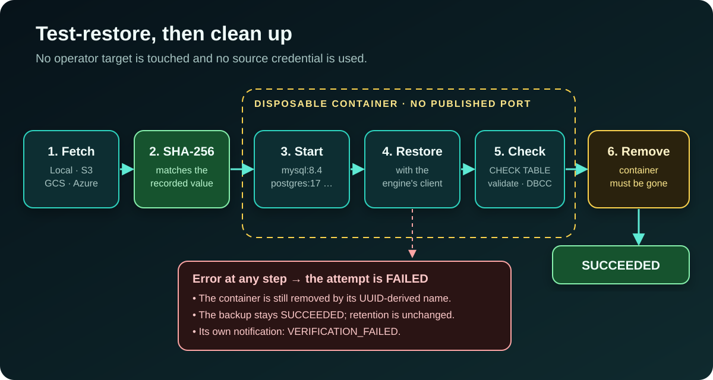

[NOTE]
====
This is *part 2* of a three-part series about https://github.com/hoangluongtran0309/database-backup-utility[Database Backup Utility].

. link:/en/blog/2026/building-database-backup-utility/[Hexagonal architecture and vertical slices]
. Seven database engines and one question: will this backup restore? _(this post)_
. link:/en/blog/2026/backup-utility-security-operations/[Securing and operating a tool that holds the keys to every database]
====

A backup file can be wrong in three different ways, and each needs a different check:

. *The file changed* after it was written: truncated, damaged on disk, overwritten. A checksum catches this.
. *The file is byte-for-byte correct but the engine cannot read it*: wrong client version, odd format, incomplete dump. Only a real restore catches this.
. *The restore finishes but the data is unreadable*: corrupt tables, `INVALID` objects. That needs a health check after the restore.

Most of this project is layers of protection around those three questions, applied consistently across seven very different engines.

== Route by engine, without pretending they are alike

The first fourteen slices had only MySQL. When PostgreSQL arrived in slice 15, there were two easy options: copy the three use cases into PostgreSQL versions, or hide every difference under one giant adapter. The first duplicates execution history, encryption, checksums and background jobs. The second lies: MySQL produces gzipped SQL text, while the safe artifact for PostgreSQL is a custom archive restored with `pg_restore`.

ADR-017 takes a third path. Every target records its `DatabaseEngine`, fixed after registration. The core has three neutral ports (`ConnectionTestPort`, `LogicalBackupPort`, `LogicalRestorePort`), and each engine has a complete adapter set that uses its own tools:

[cols="1,2,2",options="header"]
|===
|Engine |Backup |What is different on restore

|MySQL / MariaDB
|`mysqldump` / `mariadb-dump` → `.sql.gz`
|MariaDB has its own adapter rather than assuming MySQL compatibility.

|PostgreSQL
|`pg_dump --format=custom` → `.dump`
|`pg_restore --list` reads the archive first, then `--clean --if-exists --exit-on-error`.

|MongoDB
|`mongodump --archive --gzip` → `.archive.gz`
|`mongorestore --dryRun` first; `--nsFrom`/`--nsTo` to restore into a differently named database.

|SQLite
|`PRAGMA integrity_check`, then `.dump` → `.sql.gz`
|Rebuilt into a temporary file that must pass `integrity_check` before `.restore` into the destination. Replaces the whole file.

|Oracle
|Schema-mode Data Pump → `.dmp`
|Through a directory object and a directory shared by the Oracle server and the application.

|SQL Server
|SqlPackage export → `.bacpac`
|Imports only into a database that is missing or has no user objects; never drops or clears the destination.
|===

One rule applies to all of them: *a backup can only be restored into a target of the same engine*. The application service checks this before a restore row is written, and the console only offers compatible destinations. There is no format conversion and, per the ROADMAP, there never will be.

There are places where "use the native client" bites back. The original image installed Ubuntu's `postgresql-client`, which is version 16. A connection test against a PostgreSQL 17 server stayed green because `psql` could connect, but the first backup failed because `pg_dump` refuses a server newer than itself. ADR-035 fixes both sides: the image installs client 17 from PostgreSQL's official repository, and the *Test* button now reads the server's `server_version_num` and `pg_dump --version`, then *fails before any backup exists* if the server is newer than the client. It is the principle from part 1 again: a probe is only worth having if it predicts the real operation.

== Layer 1: a checksum for every artifact

When a backup succeeds, the SHA-256 of its artifact is recorded: of the file *as stored*, still compressed. It is read back from disk after the dump has closed the file, not computed from the bytes on their way down.

Both choices have reasons. The hash of the stored file is what the operator downloads, so `sha256sum shop_20260909_101530.sql.gz` on their machine prints exactly what the console shows, and a copy kept elsewhere can be checked without this tool. Hashing the bytes on the way down would only certify what the application *meant* to write; reading the closed file is the only way to know what the disk actually holds.

Every restore checks the checksum first, on the job thread, just before the client starts. A file that is missing or does not match is not applied, and *the destination database is never contacted*.

[NOTE]
====
Backups made before this feature are not backfilled. A checksum taken today certifies only what is on disk today, including a file that is already damaged. Recording it as if it had been taken when the backup was made would be claiming something nobody knows.
====

== Streamed restore, but read once first

The first restore implementation decompressed the whole archive to a temporary file and fed that to the client's stdin. Logical dumps compress very well, so a 2 GB archive could need 15 GB free. The restore then fails for lack of disk exactly when it is needed most: after an incident, on a host that may be filling up for the same reason.

ADR-016 switches to decompressing *while* feeding the client's stdin, writing nothing to disk. But pure streaming would lose a guarantee the temporary file used to give: a damaged archive would apply every statement before the bad bytes and only then fail. So the archive is *read to the end once first*, with the decompressed bytes discarded. A truncated or corrupt archive fails at that step, while the destination is untouched. The price is decompressing twice, which is still cheaper than writing and reading back a decompressed copy.

One detail is easy to miss: if the second read fails partway, the client process is *killed before its stdin is closed*. Closing stdin first would give the client a clean end of input, and it would exit 0 having applied half a dump.

== Restore into another target, confirmed by the destination's name

At first, every restore went back to the target its backup came from. That turned the one thing an operator should do regularly, prove a backup restores, into the most dangerous: the only place to try it was the production database itself.

Now a restore can go into any target of the same engine. The confirmation page states what is about to be overwritten and asks you to type *the destination's name*:

.Restore confirmation: a warning about the destination and its name to type
image::/blog/2026/backup-restore-verification/09-restore-confirm.jpg[alt="Restore confirmation page for a MySQL backup into the shop-mysql-restore target, with a red warning box and a field asking to type shop-mysql-restore to confirm"]

Choosing a different destination *reloads* the page rather than swapping it with JavaScript. The warning, the address and the name to type all describe one target; swapping the target underneath them with a script risks a page that warns about one schema and overwrites another.

== Layers 2 and 3: test-restore into a disposable database

A checksum proves the file is unchanged, not that it restores. Restoring into an operator's target is destructive. Using the source target's credentials ties a recovery test to production access. ADR-029 answers with *isolated restore verification*:

.One restore verification attempt

* The artifact from Local, S3, GCS or Azure is brought into a private path and its SHA-256 checked.
* A disposable Docker container is started *with no published database port*, named after the verification's UUID. The default images are configurable: `mysql:8.4`, `mariadb:10.11`, `postgres:17-alpine`, `mongo:8.0`. SQLite needs no Docker, just a private file below `SQLITE_ROOT`.
* After the restore comes an engine-specific health check: `CHECK TABLE` for every MySQL and MariaDB table, reading every PostgreSQL table, `validate` on every MongoDB collection, and `PRAGMA integrity_check` returning exactly `ok` for SQLite.
* *Cleanup is part of the proof*: success is stored only once the container has been removed.
* The verification adapter never receives the source target's plaintext credential.

.A MySQL backup with its checksum and a successful restore verification
image::/blog/2026/backup-restore-verification/12-restore-verification-mysql.jpg[alt="Detail page of the shop-mysql backup showing its SHA-256, the Verify checksum and Test restore buttons, and a Restore verification table with one Succeeded attempt: CHECK TABLE passed for 2 tables"]

Oracle and SQL Server came later, in ADR-030, because their clients, image terms and startup costs are very different. Oracle uses `gvenzl/oracle-free:23-slim-faststart`, always remaps the source schema to a temporary `DBBVERIFY` schema, reads every table and rejects any object left `INVALID`. SQL Server needs SqlPackage to import a BACPAC, which Microsoft's image lacks, so the project supplies a Dockerfile for operators to build an image that holds server and client in *one* container: no private network, no sidecar.

Verification is *evidence about a backup*, not a new state of the backup. If it fails, the backup is still successful, retention is unchanged, and no "backup failed" notification is sent; verification has notification events of its own. Each target can opt into automatic verification after every successful backup.

[WARNING]
====
Verification for network engines needs access to the Docker socket, which is equivalent to root on the Docker host. That is why the feature is off by default (`DBBACKUP_VERIFICATION_ENABLED=false`) and Compose ships the socket mount commented out. Turning it on is a deliberate operator decision.
====

== Storage, schedules and retention

The remaining features revolve around one principle: *an engine does not need to know where the artifact goes*.

*Storage profiles.* Engine ports only read and write a `Path`. For S3, GCS and Azure, a backup dumps into a staging directory private to that execution, computes size and SHA-256, completes the upload, and *only then* counts as successful. A restore downloads to staging and checks SHA-256 before the engine starts. Each execution snapshots the profile in use when it was accepted, so changing a target's storage only affects later backups. Even local artifacts live in `<target-id>/<execution-id>/`, the same shape as a cloud object key, so two backups never share a file (a bug found during the full feature walkthrough).

*Schedules.* The `backup_schedules` table is the source of truth; Quartz triggers are derived data, rebuilt at startup. Each trigger carries only the schedule's UUID, and the job just calls `RunBackupService.start`, exactly like pressing the button. Scheduled and manual backups share routing, the bounded pool, checksums and failure behaviour. If the application is down at a fire time, the misfire policy is *do nothing*: it resumes at the next fire instead of filling the queue with stale backups.

*Retention.* Each target can keep its newest N successful backups. Retention only runs after another successful backup of that same target, so a run of failed backups never reduces the number of good copies. And *every backup that has ever been restored is protected forever* from automatic retention, even if that restore failed. It has become evidence of an event, and an automatic cleaner has no right to delete evidence.

== Lessons

*Checksum, restore and health check answer three different questions.* Having the first does not mean having the others.

*Don't let an optimisation cost you an old guarantee.* Streamed restore saves disk, but it has to read the archive once first to keep the promise that a damaged archive never touches the destination.

*Cleanup is part of success.* A verification that leaves a stray container behind is not a successful verification.

*Whatever has been used as evidence is off-limits to automation.*

In link:/en/blog/2026/backup-utility-security-operations/[part 3] I cover the rest: how a tool that holds every database's credentials stores them, who gets to use it, and how CI proves that a release was built from the right source.
