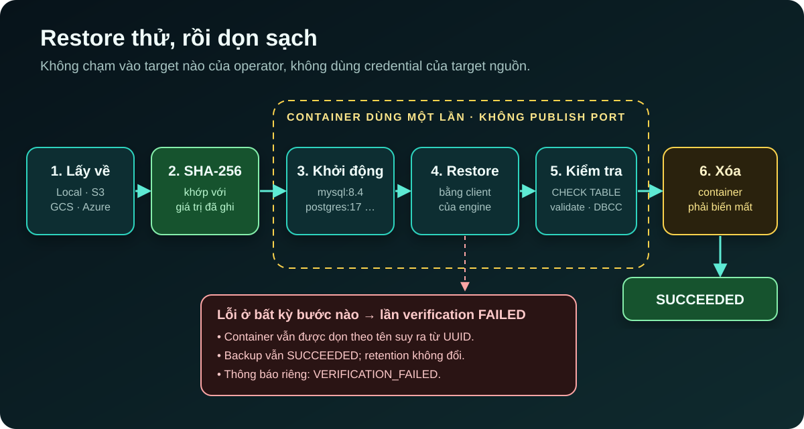

[NOTE]
====
Đây là *phần 2* trong series ba bài về https://github.com/hoangluongtran0309/database-backup-utility[Database Backup Utility].

. link:/blog/2026/building-database-backup-utility/[Kiến trúc hexagonal và lát cắt dọc]
. Bảy database engine và một câu hỏi: backup này có restore được không? _(bài này)_
. link:/blog/2026/backup-utility-security-operations/[Bảo mật và vận hành một công cụ cầm chìa khóa mọi database]
====

Một file backup có thể sai theo ba cách khác nhau, và mỗi cách cần một kiểm tra khác nhau:

. *File đã bị thay đổi* sau khi ghi: bị cắt cụt, hỏng trên đĩa, bị ghi đè. Checksum bắt được lỗi này.
. *File đúng từng byte nhưng engine không đọc được*: client sai version, định dạng lạ, dump thiếu. Chỉ một lần restore thật mới bắt được.
. *Restore chạy xong nhưng dữ liệu không đọc được*: bảng hỏng, object `INVALID`. Cần health check sau khi restore.

Phần lớn dự án này là các lớp bảo vệ cho ba câu hỏi đó, áp dụng nhất quán trên bảy engine rất khác nhau.

== Route theo engine, không giả vờ chúng giống nhau

Mười bốn lát cắt đầu chỉ có MySQL. Khi PostgreSQL tới ở lát cắt 15, có hai cách dễ: chép ba use case thành bản PostgreSQL riêng, hoặc giấu mọi khác biệt dưới một adapter khổng lồ. Cách đầu nhân đôi lịch sử execution, mã hóa, checksum và job nền. Cách sau thì nói dối: MySQL sinh ra SQL text đã gzip, còn artifact an toàn cho PostgreSQL là custom archive được restore bằng `pg_restore`.

ADR-017 chọn cách thứ ba. Mỗi target ghi lại `DatabaseEngine` của nó, không đổi được sau khi đăng ký. Core có ba port trung lập (`ConnectionTestPort`, `LogicalBackupPort`, `LogicalRestorePort`), và mỗi engine có một bộ adapter đầy đủ dùng đúng công cụ của nó:

[cols="1,2,2",options="header"]
|===
|Engine |Backup |Điểm khác biệt khi restore

|MySQL / MariaDB
|`mysqldump` / `mariadb-dump` → `.sql.gz`
|MariaDB có adapter riêng, không giả định tương thích với MySQL.

|PostgreSQL
|`pg_dump --format=custom` → `.dump`
|`pg_restore --list` đọc thử archive trước, rồi `--clean --if-exists --exit-on-error`.

|MongoDB
|`mongodump --archive --gzip` → `.archive.gz`
|`mongorestore --dryRun` trước; `--nsFrom`/`--nsTo` để restore sang database tên khác.

|SQLite
|`PRAGMA integrity_check` rồi `.dump` → `.sql.gz`
|Dựng lại vào file tạm, phải qua `integrity_check` mới `.restore` vào đích. Thay thế toàn bộ file.

|Oracle
|Data Pump schema-mode → `.dmp`
|Qua một directory object và thư mục chia sẻ giữa Oracle server và ứng dụng.

|SQL Server
|SqlPackage export → `.bacpac`
|Chỉ import vào database chưa tồn tại hoặc không có object nào; không bao giờ drop hay xóa sạch đích.
|===

Một quy tắc áp dụng cho tất cả: *backup chỉ restore được vào target cùng engine*. Application service kiểm tra điều này trước khi ghi row restore, và console chỉ đưa ra các đích tương thích. Không có chuyển đổi định dạng, và theo ROADMAP, sẽ không bao giờ có.

Cũng có những chỗ mà "dùng client gốc" cắn lại. Image ban đầu cài `postgresql-client` của Ubuntu, tức là version 16. Test kết nối tới một server PostgreSQL 17 vẫn xanh vì `psql` kết nối được, nhưng backup đầu tiên thất bại vì `pg_dump` từ chối server mới hơn chính nó. ADR-035 sửa cả hai phía: image cài client 17 từ repository chính thức của PostgreSQL, và nút *Test* giờ đọc `server_version_num` của server cùng `pg_dump --version`, rồi *thất bại trước khi có backup nào* nếu server mới hơn client. Đó lại là nguyên tắc ở phần 1: phép thử chỉ có giá trị nếu nó dự đoán được thao tác thật.

== Lớp 1: một checksum cho mọi artifact

Khi một backup thành công, SHA-256 của artifact được ghi lại: của file *như được lưu*, vẫn còn nén. Nó được đọc lại từ đĩa sau khi dump đã đóng file, không phải tính từ các byte trên đường ghi xuống.

Hai lựa chọn đó đều có lý do. Hash của file đã lưu là thứ operator tải về, nên `sha256sum shop_20260909_101530.sql.gz` trên máy họ in ra đúng giá trị console hiển thị, và một bản sao ở nơi khác có thể được kiểm tra mà không cần công cụ này. Còn hash các byte trên đường ghi chỉ chứng nhận điều ứng dụng *định* ghi; đọc lại file đã đóng là cách duy nhất biết đĩa thực sự chứa gì.

Mỗi lần restore đều kiểm tra checksum trước, trên thread của job, ngay trước khi client khởi chạy. File bị thiếu hoặc không khớp thì không được áp dụng, và *database đích không bị liên lạc*.

[NOTE]
====
Các backup tạo trước khi có tính năng này không được tính checksum bù. Một checksum lấy hôm nay chỉ chứng nhận những gì có trên đĩa hôm nay, kể cả một file đã hỏng. Ghi nó lại như thể nó được lấy lúc tạo backup là khẳng định một điều không ai biết.
====

== Restore dạng stream, nhưng vẫn đọc trước một lần

Phiên bản restore đầu tiên giải nén cả archive ra một file tạm rồi đưa vào stdin của client. Logical dump nén rất tốt, nên một archive 2 GB có thể cần 15 GB trống. Restore khi đó thất bại vì thiếu đĩa đúng vào lúc cần nó nhất: sau sự cố, trên một host có thể đang đầy vì chính lý do đó.

ADR-016 chuyển sang giải nén *trong lúc* đưa dữ liệu vào stdin của client, không ghi gì ra đĩa. Nhưng streaming thuần lại mất một đảm bảo mà file tạm từng cho: archive hỏng sẽ áp dụng mọi câu lệnh trước đoạn hỏng rồi mới thất bại. Vì vậy archive được *đọc hết một lần trước*, phần giải nén bị bỏ đi. Archive cắt cụt hoặc hỏng thất bại ở bước này, khi đích chưa bị chạm vào. Cái giá là giải nén hai lần, vẫn rẻ hơn ghi rồi đọc lại một bản giải nén trên đĩa.

Có một chi tiết dễ bỏ sót: nếu việc đọc lần hai thất bại giữa chừng, tiến trình client bị *kill trước khi stdin của nó được đóng*. Đóng stdin trước sẽ cho client một "kết thúc input" sạch sẽ, và nó sẽ exit 0 sau khi áp dụng nửa bản dump.

== Restore vào target khác, xác nhận bằng tên đích

Lúc đầu, mọi restore đều quay về target mà backup được lấy từ đó. Điều đó biến việc operator nên làm thường xuyên nhất, chứng minh backup restore được, thành việc nguy hiểm nhất: nơi duy nhất để thử là chính database production.

Giờ một restore có thể vào bất kỳ target nào cùng engine. Trang xác nhận ghi rõ cái gì sẽ bị ghi đè và bắt bạn gõ *tên của đích*:

.Trang xác nhận restore: cảnh báo về đích và yêu cầu gõ đúng tên
image::09-restore-confirm.jpg[alt="Trang xác nhận restore một backup MySQL vào target shop-mysql-restore, có hộp cảnh báo màu đỏ và ô yêu cầu gõ tên shop-mysql-restore để xác nhận"]

Khi chọn một đích khác, trang *tải lại* thay vì đổi bằng JavaScript. Cảnh báo, địa chỉ và tên phải gõ đều mô tả cùng một target; đổi target bên dưới chúng bằng script có nguy cơ tạo ra một trang cảnh báo về schema này nhưng ghi đè schema khác.

== Lớp 2 và 3: restore thử trong một database dùng một lần

Checksum chứng minh file không đổi, không chứng minh nó restore được. Restore vào một target của operator thì có tính phá hủy. Dùng credential của target nguồn thì gắn việc kiểm thử phục hồi với quyền truy cập production. ADR-029 giải quyết bằng *restore verification tách biệt*:

.Một lần restore verification

* Artifact từ Local, S3, GCS hoặc Azure được đưa về một đường dẫn riêng và kiểm tra SHA-256.
* Một container Docker dùng một lần được khởi động, *không publish port database nào*, tên container suy ra từ UUID của lần verification. Image mặc định có thể cấu hình: `mysql:8.4`, `mariadb:10.11`, `postgres:17-alpine`, `mongo:8.0`. SQLite không cần Docker, chỉ dựng một file riêng dưới `SQLITE_ROOT`.
* Sau khi restore là health check riêng cho từng engine: `CHECK TABLE` cho mọi bảng của MySQL và MariaDB, đọc mọi bảng của PostgreSQL, `validate` mọi collection của MongoDB, `PRAGMA integrity_check` phải trả về đúng `ok` cho SQLite.
* *Việc dọn dẹp là một phần của bằng chứng*: chỉ khi container đã bị xóa thì kết quả thành công mới được lưu.
* Adapter verification không bao giờ nhận credential plaintext của target nguồn.

.Backup MySQL với checksum và một lần restore verification thành công
image::12-restore-verification-mysql.jpg[alt="Trang chi tiết backup shop-mysql hiển thị SHA-256, các nút Verify checksum và Test restore, và bảng Restore verification với một lần chạy Succeeded, CHECK TABLE passed for 2 tables"]

Oracle và SQL Server tới sau ở ADR-030 vì client, điều khoản image và chi phí khởi động của chúng khác hẳn. Oracle dùng `gvenzl/oracle-free:23-slim-faststart`, luôn remap schema nguồn sang một schema tạm `DBBVERIFY`, đọc mọi bảng và từ chối mọi object còn `INVALID`. SQL Server cần SqlPackage để import BACPAC nhưng image của Microsoft không có, nên dự án cung cấp một Dockerfile để operator tự build image chứa cả server lẫn client trong *một* container: không cần network riêng, không cần sidecar.

Verification là *bằng chứng về một backup*, không phải một trạng thái mới của backup. Nó thất bại thì backup vẫn thành công, retention vẫn giữ nguyên, và không có thông báo "backup failed" nào được gửi; verification có sự kiện thông báo riêng. Mỗi target có thể bật tự động verify sau mỗi backup thành công.

[WARNING]
====
Verification cho các engine mạng cần quyền truy cập Docker socket, tương đương quyền root trên Docker host. Vì vậy tính năng này tắt mặc định (`DBBACKUP_VERIFICATION_ENABLED=false`) và Compose để sẵn phần mount socket ở dạng comment. Bật nó là một quyết định có ý thức của operator.
====

== Storage, lịch và retention

Ba tính năng còn lại xoay quanh một nguyên tắc: *engine không cần biết artifact đi đâu*.

*Storage profile.* Port của engine chỉ đọc và ghi `Path`. Với S3, GCS và Azure, backup dump vào một thư mục staging riêng cho execution đó, tính kích thước và SHA-256, upload xong, *rồi mới* được coi là thành công. Restore tải về staging và kiểm tra SHA-256 trước khi engine khởi chạy. Mỗi execution chụp lại profile đang dùng lúc được chấp nhận, nên đổi storage của target chỉ ảnh hưởng các backup sau này. Ngay cả artifact local cũng nằm trong `<target-id>/<execution-id>/`, cùng dạng với object key trên cloud, để hai backup không bao giờ dùng chung một file (một lỗi tìm thấy trong đợt chạy thử toàn bộ tính năng).

*Lịch backup.* Bảng `backup_schedules` là nguồn chân lý; trigger Quartz chỉ là dữ liệu dẫn xuất, được dựng lại lúc khởi động. Mỗi trigger chỉ mang UUID của lịch, và job chỉ gọi `RunBackupService.start` giống hệt khi bấm nút. Lịch và thao tác tay dùng chung routing, pool có giới hạn, checksum và cách thất bại. Nếu ứng dụng tắt đúng giờ chạy, misfire policy là *không làm gì*: chạy tiếp ở lần kế tiếp thay vì lấp đầy hàng đợi bằng các backup đã cũ.

*Retention.* Mỗi target có thể chọn giữ N backup thành công mới nhất. Retention chỉ chạy sau một backup thành công khác của chính target đó, nên một chuỗi backup thất bại không bao giờ làm giảm số bản tốt. Và *mọi backup đã từng được restore đều được bảo vệ vĩnh viễn* khỏi retention tự động, kể cả khi lần restore đó thất bại. Nó đã trở thành bằng chứng của một sự kiện, và một bộ dọn dẹp tự động không có quyền xóa bằng chứng.

== Bài học

*Checksum, restore và health check trả lời ba câu hỏi khác nhau.* Có cái đầu không có nghĩa là có cái sau.

*Đừng để một kiểm tra tốn kém làm mất một đảm bảo cũ.* Streaming restore tiết kiệm đĩa, nhưng phải đọc trước một lần để giữ lời hứa "archive hỏng không chạm tới đích".

*Dọn dẹp là một phần của thành công.* Một lần verification để lại container rác chưa phải là một lần verification thành công.

*Thứ đã được dùng làm bằng chứng thì tự động hóa không được xóa.*

Ở link:/blog/2026/backup-utility-security-operations/[phần 3], mình sẽ nói về phần còn lại: làm sao một công cụ giữ credential của mọi database lưu trữ chúng, ai được dùng nó, và cách CI chứng minh một bản release được build từ đúng source.
