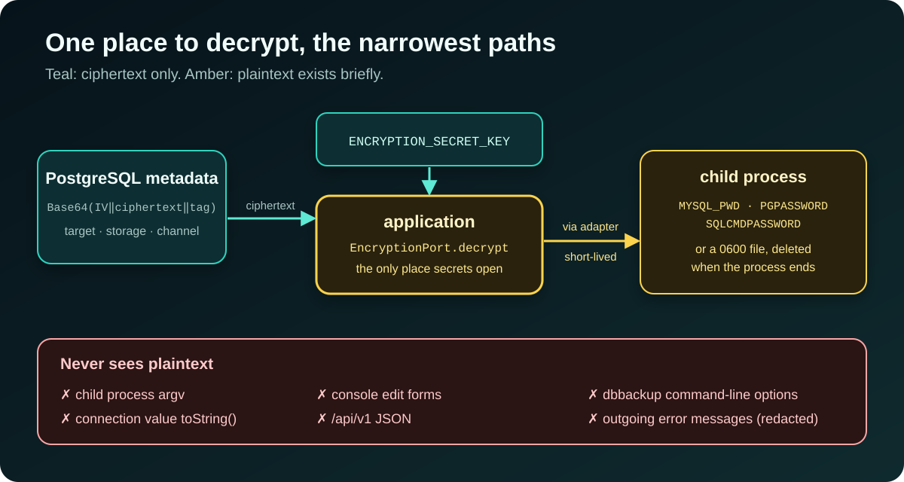

[NOTE]
====
This is *part 3* of a three-part series about https://github.com/hoangluongtran0309/database-backup-utility[Database Backup Utility].

. link:/en/blog/2026/building-database-backup-utility/[Hexagonal architecture and vertical slices]
. link:/en/blog/2026/backup-restore-verification/[Seven database engines and one question: will this backup restore?]
. Securing and operating a tool that holds the keys to every database _(this post)_
====

A backup tool is an attractive target. It holds the credentials of every registered database, can read all of their data, and is one form POST away from overwriting a production schema. The last post of the series is about how the project limits what can go wrong, and which limits it accepts on purpose.

== Credentials: storable, but opened in one place only

To run `mysqldump`, the tool must present the target's password. So the password cannot be hashed; it has to be recoverable, which means it has to be stored encrypted. ADR-002 chooses *AES-256-GCM*, with a fresh random 12-byte IV for *every* encryption:

* GCM authenticates as well as encrypts, so a ciphertext altered in the database fails to decrypt instead of yielding plausible garbage that gets handed to a MySQL client.
* A random IV each time means two targets sharing a password still have different ciphertexts. Reusing an IV under the same key is the fastest way to break GCM, so this is the property most worth a test, and `AesGcmEncryptionAdapterTest` asserts it directly.
* The key is 32 real bytes, supplied Base64-encoded in `ENCRYPTION_SECRET_KEY`, and *not* derived from a passphrase. A KDF would let a short, guessable string masquerade as a 256-bit key.
* There is no default key. A default would mean every deployment that forgot to configure one protects its passwords with a secret published in the repository. The application refuses to start.

More important than the algorithm is *who gets to decrypt*. Only the `application` layer calls `EncryptionPort`; adapters never hold the key. There is exactly one place in the system where a secret is opened, and one place to review.

.Where plaintext exists

From there, plaintext travels along the narrowest paths possible. To a child process it goes through an environment variable (`MYSQL_PWD`, `PGPASSWORD`, `SQLCMDPASSWORD`), never through argv, because argv is visible to every other process on the machine. When a tool does not read its password from the environment, as with `mongodump` or SqlPackage, the password goes into a temporary file with `0600` permissions, only the file's path appears in the arguments, and the file is deleted as soon as the process ends. Failing to create the file securely, or failing to remove it, fails the operation.

The same rules cover S3 secrets, GCS service-account JSON, Azure storage keys, Telegram bot tokens and webhook URLs. Edit forms never render a secret back; leaving the field empty keeps the existing ciphertext. Before an error message reaches a notification channel, known password, token, authorization-header and URI-credential shapes are redacted.

[WARNING]
====
Losing `ENCRYPTION_SECRET_KEY` means every stored credential is unrecoverable, and every target has to be registered again. There is no key rotation mechanism yet. The ADR says it plainly: rotation is a design change for when it is needed, not a hook to leave dangling now.
====

== One operator account, with its costs written down

Before slice 8, the console had no sign-in. Anyone who could reach port 8080 could read every target, download any artifact and restore over a live schema. There was a second hole that is easy to miss: without CSRF tokens, any web page open in the operator's browser could post a form to the console from inside the network.

ADR-011 picks the smallest solution that closes both holes: *exactly one account*, configured from the environment. `OPERATOR_PASSWORD_HASH` must be a bcrypt hash with a cost of at least 10; otherwise the application does not start. That check also catches the likeliest mistake: pasting the password itself into the variable. Everything else is Spring Security's defaults, unmodified: an `HttpOnly`, `SameSite=Lax` session cookie, CSRF tokens on every form, a strict Content-Security-Policy (no inline scripts, no inline styles), `X-Frame-Options: DENY` and `Cache-Control: no-store`.

Why no users table or OIDC? A users table means a migration, a way to create the first user, a page to manage the rest, and roles, which is a slice three times the size, for a console a handful of people share. OIDC needs an identity provider to exist first, which contradicts the goal of "nothing on the host but Docker".

The costs are recorded just as plainly:

* *Everyone shares one account*, so the console cannot tell *who* started a restore. The sign-in log only shows where each session came from.
* *No lockout and no rate limit.* bcrypt at cost 12 makes every guess slow; throttling belongs to whatever sits in front of the console. And a lockout on a single shared account would let anyone lock every operator out.
* *No built-in TLS.* Put a TLS-terminating reverse proxy in front and set `SESSION_COOKIE_SECURE=true`.

== The CLI is a client, not a back door

Automation needs everything the console can do, plus stable JSON and exit codes you can rely on. The easiest route would be a CLI that connects straight to the PostgreSQL metadata store. ADR-031 rejects it: such a CLI would bypass the use cases, could start a second scheduler, and would need the database credentials and encryption key on every operator's machine.

Instead, `web` exposes a versioned API, `/api/v1`, which calls the same application services as the console. The `dbbackup` CLI is the fifth module, containing only the JDK HTTP client, Jackson and command routing; it does not depend on `core`, `application` or Spring.

.`dbbackup help`: `<resource> <action>` commands and safe ways to pass secrets
image::/blog/2026/backup-utility-security-operations/31-cli-help.jpg[alt="A terminal showing dbbackup help: the target, storage, notification, subscription, schedule, retention, backup and restore groups; global options such as --server, --password-file, --password-stdin, --output text|json, --allow-http and --no-wait"]

A few small decisions matter:

* *Secrets never go on the command line.* The operator password comes from an environment variable, `--password-file` or `--password-stdin`. Target, storage and notification credentials are rejected as ordinary options; instead you point at an environment variable:
+
[source,bash]
----
export TARGET_DATABASE_PASSWORD='database secret'
dbbackup target add --name production --engine MYSQL --host db.internal \
  --port 3306 --database shop --username backup \
  --secret password=TARGET_DATABASE_PASSWORD
----
* *Plain HTTP is accepted only for loopback.* A remote server needs HTTPS unless `--allow-http` is given explicitly.
* *The server owns the job, not the CLI.* A backup command gets HTTP 202 with the execution's UUID, then the CLI polls until a final result (exit code `5` on failure). Interrupting the CLI does not stop the job, because `web` remains the only owner of the scheduler, the job executor and startup repair.
* *`/api/v1` is a contract.* Breaking field or semantic changes require a new API version.

== CI that proves, not just checks

ADR-032 turns the pipeline from one advisory job into independent required gates: workflow lint, full `mvn verify` with every engine's client installed (integration tests *fail* rather than skip when a binary is missing), image build and scan, CodeQL, dependency review, and an end-to-end run on Docker Compose.

The E2E run deliberately does not repeat the seven-engine matrix that the integration tests already cover. It checks the missing boundary: the packaged image, the metadata migrations, the authenticated API and the bundled CLI working together as one system. With SQLite (which needs no Docker socket), it goes through sign-in, target creation, backup, checksum, artifact download, restore verification and cross-target restore, plus failure paths such as a corrupted artifact.

A few small rules make the supply chain more trustworthy:

* Every external GitHub Action is pinned to a full commit SHA, not a tag that can be moved.
* Trivy blocks every fixable HIGH and CRITICAL finding. A temporary exception must carry a CVE, a reason, the affected package and an *expiry no more than 90 days away*; the workflow lint step enforces that policy itself.
* `main` and `develop` only accept pull requests that pass every check.
* A release starts from an annotated tag that must point to a commit on `main`, match the non-snapshot Maven version and have hand-written release notes in the repository. The workflow publishes the image to GHCR with JARs, checksums and SPDX SBOMs, then records build-provenance and SBOM *attestations*, so anyone can verify which source an image was built from.

== Walking through your own product

The last part of the ROADMAP has two sections I value most: "Fixes from the walkthrough" and "Fixes from the feature tour". I opened a browser, went through *every* console feature on all seven engines like a real operator, and logged each problem in `docs/walkthrough/ISSUES.md` with reproduction steps, the expected result and evidence.

That walkthrough found bugs the tests did not:

* Two local backups that started in the same second with the same database name overwrote each other's file.
* The example Oracle image built fine but lacked `libaio`, so `sqlplus` could not start.
* The main image could not back up PostgreSQL 17, as described in part 2.
* Chrome offered the database credentials on the operator sign-in page.
* The CLI's default `--output text` printed JSON.

Each group of problems became its own fix slice, with its own ADR where needed, and was marked fixed in the ISSUES file itself. Automated tests answer "does the code do what I think it does?"; walking through the product as a user answers "is what I think actually right?".

== Lessons

*Shrink where plaintext exists instead of just encrypting it.* One place that decrypts, the narrowest possible paths, and never through argv.

*Pick the smallest solution that closes the hole, then write down its cost.* A shared account has real limits; recording them in an ADR lets whoever deploys it decide whether they are acceptable.

*A tool with two interfaces should still have one brain.* The CLI goes through the same use cases as the console, so no rule gets bypassed.

*Use your own product like a stranger would.* The final walkthrough found bugs the automated tests did not.

That's the end of the series. The source code, 37 ADRs and a feature guide with screenshots are all on https://github.com/hoangluongtran0309/database-backup-utility[GitHub], and the project overview is on the link:/en/projects/database-backup-utility/[project page].
