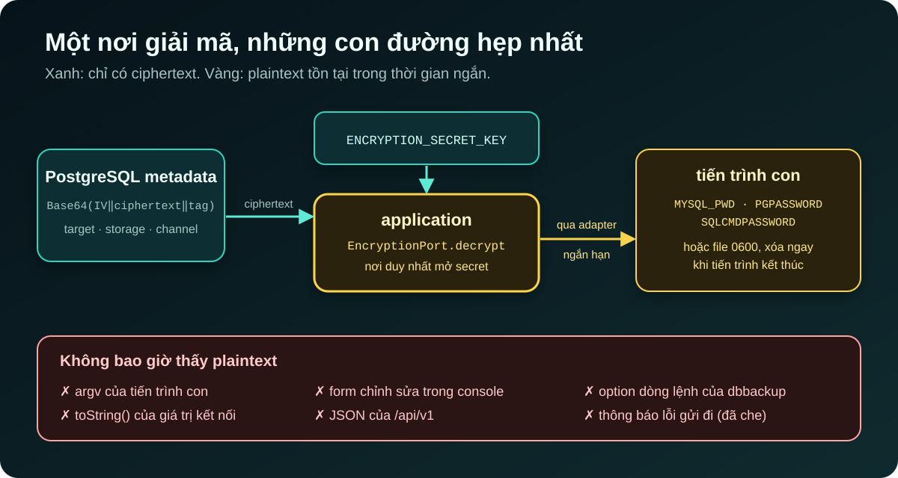
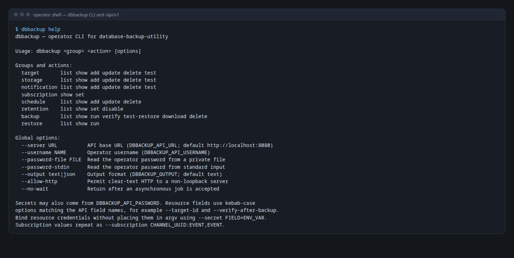

[NOTE]
====
Đây là *phần 3* trong series ba bài về https://github.com/hoangluongtran0309/database-backup-utility[Database Backup Utility].

. link:/blog/2026/building-database-backup-utility/[Kiến trúc hexagonal và lát cắt dọc]
. link:/blog/2026/backup-restore-verification/[Bảy database engine và một câu hỏi: backup này có restore được không?]
. Bảo mật và vận hành một công cụ cầm chìa khóa mọi database _(bài này)_
====

Một công cụ backup là mục tiêu hấp dẫn. Nó giữ credential của mọi database được đăng ký, đọc được toàn bộ dữ liệu, và chỉ cần một form POST là có thể ghi đè một schema production. Bài cuối của series nói về cách dự án giới hạn những gì có thể sai, và những giới hạn nó chấp nhận một cách có ý thức.

== Credential: lưu được, nhưng chỉ mở ở một chỗ

Để chạy `mysqldump`, công cụ phải đưa ra được mật khẩu của target. Mật khẩu vì vậy không thể hash, nó phải khôi phục được, tức là phải được lưu ở dạng mã hóa. ADR-002 chọn *AES-256-GCM*, với một IV 12 byte ngẫu nhiên mới cho *mỗi* lần mã hóa:

* GCM vừa mã hóa vừa xác thực, nên một ciphertext bị sửa trong database sẽ không giải mã được, thay vì cho ra một chuỗi rác trông hợp lý rồi bị đưa cho client MySQL.
* IV ngẫu nhiên mỗi lần nghĩa là hai target dùng chung mật khẩu vẫn có ciphertext khác nhau. Dùng lại IV dưới cùng một key là cách nhanh nhất để phá GCM, nên đây là thuộc tính đáng có test nhất, và `AesGcmEncryptionAdapterTest` kiểm tra nó trực tiếp.
* Key là 32 byte thật, truyền ở dạng Base64 qua `ENCRYPTION_SECRET_KEY`, *không* suy ra từ passphrase. Một KDF sẽ cho phép một chuỗi ngắn dễ đoán đội lốt key 256-bit.
* Không có key mặc định. Một giá trị mặc định nghĩa là mọi deployment quên cấu hình sẽ bảo vệ mật khẩu bằng một secret công khai trong repository. Ứng dụng từ chối khởi động.

Quan trọng hơn thuật toán là *ai được giải mã*. Chỉ tầng `application` gọi `EncryptionPort`; adapter không bao giờ giữ key. Cả hệ thống có đúng một nơi secret được mở, và một nơi để review.

.Plaintext tồn tại ở đâu

Từ đó, plaintext đi tiếp theo những con đường hẹp nhất có thể. Tới tiến trình con, nó đi qua biến môi trường (`MYSQL_PWD`, `PGPASSWORD`, `SQLCMDPASSWORD`), không bao giờ qua argv, vì argv hiện ra với mọi process khác trên máy. Khi công cụ không đọc mật khẩu từ môi trường, như `mongodump` hay SqlPackage, mật khẩu nằm trong một file tạm quyền `0600`, chỉ đường dẫn file xuất hiện trong tham số, và file bị xóa ngay khi tiến trình kết thúc. Không tạo được file an toàn, hoặc không xóa được nó, đều làm thao tác thất bại.

Cùng quy tắc đó áp dụng cho S3 secret, service account JSON của GCS, storage key của Azure, bot token Telegram và URL webhook. Form chỉnh sửa không bao giờ hiển thị lại secret; để trống nghĩa là giữ nguyên ciphertext cũ. Trước khi một thông báo lỗi tới kênh thông báo, các mẫu password, token, header authorization và credential trong URI đều bị che đi.

[WARNING]
====
Mất `ENCRYPTION_SECRET_KEY` nghĩa là mọi credential đã lưu không thể khôi phục, và mọi target phải được đăng ký lại. Hiện không có cơ chế xoay vòng key. ADR ghi rõ: xoay vòng là một thay đổi thiết kế khi thật sự cần, không phải một hook để treo lơ lửng từ bây giờ.
====

== Một tài khoản operator, và cái giá được viết ra

Trước lát cắt thứ 8, console không có đăng nhập. Ai tới được port 8080 cũng đọc được mọi target, tải mọi artifact và restore đè lên schema thật. Có cả một lỗ thứ hai ít người để ý: không có CSRF token, bất kỳ trang web nào đang mở trong trình duyệt của operator cũng có thể POST một form tới console từ bên trong mạng nội bộ.

ADR-011 chọn giải pháp nhỏ nhất đóng được cả hai lỗ: *đúng một tài khoản*, cấu hình từ môi trường. `OPERATOR_PASSWORD_HASH` phải là một bcrypt hash với cost ít nhất 10; nếu không, ứng dụng không khởi động. Kiểm tra này bắt luôn lỗi dễ mắc nhất: dán chính mật khẩu vào biến môi trường. Phần còn lại là mặc định của Spring Security, không biến tấu: session cookie `HttpOnly` và `SameSite=Lax`, CSRF token trên mọi form, Content-Security-Policy chặt (không inline script, không inline style), `X-Frame-Options: DENY` và `Cache-Control: no-store`.

Vì sao không có bảng user hay OIDC? Một bảng user nghĩa là migration, cách tạo user đầu tiên, trang quản lý và vai trò, tức là một lát cắt gấp ba lần, cho một console vài người dùng chung. OIDC cần một identity provider có sẵn, trái với mục tiêu "trên host chỉ cần Docker".

Cái giá được ghi lại thẳng thắn:

* *Mọi người dùng chung một tài khoản*, nên console không thể biết *ai* đã khởi chạy một lần restore. Log đăng nhập chỉ cho biết session đến từ đâu.
* *Không có lockout hay rate limit.* bcrypt cost 12 làm mỗi lần đoán chậm; throttling thuộc về thứ đứng trước console. Và lockout trên một tài khoản dùng chung sẽ cho phép bất kỳ ai khóa mọi operator ra ngoài.
* *Không có TLS sẵn.* Đặt một reverse proxy có TLS phía trước và bật `SESSION_COOKIE_SECURE=true`.

== CLI là một client, không phải một cửa sau

Automation cần mọi thứ console làm được, cộng với JSON ổn định và exit code có thể dựa vào. Cách dễ nhất là cho CLI kết nối thẳng vào PostgreSQL metadata. ADR-031 từ chối điều đó: CLI như vậy sẽ bỏ qua các use case, có thể khởi động một scheduler thứ hai, và cần credential database cùng key mã hóa trên máy của mọi operator.

Thay vào đó, `web` mở một API có version, `/api/v1`, gọi đúng các application service mà console dùng. CLI `dbbackup` là module thứ năm, chỉ chứa JDK HTTP client, Jackson và phần định tuyến lệnh; nó không phụ thuộc vào `core`, `application` hay Spring.

.`dbbackup help`: nhóm lệnh `<resource> <action>` và các cách đưa secret vào an toàn

Một vài quyết định nhỏ đáng kể:

* *Secret không bao giờ nằm trên dòng lệnh.* Mật khẩu operator đi qua biến môi trường, `--password-file` hoặc `--password-stdin`. Credential của target, storage và kênh thông báo bị từ chối nếu truyền như option bình thường; thay vào đó bạn trỏ tới một biến môi trường:
+
[source,bash]
----
export TARGET_DATABASE_PASSWORD='database secret'
dbbackup target add --name production --engine MYSQL --host db.internal \
  --port 3306 --database shop --username backup \
  --secret password=TARGET_DATABASE_PASSWORD
----
* *HTTP thuần chỉ được chấp nhận cho loopback.* Server từ xa cần HTTPS, trừ khi `--allow-http` được truyền tường minh.
* *Server sở hữu job, không phải CLI.* Lệnh backup trả về HTTP 202 cùng UUID của execution, rồi CLI poll cho tới khi có kết quả cuối (exit code `5` nếu thất bại). Ngắt CLI giữa chừng không dừng job, vì `web` vẫn là nơi duy nhất sở hữu scheduler, job executor và việc sửa trạng thái lúc khởi động.
* *`/api/v1` là một hợp đồng.* Thay đổi phá vỡ field hay ngữ nghĩa cần một version API mới.

== CI chứng minh, không chỉ kiểm tra

ADR-032 biến pipeline từ một job "tư vấn" thành các cổng bắt buộc độc lập: lint workflow, `mvn verify` đầy đủ với client của mọi engine (integration test *thất bại* chứ không tự bỏ qua khi thiếu binary), build và quét image, CodeQL, dependency review, và một luồng E2E trên Docker Compose.

Luồng E2E cố ý không lặp lại ma trận bảy engine mà integration test đã phủ. Nó kiểm tra ranh giới còn thiếu: image đã đóng gói, migration metadata, API có xác thực và CLI đi kèm chạy cùng nhau như một hệ thống. Với SQLite (không cần Docker socket), nó chạy qua đăng nhập, tạo target, backup, checksum, tải artifact, restore verification và restore sang target khác, cùng các đường thất bại như artifact bị làm hỏng.

Một vài quy tắc nhỏ làm chuỗi cung ứng đáng tin hơn:

* Mọi GitHub Action bên ngoài được pin theo commit SHA đầy đủ, không theo tag có thể bị dời.
* Trivy chặn mọi lỗ hổng HIGH và CRITICAL đã có bản sửa. Một ngoại lệ tạm thời phải có CVE, lý do, package bị ảnh hưởng và *ngày hết hạn không quá 90 ngày*; chính bước lint workflow kiểm tra chính sách đó.
* `main` và `develop` chỉ nhận pull request đã qua mọi check.
* Release bắt đầu từ một tag có chú thích, phải trỏ tới commit trên `main`, khớp version Maven không phải snapshot và có release note viết tay trong repository. Workflow publish image lên GHCR cùng JAR, checksum và SBOM SPDX, rồi ghi *attestation* về nguồn gốc build và SBOM, để bất kỳ ai cũng kiểm chứng được image đó được build từ source nào.

== Chạy thử chính sản phẩm của mình

Phần cuối của ROADMAP có hai mục mình thấy giá trị nhất: "Fixes from the walkthrough" và "Fixes from the feature tour". Mình mở trình duyệt, đi qua *mọi* tính năng của console trên cả bảy engine như một operator thật, và ghi mỗi vấn đề vào `docs/walkthrough/ISSUES.md` với các bước tái hiện, kết quả mong đợi và bằng chứng.

Đợt chạy thử đó tìm ra những lỗi mà test không bắt được:

* Hai backup local bắt đầu cùng một giây, cùng tên database, ghi đè file của nhau.
* Image Oracle mẫu build được nhưng thiếu `libaio`, nên `sqlplus` không khởi động được.
* Image chính không backup được PostgreSQL 17, như đã kể ở phần 2.
* Chrome gợi ý điền credential của database vào trang đăng nhập operator.
* Lệnh CLI với `--output text` mặc định lại in ra JSON.

Mỗi nhóm lỗi trở thành một lát cắt sửa lỗi riêng, có ADR riêng nếu cần, và được đánh dấu đã sửa trong chính file ISSUES. Test tự động trả lời "code có làm đúng điều mình nghĩ không?"; chạy thử như người dùng trả lời "điều mình nghĩ có đúng không?".

== Bài học

*Thu hẹp nơi plaintext tồn tại thay vì chỉ mã hóa nó.* Một nơi giải mã, những con đường hẹp nhất có thể, và không bao giờ qua argv.

*Chọn giải pháp nhỏ nhất đóng được lỗ hổng, rồi viết cái giá ra.* Một tài khoản dùng chung có giới hạn thật; ghi chúng vào ADR giúp người triển khai quyết định có chấp nhận được hay không.

*Một công cụ có hai giao diện thì vẫn chỉ nên có một bộ não.* CLI đi qua cùng use case với console, nên không có quy tắc nào bị bỏ qua.

*Hãy tự dùng sản phẩm của mình như một người lạ.* Đợt chạy thử ở cuối tìm ra những lỗi mà bộ test tự động không thấy.

Đó là hết series. Mã nguồn, 37 ADR và hướng dẫn tính năng có ảnh chụp màn hình đều có trên https://github.com/hoangluongtran0309/database-backup-utility[GitHub], và tổng quan dự án ở link:/projects/database-backup-utility/[trang project].
