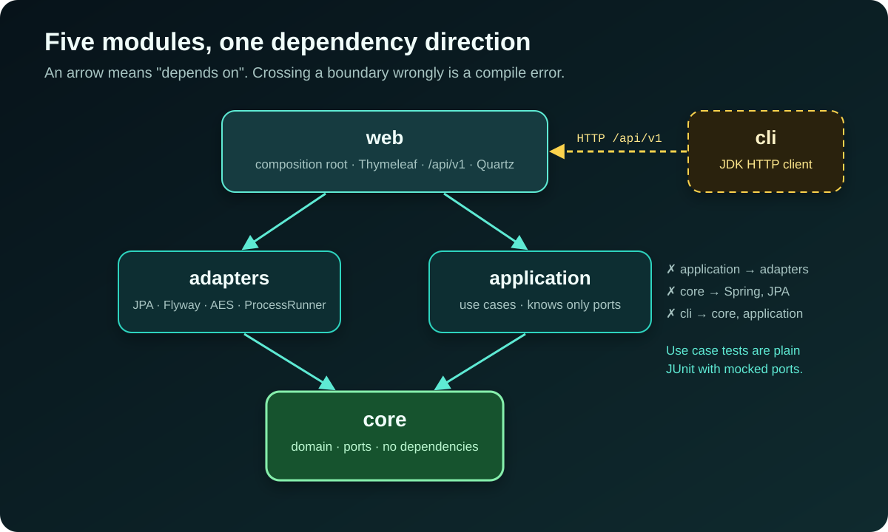

[NOTE]
====
This is *part 1* of a three-part series about https://github.com/hoangluongtran0309/database-backup-utility[Database Backup Utility].

. Hexagonal architecture and vertical slices _(this post)_
. link:/en/blog/2026/backup-restore-verification/[Seven database engines and one question: will this backup restore?]
. link:/en/blog/2026/backup-utility-security-operations/[Securing and operating a tool that holds the keys to every database]
====

Most teams have backups. Far fewer know for certain that their backups restore. A nightly cron job running `mysqldump` stays green for months, until the day it is needed and the file turns out to be truncated, the client is the wrong version, or the credential expired long ago.

https://github.com/hoangluongtran0309/database-backup-utility[Database Backup Utility] is the self-hosted tool I wrote to take that question seriously. It performs logical backup and restore for seven engines (MySQL, MariaDB, PostgreSQL, MongoDB, SQLite, plus Oracle and SQL Server through optional client packs), keeps artifacts on local disk, S3, GCS or Azure, and can test-restore any backup into a disposable database. v0.1.0 shipped on 14 September 2026; v0.20.0 is the twentieth release, with 37 ADRs recording the decisions along the way.

This post covers the shape of the system. The next two go into the individual engines, restore verification and security.

== A narrow scope is a feature

The first sentence of the README is not a feature list but a limit: *full logical dumps and same-engine restores only*. The ROADMAP even has a section called "Deliberately out of scope", which says plainly that this means absent, not "later":

* Physical backups for any engine.
* Differential or incremental backups, and backup chains.
* Binlog, WAL or oplog replay, and point-in-time recovery.
* Conversion or restore between different database engines.

The reason is practical. Each item on that list is a system of its own with its own ways to fail. A logical dump is simple: one file, in the engine's own format, restored by the engine's own tool. An operator can download it and check it with `sha256sum` or `pg_restore --list` without this tool. Keeping that simplicity matters more than one more feature that sounds attractive.

== Five modules, and the boundary is a compile error

This project is a rewrite. According to ADR-001, its predecessor grew to 376 Java files, 112 of them in `core` alone, mostly because structure was added ahead of need. So the rewrite's first question was: on day one, when the whole application is about a dozen classes, how much structure is justified?

There were two real options: one module with `core`/`application`/`adapters`/`web` packages and an ArchUnit test to catch bad imports, or one Maven module per layer so the compiler holds the boundary. I chose the second, and later added a fifth module for the CLI:

.Five Maven modules and their dependency direction

The deciding property is not tidiness but that `core` has an *empty dependency list*. A domain class cannot import Spring or JPA, not because a rule forbids it, but because those jars are not on its classpath. There is no rule to remember and no test to keep passing.

Just as important: *`application` does not depend on `adapters`*. If it did, nothing would stop a use case reaching past its ports into a JPA repository, and the moment one did, every use case test would need a Spring context and a container. Keeping that dependency absent is why use case tests are plain JUnit with mocked ports. `web` is the only module that sees both sides, and Spring wires them together at startup.

The accepted price is stated just as clearly: a feature touches several modules, and there are five poms for a small amount of code. The ADR also records the way back: if the split ever costs more than it returns, collapsing to one module means bringing ArchUnit back to do the compiler's job.

== Every feature is a vertical slice

The ROADMAP opens with a rule: *one vertical slice at a time*. Domain, adapter, use case, web UI, migration, tests and documentation land in a single commit. A slice does not start until the previous one is finished, and nothing is built ahead of the slice that needs it.

The first round had only MySQL and seven steps: register a target, test the connection, run a backup, gzip it, restore it, download and delete it, package it with Docker. With sign-in added, those eight slices became v0.1.0. PostgreSQL only arrived in slice 15, and only then did the concept of a `DatabaseEngine` appear. Until that point every target was MySQL without the fact being stored anywhere.

It looks slow, but it keeps every port honest. When the second engine arrived, the ports were generalised from a real case rather than an imagined one:

[source,java]
----
/** Produces one full logical backup artifact. */
public interface LogicalBackupPort {

    DatabaseEngine engine(); // <1>

    /** Includes its leading dot, for example {@code .sql.gz} or {@code .dump}. */
    String artifactSuffix(); // <2>

    /** Writes the complete artifact and removes partial output on failure. */
    long dumpTo(DatabaseConnection connection, Path destination);

    // ... two default methods for engines that run server-side jobs (Oracle Data Pump)
}
----
<1> Each adapter declares its own engine; `EngineAdapterRegistry` indexes them once at startup.
<2> The artifact format belongs to the adapter. Naming `.sql.gz` in the use case would make it a hidden MySQL assumption.

The registry also rejects an engine with a partial adapter set: connection test, backup and restore must all be present, or none. A missing adapter is an explicit configuration error, never a silent fallback to another engine.

== Driving the database's own client, not JDBC

For a Java application, the natural way to test a connection is to open a JDBC connection. ADR-003 chooses the opposite: run `mysql --execute="SELECT 1"` as a child process, and keep *no MySQL JDBC driver* on the compile classpath.

The deciding argument: a backup *is* `mysqldump`, a child process. A JDBC probe tests a *different* path. It can report a healthy target on a host where `mysqldump` is missing, unreadable, or the wrong version. The probe is only worth having if passing it predicts that a backup will run, which means probing the way a backup runs.

The error shown to the operator is MySQL's own text, verbatim:

.Target list: the `Access denied` error is MySQL's own wording
image::/blog/2026/building-database-backup-utility/04-targets-tested.jpg[alt="The Backup targets page of the console listing SQLite, MySQL and MariaDB targets; one MySQL target failed with the verbatim ERROR 1045 Access denied message"]

"Access denied", "Unknown database" and "Can't connect to MySQL server" send an operator to three different places. A house-written "Connection failed" sends them nowhere. The integration tests proved it: a least-privileged backup user gets "Access denied ... to database" rather than "Unknown database", because MySQL will not confirm whether the schema exists. A rewritten message would have hidden that distinction.

Child processes have traps of their own, and all of them are solved once in `ProcessRunner` instead of at each call site:

* stdout and stderr are drained on threads of their own, avoiding the classic pipe-buffer deadlock.
* Every process has a timeout.
* Secrets travel through `ProcessBuilder.environment()` (`MYSQL_PWD`, `PGPASSWORD`...), never through argv or system properties.

The client binaries become a hard runtime dependency, so the application checks each configured path at startup and *refuses to start* if one is not executable. A misconfiguration becomes a startup failure rather than a puzzling connection error hours later. There are small details too, such as rewriting `localhost` to `127.0.0.1`, because the MySQL client treats `localhost` as a Unix socket and silently ignores `--port`.

== Record first, run second

A `mysqldump` of a real schema takes minutes, so it cannot run inside the HTTP request. What remains is the order: start the work and then record it, or record it and then start the work?

ADR-004 decides: `RunBackupService.start` writes a `RUNNING` row, *commits it*, and only then submits the job to a pool, while the controller redirects straight to `/executions/{id}`. The method is deliberately *not* `@Transactional`. If it were, the row would be invisible to every other connection until the method returned, while the background thread reads through a different connection and might find nothing.

The pool is a fixed `ThreadPoolExecutor` with a bounded queue (`JOB_CONCURRENCY` defaults to 2, `JOB_QUEUE_CAPACITY` to 20). When the queue is full the job is rejected, and *that rejection is written onto the row* as a failed execution. I deliberately avoided `CallerRunsPolicy`: it would run the dump on the HTTP thread and bring back exactly the hang this ADR exists to avoid.

One small but important rule covers a process that dies mid-job. Backups run in this process and nowhere else, so a row still `RUNNING` at startup belongs to a process that is gone. The application marks such rows failed at startup. Without that rule, the console would show a dead backup as in progress forever.

[TIP]
====
The "persist first, run second, repair at startup" pattern repeats for every later job type: restores, restore verification, and even Oracle Data Pump, where the job runs on the server and has to be stopped explicitly.
====

== Lessons from the architecture

*Write down what you will not build.* A clear out-of-scope list makes it easy to decline requests that are attractive but would multiply the system's complexity.

*Let the compiler hold the boundary.* A boundary that exists only as a convention gets crossed on a busy day. A boundary that is a compile error does not.

*Check the path that will actually be used.* A health check that does not follow the real operation's path is just a green number on a dashboard.

*Never let the operator see a false state.* Record before you act, record the refusal too, and repair whatever the previous process left behind.

In link:/en/blog/2026/backup-restore-verification/[part 2] I walk through the seven engines and the feature I value most in this project: test-restoring a backup without touching any real database. The project overview is on the link:/en/projects/database-backup-utility/[project page].
