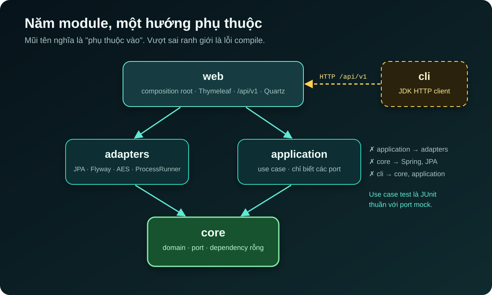
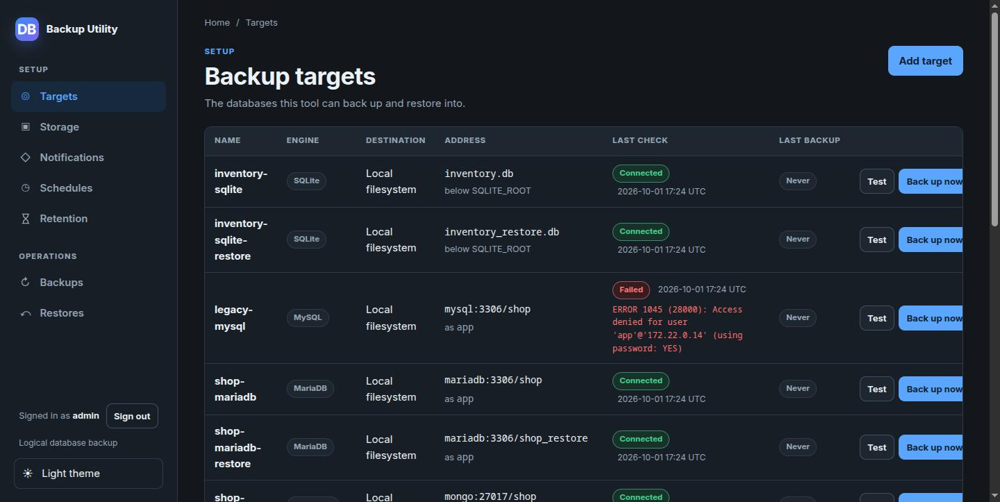

[NOTE]
====
Đây là *phần 1* trong series ba bài về https://github.com/hoangluongtran0309/database-backup-utility[Database Backup Utility].

. Kiến trúc hexagonal và lát cắt dọc _(bài này)_
. link:/blog/2026/backup-restore-verification/[Bảy database engine và một câu hỏi: backup này có restore được không?]
. link:/blog/2026/backup-utility-security-operations/[Bảo mật và vận hành một công cụ cầm chìa khóa mọi database]
====

Hầu hết các team đều có backup. Ít team hơn nhiều biết chắc backup của mình restore được. Một cron job chạy `mysqldump` mỗi đêm vẫn xanh trong nhiều tháng, cho tới ngày cần đến nó thì mới phát hiện file bị cắt cụt, client sai version, hoặc credential đã hết hạn từ lâu.

https://github.com/hoangluongtran0309/database-backup-utility[Database Backup Utility] là công cụ tự host mình viết để trả lời câu hỏi đó một cách nghiêm túc. Nó backup và restore logic cho bảy engine (MySQL, MariaDB, PostgreSQL, MongoDB, SQLite, cùng Oracle và SQL Server qua client pack tùy chọn), lưu artifact ở local, S3, GCS hoặc Azure, và có thể restore thử từng backup vào một database dùng một lần. Bản v0.1.0 ra ngày 14/09/2026; v0.20.0 là bản phát hành thứ 20, với 37 ADR ghi lại các quyết định trên đường đi.

Bài này nói về hình dạng của hệ thống. Hai bài sau đi vào từng engine, restore verification và phần bảo mật.

== Phạm vi hẹp là một tính năng

Câu đầu tiên trong README không phải danh sách tính năng mà là giới hạn: *chỉ full logical dump và restore vào cùng engine*. ROADMAP còn có một mục riêng tên "Deliberately out of scope", và nó viết rõ đây không phải "để sau" mà là "không có":

* Physical backup cho bất kỳ engine nào.
* Differential, incremental và chuỗi backup.
* Replay binlog, WAL hay oplog, và point-in-time recovery.
* Chuyển đổi hoặc restore giữa hai engine khác nhau.

Lý do rất thực tế. Mỗi thứ trong danh sách trên là một hệ thống riêng với cách thất bại riêng. Một logical dump thì đơn giản: một file, một định dạng chuẩn của engine, restore bằng chính công cụ của engine. Operator có thể tải file về và tự kiểm tra bằng `sha256sum` hoặc `pg_restore --list` mà không cần công cụ này. Giữ được sự đơn giản đó quan trọng hơn việc có thêm một tính năng nghe hấp dẫn.

== Năm module, và ranh giới là lỗi compile

Dự án này là bản viết lại. Theo ADR-001, bản tiền thân phình lên 376 file Java, riêng `core` đã 112 file, phần lớn vì cấu trúc được thêm vào trước khi cần. Câu hỏi đầu tiên của bản viết lại vì thế là: ngày đầu tiên, khi cả ứng dụng chỉ khoảng một tá class, cần bao nhiêu cấu trúc?

Có hai lựa chọn thật sự: một module với các package `core`/`application`/`adapters`/`web` và một test ArchUnit chặn import sai, hoặc mỗi tầng một Maven module để compiler tự giữ ranh giới. Mình chọn cách thứ hai, và về sau thêm module thứ năm cho CLI:

.Năm Maven module và hướng phụ thuộc

Điểm quyết định không phải là sự gọn gàng mà là `core` có *danh sách dependency rỗng*. Một class domain không thể import Spring hay JPA, không phải vì có quy tắc cấm, mà vì các jar đó không có trên classpath. Không có quy tắc nào phải nhớ và không có test nào phải giữ cho xanh.

Quan trọng không kém: *`application` không phụ thuộc `adapters`*. Nếu có, sẽ không có gì ngăn một use case vượt qua port để gọi thẳng JPA repository, và ngay khi điều đó xảy ra, mọi test use case đều cần Spring context và container. Giữ dependency đó vắng mặt là lý do test của use case là JUnit thuần với port được mock. `web` là module duy nhất thấy cả hai phía, và Spring nối chúng lại lúc khởi động.

Cái giá được chấp nhận rõ ràng: một tính năng chạm vào nhiều module, và có năm file pom cho một lượng code còn nhỏ. ADR cũng ghi luôn đường lui: nếu một ngày việc tách module tốn hơn lợi ích, gộp về một module nghĩa là phải đưa ArchUnit trở lại để thay vai trò của compiler.

== Mỗi tính năng là một lát cắt dọc

ROADMAP mở đầu bằng một quy tắc: *mỗi lần một lát cắt dọc*. Domain, adapter, use case, giao diện web, migration, test và tài liệu vào cùng một commit. Lát cắt sau không bắt đầu khi lát cắt trước chưa xong, và không có gì được xây trước lát cắt cần nó.

Vòng đầu tiên chỉ có MySQL và bảy bước: đăng ký target, test kết nối, chạy backup, nén gzip, restore, tải về và xóa, đóng gói Docker. Thêm bước đăng nhập, tám lát cắt đó thành v0.1.0. PostgreSQL chỉ xuất hiện ở lát cắt thứ 15, và đến lúc đó mới có khái niệm `DatabaseEngine`. Trước đó, mọi target là MySQL mà không cần lưu điều đó ở đâu cả.

Cách làm này có vẻ chậm, nhưng nó giữ cho mọi port trung thực. Khi engine thứ hai tới, các port được tổng quát hóa từ một trường hợp thật thay vì từ tưởng tượng:

[source,java]
----
/** Produces one full logical backup artifact. */
public interface LogicalBackupPort {

    DatabaseEngine engine(); // <1>

    /** Includes its leading dot, for example {@code .sql.gz} or {@code .dump}. */
    String artifactSuffix(); // <2>

    /** Writes the complete artifact and removes partial output on failure. */
    long dumpTo(DatabaseConnection connection, Path destination);

    // ... hai default method cho engine chạy job phía server (Oracle Data Pump)
}
----
<1> Mỗi adapter tự khai báo engine của mình; `EngineAdapterRegistry` đánh chỉ mục chúng một lần lúc khởi động.
<2> Định dạng artifact thuộc về adapter. Đặt `.sql.gz` trong use case sẽ biến nó thành một giả định ngầm về MySQL.

Registry còn từ chối một engine chỉ có một phần adapter: test kết nối, backup và restore phải có đủ cả ba, hoặc không có gì. Thiếu adapter là lỗi cấu hình rõ ràng, không bao giờ âm thầm rơi về engine khác.

== Gọi thẳng client của database, không dùng JDBC

Với một ứng dụng Java, cách tự nhiên để test kết nối là mở một JDBC connection. ADR-003 chọn cách ngược lại: chạy `mysql --execute="SELECT 1"` như một tiến trình con, và ứng dụng *không có MySQL JDBC driver* trên classpath compile.

Lý do quyết định: backup chính là `mysqldump`, một tiến trình con. Một phép thử bằng JDBC kiểm tra một đường đi *khác*. Nó có thể báo target khỏe trên một host mà `mysqldump` bị thiếu, không đọc được, hoặc sai version. Phép thử chỉ có giá trị nếu qua được nó dự đoán được rằng backup sẽ chạy, nghĩa là phải thử đúng theo cách backup chạy.

Lỗi hiển thị cho operator cũng là nguyên văn lời của MySQL:

.Danh sách target: lỗi `Access denied` được giữ nguyên văn từ MySQL

"Access denied", "Unknown database" và "Can't connect to MySQL server" dẫn operator tới ba chỗ khác nhau. Một câu "Connection failed" tự viết thì không dẫn đi đâu cả. Điều này đã được kiểm chứng ngay trong integration test: một backup user ít quyền nhận "Access denied ... to database" chứ không phải "Unknown database", vì MySQL không xác nhận schema có tồn tại hay không. Một thông báo được viết lại sẽ che mất sự khác biệt đó.

Gọi tiến trình con có những cái bẫy riêng, và tất cả được giải quyết một lần trong `ProcessRunner` thay vì ở từng chỗ gọi:

* Đọc stdout và stderr trên các thread riêng để tránh deadlock kinh điển khi pipe buffer đầy.
* Mọi tiến trình đều có timeout.
* Secret đi qua `ProcessBuilder.environment()` (`MYSQL_PWD`, `PGPASSWORD`...), không bao giờ qua argv hay system property.

Client binary trở thành dependency runtime bắt buộc, nên ứng dụng kiểm tra từng đường dẫn lúc khởi động và *từ chối khởi động* nếu một binary không chạy được. Cấu hình sai thành lỗi khởi động, thay vì một lỗi kết nối khó hiểu vài giờ sau. Có cả những chi tiết nhỏ như `localhost` được đổi thành `127.0.0.1`, vì client MySQL hiểu `localhost` là Unix socket và lặng lẽ bỏ qua `--port`.

== Ghi lại trước, chạy sau

Một `mysqldump` trên schema thật mất vài phút, nên không thể chạy trong HTTP request. Câu hỏi còn lại là thứ tự: khởi chạy rồi ghi lại, hay ghi lại rồi khởi chạy?

ADR-004 chọn: `RunBackupService.start` ghi một row `RUNNING`, *commit*, rồi mới đưa job vào pool, và controller redirect ngay tới `/executions/{id}`. Method này cố ý *không* có `@Transactional`. Nếu có, row sẽ vô hình với mọi connection khác cho tới khi method trả về, trong khi thread nền đọc qua một connection khác và có thể không thấy gì.

Pool là một `ThreadPoolExecutor` cố định với hàng đợi có giới hạn (`JOB_CONCURRENCY` mặc định 2, `JOB_QUEUE_CAPACITY` mặc định 20). Khi hàng đợi đầy, job bị từ chối và *lần từ chối đó được ghi lên row* thành một execution thất bại. Mình cố ý không dùng `CallerRunsPolicy`: nó sẽ chạy dump trên thread HTTP và mang lại đúng vấn đề mà ADR này muốn tránh.

Có một quy tắc nhỏ nhưng quan trọng cho trường hợp tiến trình chết giữa chừng. Backup chỉ chạy trong process này, nên một row vẫn còn `RUNNING` lúc khởi động chắc chắn thuộc về một process đã mất. Ứng dụng đánh dấu chúng thất bại khi khởi động. Không có quy tắc đó, console sẽ hiện một backup đã chết là "đang chạy" mãi mãi.

[TIP]
====
Mẫu "persist trước, chạy sau, sửa lúc khởi động" lặp lại ở mọi loại job sau này: restore, restore verification, và cả Oracle Data Pump, nơi job chạy ở phía server và phải được dừng lại một cách tường minh.
====

== Bài học từ phần kiến trúc

*Viết phạm vi "không làm" ra giấy.* Một danh sách out-of-scope rõ ràng giúp từ chối các yêu cầu hấp dẫn nhưng làm hệ thống phức tạp gấp nhiều lần.

*Để compiler giữ ranh giới.* Một ranh giới chỉ tồn tại trong quy ước sẽ bị vượt qua vào một ngày bận rộn. Một ranh giới là lỗi compile thì không.

*Kiểm tra đúng con đường sẽ được dùng.* Một health check không đi qua đường của thao tác thật chỉ là một con số xanh trên dashboard.

*Không bao giờ để operator nhìn thấy một trạng thái sai.* Ghi lại trước khi làm, ghi cả lần bị từ chối, và sửa những gì process trước để lại.

Ở link:/blog/2026/backup-restore-verification/[phần 2], mình sẽ đi qua bảy engine và tính năng mình thấy giá trị nhất của dự án: restore thử một backup mà không chạm vào database thật nào. Tổng quan dự án có tại link:/projects/database-backup-utility/[trang project].
