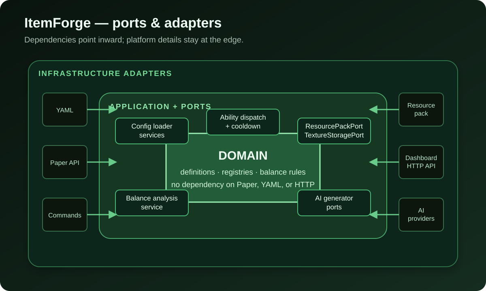
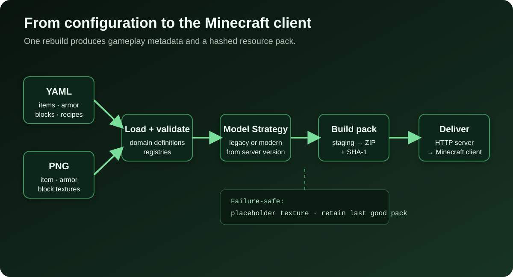

A custom item in Minecraft sounds simple: a sword with its own name and texture, plus an ability that fires when the player clicks. Getting that item onto a server is less simple. An operator has to connect gameplay configuration, item metadata, model JSON, textures, a resource pack, a place to host the pack, and the event-handling logic.

Each piece can also change between Minecraft versions. Starting with 1.21.4, the way the client maps an item to its model differs significantly from the older `CustomModelData` mechanism. If those details leak across the codebase, a version change can spread conditional branches everywhere.

That is why I built https://github.com/hoangluongtran0309/item-forge[ItemForge]: a free, open-source plugin for Paper where server administrators describe content in YAML and the plugin turns that configuration into working in-game items.

The first release does not try to match every feature of plugins that have existed for years. The goal of v1.0.0 is to complete one coherent, explainable path:

[quote]
____
One configuration travels from YAML to a domain model, gameplay logic, and a resource pack, whether the server uses the old or the new model system.
____

== Start with a stable configuration contract

This is a shortened version of the `void_sword` included with ItemForge:

[source,yaml]
----
items:
  void_sword:
    material: NETHERITE_SWORD
    custom-model-data: 1001
    display-name: "&5Void Netherite Sword"
    lore:
      - "&7Quenched in the dark between worlds."
    abilities:
      - type: POTION_EFFECT
        trigger: RIGHT_CLICK
        effect: SPEED
        duration-seconds: 15
        cooldown-seconds: 30
----

The person writing this configuration should only need to describe what the item is. They should not have to know whether the server will produce legacy or modern model files. `custom-model-data` remains in the same schema so a configuration can move from an older server to a newer one without splitting into two sets of files.

When the plugin starts, or when an administrator runs `/itemforge reload`, an adapter reads the YAML and maps it to domain records such as `ItemDefinition`, `ArmorDefinition`, and `RecipeDefinition`. Application services put those definitions into registries. Paper adapters then turn them into `ItemStack` instances, recipes, and listeners.

The dependency direction matters. The domain neither reads YAML nor calls the Paper API. YAML is one input, and Paper is one output. As a result, the balance rules can operate on the same domain model without starting a Minecraft server.

.The main ItemForge layers and their dependency direction

`ItemForgePlugin` remains the composition root. It detects the server version, creates the adapters, services, and registries, and wires them together. That bootstrap code is fairly long, but the wiring is deliberately concentrated in one place instead of being scattered through business logic.

== The hardest problem: two generations of item models

On servers before 1.21.4, ItemForge uses the legacy strategy: `CustomModelData` and an `overrides` list in the base material model. Starting with 1.21.4, it uses the `item_model` component and standalone item model files.

The two pack formats are different, but the rest of the system should not care. I put the difference behind `ItemModelStrategy` and select an implementation once at startup:

[source,java]
----
return version.isAtLeast(1, 21, 4)
        ? new ModernModelStrategy(modelJsonGenerator, textureFileCopier)
        : new LegacyModelStrategy(modelJsonGenerator, textureFileCopier);
----

Armor and blocks follow the same factory principle, but each has its own interface. They are not forced into a single abstraction merely because they all generate resource-pack files. Armor has to handle equipment assets and layer textures. Blocks have to generate blockstates from a note block's instrument-and-note pair.

This separation has three practical benefits:

* Version checks stay at the composition boundary.
* Configuration loading, commands, and gameplay flows are not duplicated by version.
* If Minecraft changes the format again, the area that needs to change already has a clear boundary.

The Strategy pattern does not remove the complexity. It gives that complexity a name and puts it somewhere that can be tested and replaced.

== From YAML to a resource-pack file

A valid item in a registry is not enough for a client to display its texture. ItemForge still has to create the correct directory tree, write model JSON, copy PNG files, generate `pack.mcmeta`, zip the staging directory, and calculate a SHA-1 hash.

.The resource-pack generation and delivery pipeline

`ResourcePackBuilder` coordinates that pipeline:

. Clear the previous staging directory so models for deleted items cannot remain in the new pack.
. Hand items, armor, and blocks to their respective strategies.
. Write `pack.mcmeta` for the detected server version.
. Package `resource-pack.zip` and calculate its SHA-1.
. If a host is configured, publish the new URL and hash for the player listener.

Two small failure modes have an outsized effect on operations.

First, one missing texture must not invalidate the whole pack. ItemForge creates a placeholder for the missing entry and logs the reason. An operator can still join the server, see which item is broken, and fix the right file instead of losing the complete resource pack.

Second, if a rebuild fails, the builder keeps the previous `currentPackInfo`. New players continue to receive the most recent pack that built successfully. This is not a fully transactional deployment, but it degrades more safely than replacing a known-good state with an empty one.

The built-in HTTP server removes another external deployment step. Once the pack has been created, the plugin serves the ZIP itself, and `PlayerJoinPackListener` sends its URL and hash to the client. If `resource-pack.host` is still `CHANGE_ME`, the pack is built locally but the HTTP server does not start.

== Items are only one part of the problem

Once the complete path worked for items, armor, recipes, and blocks exposed different Minecraft constraints.

=== Armor has two kinds of texture

An armor piece needs a flat icon for the inventory and a layer rendered on the player. On a modern server, ItemForge generates an equipment asset and uses the equippable component. On a legacy server, the plugin has to override a vanilla armor-layer path.

The legacy approach means only one custom armor set can occupy a vanilla material family. ItemForge documents that limitation instead of hiding it behind an abstraction that looks more complete than it is.

=== Recipes must identify an exact custom item

If a recipe only compares `Material`, every `NETHERITE_SWORD` looks like `void_sword`. `RecipeIngredientResolver` therefore checks for a custom item ID first, then an armor ID, and finally a vanilla `Material`. A custom ingredient has to match the metadata of that specific item.

ItemForge supports shaped and shapeless recipes, but custom blocks cannot yet be used as an ingredient or result in v1.0.0.

=== Custom blocks need durable state

A custom block is represented by a note block. Each definition owns a unique `instrument` and `note` pair, which the resource pack maps to a custom texture. The plugin records a tag by world coordinate so it can recognize the block after a restart. Listeners cover placement, breaking, piston movement, explosions, and vanilla automatically recalculating the instrument.

This behavior has been tested manually on a real server, but the piston, explosion, and chunk-reload edge cases do not yet have an automated regression suite. Because blocks modify persistent world state, the README recommends backing up a world before heavy use.

== Balance analysis: rules first, AI second

Once abilities and recipes can be defined in configuration, the hardest mistakes are not necessarily invalid YAML. An item can load successfully and still damage gameplay: a potion effect can last as long as its own cooldown, powerful gear can cost almost nothing to craft, or one armor set can mix incompatible material tiers.

`/itemforge analyze` handles this class of mistake with deterministic rules. The rules always run, require no API key, and produce the same findings for the same input. The analyzer scores every item before narrowing a report to one ID because an item can only be considered an outlier relative to the rest of the configuration.

AI is an additional layer for observations that are difficult to express as formulas, such as a gap in progression or two items that make each other pointless. It is disabled by default. If enabled and the API times out, reaches a quota, or returns an error, every rule finding remains intact and the report adds a notice that AI was unavailable.

That design follows a simple rule: a nondeterministic component with a monetary cost must not become a prerequisite for a core feature.

ItemForge currently includes adapters for Claude, ChatGPT, DeepSeek, and Gemini. The providers share one structured-output seam, so the application service does not need to know where the HTTP request is sent.

== The dashboard is a client, not the plugin core

Editing YAML works well with Git and automation, but it is not the most convenient workflow for every server administrator. ItemForge therefore includes a separate Spring Boot dashboard. It calls a bearer-token-protected REST API exposed by the plugin to manage items, armor, blocks, and recipes and to display balance reports.

The dashboard also includes Texture Studio, a browser-based pixel editor with previews for flat icons, 3D blocks, and both armor layers on a humanoid model. The reference library only reads resource packs imported by the user. ItemForge neither bundles nor downloads Minecraft assets.

Keeping the dashboard separate leaves two independent ways to use the project:

* Install only the JAR and edit YAML for the smallest system.
* Enable the API and run the dashboard when a visual management interface is useful.

The dashboard API and AI integration are both disabled by default. A `CHANGE_ME` placeholder is not treated as a valid credential: the plugin refuses to start the API until its bearer token is changed, and the dashboard refuses every login while its password hash is still the sample value.

== What v1.0.0 does not do yet

A trustworthy release is more than a list of completed features. ItemForge v1.0.0 has several explicitly documented limitations:

* `ON_HIT`, `ON_KILL`, and `ON_CONSUME` exist in the data model but are not dispatched at runtime.
* `DAMAGE_BONUS` can be parsed and validated but does not yet modify damage.
* A custom block cannot appear in a recipe or drop itself.
* A legacy server can render only one custom armor set per vanilla material family.
* Custom-block world-state edge cases do not yet have automated regression coverage.

The balance analyzer reports the unimplemented triggers and effect so a configuration does not silently load and then never execute. Turning a gap into an actionable warning is much better than pretending the abstraction is complete.

== Lessons I will carry into the next project

*Keep the user-facing contract stable.* Version details may change, but the same YAML should continue to describe the same item.

*Put differences at the boundary.* Version strategies, configuration adapters, and AI provider adapters keep Paper, filesystem, and HTTP details out of the application layer.

*Design the fallback before the happy path.* Placeholder textures, retaining the last good pack, and rule analysis that does not depend on AI all start with the same question: if this step fails, what can the operator still use?

*Do not force everything through one interface.* Items, armor, and blocks all contribute to a resource pack, but their constraints are different enough to deserve separate strategies.

*Documentation is part of the product.* The sample Void Netherite set, shipped defaults, security placeholders, and Known gaps section help other people evaluate the project by its actual state rather than by its marketing.

ItemForge v1.0.0 is only a foundation, but it completes a vertical slice from the domain to the in-game experience. You can see the overview on the link:/en/projects/itemforge/[ItemForge project page], read the https://github.com/hoangluongtran0309/item-forge[source on GitHub], or download https://github.com/hoangluongtran0309/item-forge/releases/tag/v1.0.0[release v1.0.0]. If you try it on your own server, bug reports with clear reproduction steps will be especially valuable for future releases.
