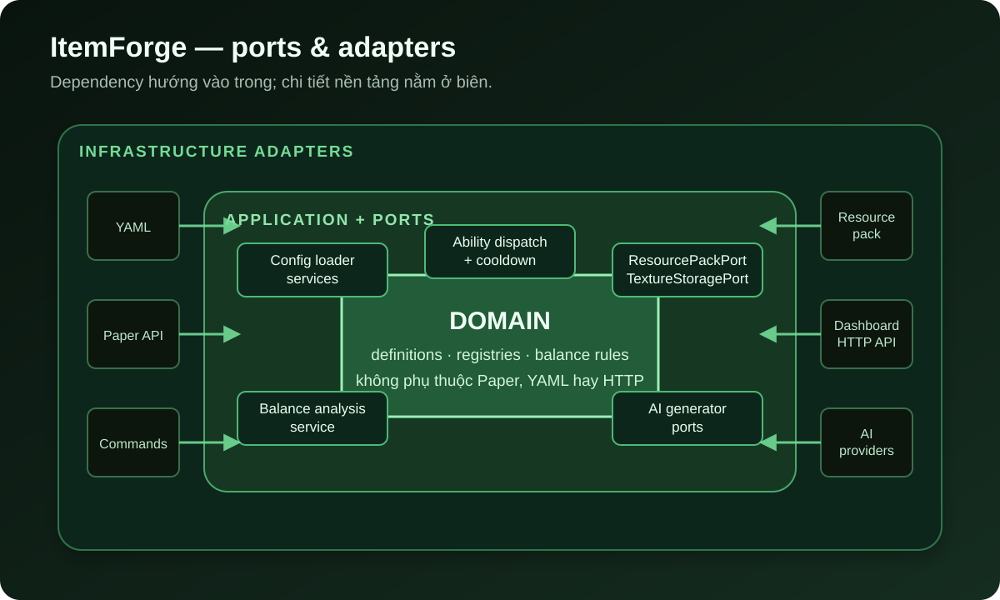
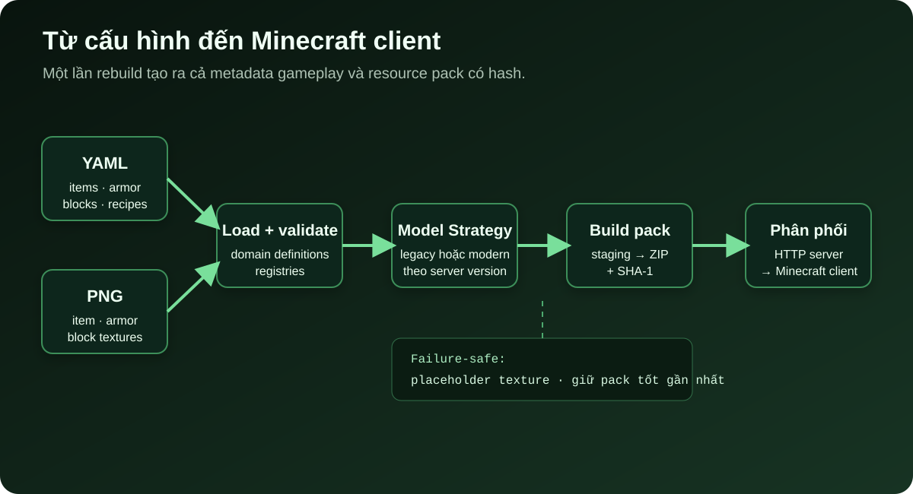

Một custom item trong Minecraft trông rất đơn giản: một thanh kiếm có tên riêng, texture riêng và một ability khi người chơi click chuột. Nhưng để đưa item đó vào server, người vận hành phải nối nhiều mảnh ghép với nhau: cấu hình gameplay, metadata của item, model JSON, texture, resource pack, nơi host file và logic xử lý sự kiện.

Mỗi mảnh lại thay đổi theo phiên bản Minecraft. Từ 1.21.4, cách client ánh xạ model cho item khác đáng kể so với cơ chế `CustomModelData` trước đó. Nếu để chi tiết này lọt vào toàn bộ codebase, một thay đổi phiên bản có thể kéo theo hàng loạt nhánh `if` khó kiểm soát.

Đó là lý do mình xây dựng https://github.com/hoangluongtran0309/item-forge[ItemForge]: một plugin miễn phí, mã nguồn mở cho Paper, nơi quản trị viên mô tả nội dung bằng YAML còn plugin chịu trách nhiệm biến cấu hình đó thành item hoạt động được trong game.

Phiên bản đầu tiên không cố thay thế mọi tính năng của các plugin lâu năm. Mục tiêu của v1.0.0 là tạo ra một đường đi hoàn chỉnh và có thể giải thích được:

[quote]
____
Một cấu hình duy nhất đi từ YAML đến domain model, gameplay logic và resource pack, bất kể server đang dùng cơ chế model cũ hay mới.
____

== Điểm bắt đầu: cấu hình phải là hợp đồng ổn định

Đây là phiên bản rút gọn của `void_sword` được phát hành cùng ItemForge:

[source,yaml]
----
items:
  void_sword:
    material: NETHERITE_SWORD
    custom-model-data: 1001
    display-name: "&5Void Netherite Sword"
    lore:
      - "&7Quenched in the dark between worlds."
    abilities:
      - type: POTION_EFFECT
        trigger: RIGHT_CLICK
        effect: SPEED
        duration-seconds: 15
        cooldown-seconds: 30
----

Người viết cấu hình chỉ cần quan tâm item là gì, không cần biết server sẽ tạo file model theo định dạng legacy hay modern. `custom-model-data` vẫn tồn tại trong cùng schema để cấu hình có thể được mang từ server cũ sang server mới mà không phải tách thành hai bộ file.

Khi plugin khởi động hoặc chạy `/itemforge reload`, YAML được adapter đọc và chuyển thành các domain record như `ItemDefinition`, `ArmorDefinition` và `RecipeDefinition`. Application service đưa chúng vào registry; các adapter Paper biến definition thành `ItemStack`, recipe và listener tương ứng.

Điểm quan trọng ở đây là hướng phụ thuộc: domain không đọc YAML và cũng không gọi Paper API. YAML chỉ là một đầu vào; Paper chỉ là một đầu ra. Nhờ vậy, rule phân tích cân bằng có thể chạy trên cùng domain model mà không cần khởi động Minecraft server.

.Các lớp chính của ItemForge và hướng phụ thuộc

`ItemForgePlugin` vẫn là composition root: nó phát hiện phiên bản server, tạo adapter, service và registry rồi nối chúng với nhau. Phần bootstrap này tương đối dài, nhưng sự dài dòng nằm ở một chỗ có chủ đích thay vì bị phân tán vào logic nghiệp vụ.

== Bài toán khó nhất: hai thế hệ model cùng tồn tại

Trên server trước 1.21.4, ItemForge dùng chiến lược legacy: `CustomModelData` và danh sách `overrides` trong model của material gốc. Từ 1.21.4, plugin dùng `item_model` component cùng các file item model độc lập.

Hai cách tạo pack khác nhau, nhưng phần còn lại của hệ thống không nên biết điều đó. Mình đặt khác biệt sau `ItemModelStrategy` và chọn implementation đúng một lần khi khởi động:

[source,java]
----
return version.isAtLeast(1, 21, 4)
        ? new ModernModelStrategy(modelJsonGenerator, textureFileCopier)
        : new LegacyModelStrategy(modelJsonGenerator, textureFileCopier);
----

Armor và block có factory cùng nguyên tắc nhưng interface riêng. Chúng không bị ép vào một abstraction chung chỉ vì đều sinh file cho resource pack: armor phải xử lý equipment asset và layer texture, còn block phải tạo blockstate từ cặp instrument/note của note block.

Cách tách này đem lại ba lợi ích thực tế:

* Điều kiện phiên bản chỉ xuất hiện ở biên khởi tạo.
* Luồng load config, command và gameplay không nhân đôi theo phiên bản.
* Khi Minecraft đổi định dạng lần nữa, phạm vi cần thay đổi đã có ranh giới rõ ràng.

Strategy không làm sự phức tạp biến mất. Nó gom sự phức tạp vào nơi có thể gọi tên, kiểm thử và thay thế.

== Từ YAML đến file resource pack

Một item hợp lệ trong registry chưa đủ để client nhìn thấy texture. ItemForge còn phải tạo đúng cây thư mục, ghi model JSON, copy PNG, tạo `pack.mcmeta`, zip thư mục staging và tính SHA-1.

.Pipeline tạo và phân phối resource pack

`ResourcePackBuilder` điều phối pipeline này:

. Xóa staging cũ để model của item đã bị xóa không lọt vào pack mới.
. Giao item, armor và block cho Strategy tương ứng.
. Ghi `pack.mcmeta` theo phiên bản server.
. Đóng gói `resource-pack.zip` và tính SHA-1.
. Nếu host đã được cấu hình, công bố URL và hash mới cho listener gửi tới người chơi.

Hai failure mode nhỏ lại ảnh hưởng lớn tới trải nghiệm vận hành.

Thứ nhất, thiếu một texture không được phép làm hỏng toàn bộ pack. ItemForge dùng placeholder cho entry bị thiếu và ghi rõ nguyên nhân vào log. Người vận hành vẫn có thể vào server, nhìn thấy item lỗi và sửa đúng file thay vì mất cả resource pack.

Thứ hai, nếu quá trình rebuild thất bại, builder giữ lại `currentPackInfo` trước đó. Người chơi mới vẫn nhận bản pack gần nhất đã tạo thành công. Đây không phải transactional deployment hoàn chỉnh, nhưng là một lựa chọn degrade an toàn hơn việc thay trạng thái tốt bằng trạng thái rỗng.

HTTP server tích hợp giúp bỏ một bước triển khai bên ngoài. Sau khi pack được tạo, plugin phục vụ chính file ZIP và `PlayerJoinPackListener` gửi URL cùng hash cho client. Nếu `resource-pack.host` vẫn là `CHANGE_ME`, pack chỉ được build cục bộ và HTTP server không khởi động.

== Item chỉ là một phần của bài toán

Sau khi đường đi cho item hoạt động, armor, recipe và block làm lộ ra những ràng buộc khác nhau của Minecraft.

=== Armor có hai loại texture

Một mảnh giáp cần icon phẳng trong inventory và layer được vẽ trên người chơi. Trên server modern, ItemForge sinh equipment asset và dùng equippable component. Với server legacy, plugin phải override đường dẫn layer vanilla.

Giới hạn của cách legacy là chỉ một bộ custom armor có thể chiếm một họ material vanilla. ItemForge ghi rõ giới hạn này thay vì che nó sau một abstraction tưởng như hoàn hảo.

=== Recipe phải nhận diện đúng custom item

Nếu recipe chỉ so sánh `Material`, mọi thanh `NETHERITE_SWORD` sẽ giống `void_sword`. `RecipeIngredientResolver` vì thế thử custom item id trước, rồi armor id, cuối cùng mới đến vanilla `Material`. Một nguyên liệu custom phải khớp chính xác metadata của item đó.

ItemForge hỗ trợ shaped và shapeless recipe, nhưng custom block chưa thể làm ingredient hoặc result trong v1.0.0.

=== Custom block cần trạng thái bền vững

Custom block được biểu diễn bằng note block. Mỗi definition sở hữu một cặp `instrument` và `note`, từ đó resource pack ánh xạ blockstate sang texture riêng. Plugin gắn tag theo tọa độ để nhận diện block sau khi server khởi động lại và có listener cho placement, breaking, piston, explosion cùng việc vanilla tự tính lại instrument.

Phần này đã được kiểm tra thủ công trên server thật, nhưng các edge case liên quan piston, explosion và chunk reload chưa có regression suite tự động. Vì block chạm trực tiếp vào world state, README khuyến nghị backup world trước khi sử dụng nặng.

== Balance analyzer: rule trước, AI sau

Khi cho phép định nghĩa ability và recipe bằng cấu hình, lỗi khó nhất không hẳn là YAML sai cú pháp. Một item vẫn có thể load hoàn toàn hợp lệ nhưng phá hỏng gameplay: potion effect tồn tại lâu bằng cooldown, trang bị mạnh mà gần như không tốn nguyên liệu, hoặc một bộ armor trộn nhiều material tier không hợp lý.

`/itemforge analyze` xử lý lớp lỗi này bằng các rule xác định. Rule luôn chạy, không cần API key và cho cùng kết quả với cùng một input. Analyzer chấm toàn bộ item trước khi lọc report theo id, vì một item chỉ có thể được xem là outlier khi đặt cạnh phần còn lại của config.

AI là lớp bổ sung cho những nhận xét khó mã hóa thành công thức, chẳng hạn khoảng trống progression hoặc hai item làm nhau trở nên vô nghĩa. Nó bị tắt mặc định. Nếu được bật nhưng API timeout, hết quota hoặc trả lỗi, rule findings vẫn còn nguyên và report thêm thông báo AI không khả dụng.

Thiết kế này dựa trên một nguyên tắc đơn giản: thành phần không xác định và có chi phí không được trở thành điều kiện để tính năng cốt lõi hoạt động.

ItemForge hiện hỗ trợ adapter cho Claude, ChatGPT, DeepSeek và Gemini. Các provider dùng chung một structured-output seam, nên application service không cần biết request HTTP được gửi tới đâu.

== Dashboard là một client, không phải lõi của plugin

Sửa YAML phù hợp với Git và automation, nhưng không phải cách làm thuận tiện nhất cho mọi server admin. Vì vậy ItemForge có một ứng dụng Spring Boot riêng làm dashboard. Nó gọi REST API có bearer token do plugin cung cấp để quản lý item, armor, block, recipe và xem balance report.

Dashboard còn có Texture Studio: pixel editor chạy trong trình duyệt với preview icon phẳng, block 3D và hai armor layer trên mô hình người. Reference library chỉ đọc resource pack do người dùng tự import; ItemForge không đóng gói hoặc tải asset Minecraft.

Việc tách dashboard khỏi plugin giữ hai chế độ sử dụng độc lập:

* Chỉ cài file JAR và sửa YAML nếu muốn hệ thống gọn nhất.
* Bật API và chạy dashboard khi cần giao diện quản trị.

API dashboard và AI đều tắt mặc định. Placeholder `CHANGE_ME` không được xem là credential hợp lệ: plugin từ chối khởi động API nếu bearer token chưa được thay đổi, và dashboard cũng từ chối đăng nhập nếu password hash còn là giá trị mẫu.

== Những gì v1.0.0 chưa làm

Một release đáng tin không chỉ là danh sách những gì đã xong. ItemForge v1.0.0 còn các giới hạn đã được ghi rõ:

* `ON_HIT`, `ON_KILL`, `ON_CONSUME` tồn tại trong data model nhưng chưa được dispatch ở runtime.
* `DAMAGE_BONUS` parse và validate được nhưng chưa áp dụng damage.
* Custom block chưa thể xuất hiện trong recipe hoặc drop chính nó.
* Legacy server chỉ render được một custom armor set trên mỗi họ material vanilla.
* Các edge case world state của custom block chưa có regression test tự động.

Balance analyzer tự báo các trigger và effect chưa thực thi, để cấu hình không im lặng load rồi không bao giờ chạy. Với mình, biến một khoảng trống thành cảnh báo có thể hành động tốt hơn nhiều so với giả vờ abstraction đã hoàn tất.

== Những bài học mình mang sang dự án tiếp theo

*Ổn định hợp đồng ở phía người dùng.* Chi tiết phiên bản có thể đổi, nhưng cùng một YAML nên tiếp tục mô tả cùng một item.

*Đặt khác biệt ở biên.* Version Strategy, config adapter và AI provider adapter giúp phần application không mang theo chi tiết của Paper, file system hay HTTP.

*Thiết kế đường lui trước đường đẹp.* Placeholder texture, pack cũ được giữ lại và rule analysis không phụ thuộc AI đều xuất phát từ việc hỏi: nếu bước này thất bại, người vận hành còn dùng được gì?

*Không ép mọi thứ vào một interface.* Item, armor và block đều sinh resource pack, nhưng ràng buộc khác nhau đủ lớn để chúng có Strategy riêng.

*Tài liệu là một phần của sản phẩm.* Sample “Void Netherite”, file cấu hình mặc định, security placeholder và phần Known gaps giúp người khác đánh giá dự án dựa trên trạng thái thật thay vì lời quảng cáo.

ItemForge v1.0.0 mới là nền móng, nhưng nó đã đi hết một lát cắt từ domain đến trải nghiệm trong game. Bạn có thể xem tổng quan tại link:/projects/itemforge/[trang project ItemForge], đọc https://github.com/hoangluongtran0309/item-forge[mã nguồn trên GitHub] hoặc tải https://github.com/hoangluongtran0309/item-forge/releases/tag/v1.0.0[release v1.0.0]. Nếu thử dự án trên server của mình, những bug report có bước tái hiện rõ ràng sẽ là đóng góp rất hữu ích cho các phiên bản tiếp theo.
