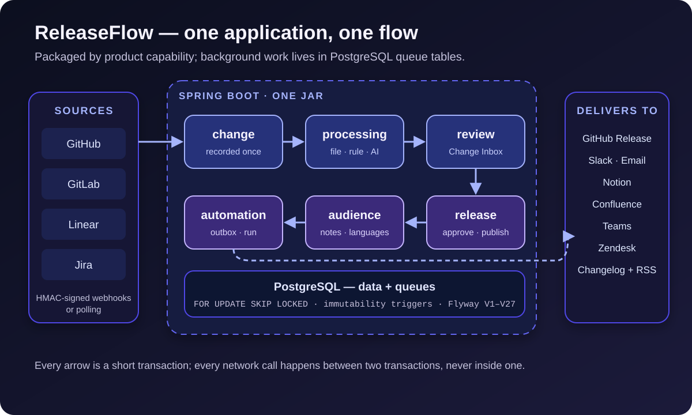

[NOTE]
====
This is *part 1* of a three-part series on https://github.com/hoangluongtran0309/ai-powered-release-notes-generator[ReleaseFlow].

. From merged pull requests to release notes _(this article)_
. link:/en/blog/2026/releaseflow-ai-human-review/[AI suggests, people decide]
. link:/en/blog/2026/releaseflow-security-multi-tenant/[Securing a multi-tenant app that takes webhooks from strangers]
====

Release notes are the document everyone wants to read and nobody wants to write. On release day, someone reopens the list of pull requests, guesses which changes are features and which are breaking, rewrites technical titles into sentences users understand, and then copies the same text into a GitHub Release, Slack, and an email.

That process has three built-in problems. It costs time exactly when the team is busiest. It misses things: a PR titled `chore: tidy` that edits a database migration still ends up under "maintenance". And it leaves no trail: once the note is out, nobody knows who decided whether a change was breaking.

https://github.com/hoangluongtran0309/ai-powered-release-notes-generator[ReleaseFlow] is my answer to that problem. v0.1.0 shipped on 23 September 2026 after 43 commits and 30 ADRs. Its goal fits in one sentence:

[quote]
____
Turn software changes into release notes that people have reviewed and that cannot change once published.
____

This article is about the overall shape of the system. The next two go deeper into the role of AI and into the security decisions.

== The main path: a change travels from source to reader

All of ReleaseFlow revolves around a single path:

. *Sources* send changes in: GitHub, GitLab, and Linear through signed webhooks; Jira Cloud through a poll every five minutes, so there is no webhook to set up.
. A *change* is recorded exactly once, however many times a webhook is redelivered.
. *Processing* asks the provider which files changed, classifies with rules, and, if enabled, asks an AI to write a summary.
. *Review*: someone on the team confirms or corrects the changes that need a second look.
. A *release* gathers changes, goes through review, and is published.
. *Audiences* get their own note each, in one or several languages.
. *Automation* delivers the published note to a GitHub Release, Slack, email, Notion, Confluence, Teams, Zendesk, or a public changelog.

.ReleaseFlow's data flow and boundaries

The diagram could pass for seven services. In reality, all of it lives in one application.

== One module, but not a big ball of mud

ReleaseFlow is a modular monolith: one Maven module, packaged as one executable JAR. The code is packaged by product capability rather than by technical layer:

----
com.hoangluongtran0309.releaseflow
├── account       # organizations, users, invitations
├── project       # projects and integration sources
├── change        # intake, processing, classification, review
├── category
├── audience      # audiences and templates
├── release       # release lifecycle and notes
├── translation
├── automation    # rules, runs, actions
├── changelog
├── github · gitlab · linear · jira
└── ...
----

Each package owns its controllers, services, repositories, and entities. Dependency direction is kept on purpose and recorded in an ADR when it changes. For example, `release` calls into `change` to record review decisions, but `change` never knows about `release`. When `account` needs three default audiences at registration, it publishes an `OrganizationRegistered` event that `audience` handles inside the same transaction, instead of calling it directly.

The predecessor project was split into two Maven modules: an AGPL open core and a proprietary enterprise part. For the rewrite I kept one module from the start and first recorded that as provisional. ADR-0029 settled it: there is no commercial plan that a compile-time boundary would serve, and *a boundary maintained for a plan nobody has is a cost with no payer*. The same ADR moved the repository to Apache-2.0, the licence of the Spring, Flyway, and Testcontainers ecosystem itself.

The monolith is not a compromise here. With one developer, one database, and a linear business flow, splitting into services only adds network hops, new ways to fail, and more things to deploy. Package boundaries give me most of the benefits of separate modules without the operational cost.

== Building one vertical slice at a time

ReleaseFlow was built one complete vertical slice at a time. Each slice goes from a Flyway migration, through domain and service, to both the REST API and the Thymeleaf UI, with integration tests running against a real PostgreSQL through Testcontainers. The README only describes what already runs; what does not yet lives in `docs/implementation-status.md`.

This approach has a consequence I like a lot: every slice has to answer one concrete design question, and the answer becomes a short ADR. The first multi-tenant slice produced ADR-0001. The background-processing slice produced ADR-0008. The automatic-AI slice produced ADR-0009, which superseded the earlier ADR-0004. The thirty ADRs read like a log of every time I changed my mind, and why.

Vertical slices also expose wrong assumptions early. ADR-0016 is an example: a Project used to have exactly one GitHub integration. When GitLab, Linear, and Jira arrived, the `github_integrations` table was renamed in place to `integration_sources`, keeping IDs, webhook paths, and ciphertexts. Nothing had to be re-encrypted, and every configured webhook kept working.

== A durable queue without a message broker

GitHub abandons a webhook after ten seconds. Processing a change, meanwhile, may need a GitHub call for the file list, an AI call for the summary, and retries when the network fails. None of that can happen inside the webhook request, and certainly not inside a database transaction.

ReleaseFlow's answer is *one table per kind of work* in PostgreSQL: `change_processing_jobs`, `source_sync_jobs`, `translation_jobs`, the automation outbox... The webhook does one thing: in a single transaction, it records the change as `PROCESSING` and a `PENDING` job. A scheduled worker claims jobs with this query:

[source,java]
----
// SKIP LOCKED lets several workers claim different jobs without waiting on each other.
@Query(value = """
        SELECT * FROM change_processing_jobs
        WHERE status IN ('PENDING', 'FALLBACK_REQUIRED') AND next_attempt_at <= :now
        ORDER BY next_attempt_at, created_at
        LIMIT 1
        FOR UPDATE SKIP LOCKED <1>
        """, nativeQuery = true)
Optional<ChangeProcessingJob> lockNextDue(@Param("now") Instant now);
----
<1> A row another worker has locked is skipped instead of waited on, so several instances run side by side without a leader.

Every job goes through three separate steps: *claim* it in a short transaction, *call the network* with no transaction open, then *record the result* in a second transaction. A claim is valid only while its time still matches the job row, so a slow worker cannot overwrite another worker's result.

The hardest part is a worker dying halfway. Fetching the file list again is safe to repeat. Calling the AI is not: it costs money and may answer differently the second time. So an abandoned job is recovered in two different ways:

[source,java]
----
// A worker that died mid-call leaves its claim behind. Collecting files is safe to
// repeat, but an AI call is not: a stale CLASSIFYING job is completed without it.
UPDATE change_processing_jobs
SET status = CASE status WHEN 'CLASSIFYING' THEN 'FALLBACK_REQUIRED' ELSE 'PENDING' END,
    next_attempt_at = :now
WHERE status IN ('ENRICHING', 'CLASSIFYING') AND claimed_at < :staleBefore
----

A job stuck in `ENRICHING` for more than ten minutes starts again. A job stuck in `CLASSIFYING` is completed from the rules and the recorded file list, *without a second AI call*, and that change must be reviewed by a person.

The same pattern is reused for history imports, translation, and automation. I never needed Kafka or RabbitMQ. PostgreSQL was already there and already backed up, and a job lives in the same transaction as its data, so there is no "change recorded but message lost" case.

== Publication is never held up by automation

Automation is where the queue pattern pays off most. The predecessor created automation runs in a `BEFORE_COMMIT` listener on publication. If a rule pointed at an audience with no note, the listener threw, and *the publication rolled back with it*. A mistyped Slack URL could block a release.

ReleaseFlow turns that around. `ReleaseService.publish` only publishes a `ReleasePublished` event; the listener writes exactly one row into `automation_publish_jobs` and does nothing else. It matches no rule, reads no note, and makes no network call. `AutomationWorker` turns that row into runs after the transaction commits. "A rule cannot block a release" becomes true *by construction*, not by care.

Outbound deliveries are not repeated lightly either. Classifying a change twice gives the same result; emailing a thousand people twice does not. So an action has an `UNKNOWN` state next to `FAILED`: if a worker stops while it is calling a provider, ReleaseFlow does not guess. That action is never resent on its own, and a person who wants to retry it must confirm they accept a possible duplicate.

== What v0.1.0 deliberately leaves out

ReleaseFlow's "not yet" list is long, and written down on purpose:

* Changing roles or removing members.
* Rotating secrets and tokens, or disconnecting and replacing a connected source.
* Paging and search in the Change Inbox, and bulk review.
* Correcting or withdrawing a published release note.
* Alerting and durable metric storage; the bundled Docker Compose stack is only a demo.

I find a clear list like that more useful than a README that promises everything. Anyone evaluating the project knows exactly what they are getting.

== Lessons from the architecture

*Choose the system's shape for your team and your data, not for fashion.* One person, one database, one linear flow: a monolith is the right call.

*Never call the network inside a transaction.* This rule shapes nearly every service in ReleaseFlow, and it makes reasoning about failures far simpler.

*Separate work that can be repeated from work that cannot.* Recovery must differ per state, and that difference belongs in the code.

*Record decisions as you make them.* A short ADR written during a slice is much cheaper than trying to remember months later.

In link:/en/blog/2026/releaseflow-ai-human-review/[part 2] I cover the part most people ask about: what the AI is allowed to do in ReleaseFlow, and why the answer is "less than you might think". The project overview is on the link:/en/projects/releaseflow/[ReleaseFlow project page].
