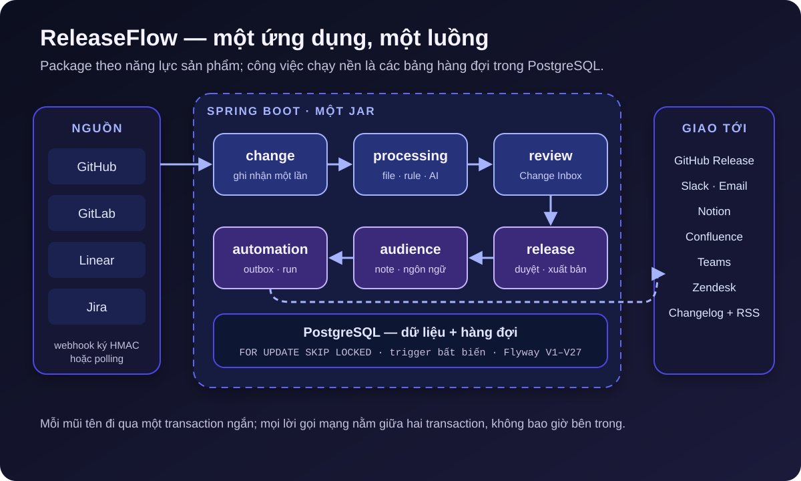

[NOTE]
====
Đây là *phần 1* trong series ba bài về https://github.com/hoangluongtran0309/ai-powered-release-notes-generator[ReleaseFlow].

. Từ pull request đã merge đến release note _(bài này)_
. link:/blog/2026/releaseflow-ai-human-review/[AI đề xuất, con người quyết định]
. link:/blog/2026/releaseflow-security-multi-tenant/[Bảo mật một ứng dụng multi-tenant nhận webhook từ người lạ]
====

Release note là loại tài liệu ai cũng muốn đọc nhưng không ai muốn viết. Đến ngày phát hành, người phụ trách phải mở lại danh sách pull request, đoán xem thay đổi nào là tính năng, thay đổi nào là breaking, viết lại tiêu đề kỹ thuật thành câu người dùng hiểu được, rồi copy cùng một nội dung sang GitHub Release, Slack và email.

Việc này có ba vấn đề cố hữu. Nó tốn thời gian đúng vào lúc team bận nhất. Nó dễ bỏ sót: một PR tên `chore: tidy` nhưng sửa migration database vẫn lọt vào mục "bảo trì". Và nó không có dấu vết: sau khi đăng, không ai biết ai đã quyết định một thay đổi là breaking hay không.

https://github.com/hoangluongtran0309/ai-powered-release-notes-generator[ReleaseFlow] là câu trả lời của mình cho bài toán đó. Phiên bản v0.1.0 được phát hành ngày 23/09/2026 sau 43 commit và 30 ADR. Mục tiêu của nó gói trong một câu:

[quote]
____
Biến những thay đổi phần mềm thành release note có người duyệt và bất biến sau khi xuất bản.
____

Bài này nói về hình dạng tổng thể của hệ thống. Hai bài sau đi sâu vào vai trò của AI và các quyết định bảo mật.

== Luồng chính: change đi từ nguồn đến người đọc

Toàn bộ ReleaseFlow xoay quanh một đường đi duy nhất:

. *Nguồn* gửi thay đổi vào: GitHub, GitLab và Linear qua webhook có chữ ký; Jira Cloud qua polling mỗi năm phút vì không cần cấu hình webhook.
. *Change* được ghi nhận đúng một lần, dù webhook có gửi lại bao nhiêu lần.
. *Processing* hỏi nhà cung cấp danh sách file đã đổi, phân loại bằng rule, và nếu được bật thì gọi AI để viết tóm tắt.
. *Review*: người trong team xác nhận hoặc sửa những change cần xem lại.
. *Release* gom change, đi qua vòng duyệt rồi xuất bản.
. *Audience* sinh một note riêng cho từng nhóm người đọc, bằng một hoặc nhiều ngôn ngữ.
. *Automation* giao note đã xuất bản tới GitHub Release, Slack, email, Notion, Confluence, Teams, Zendesk hoặc changelog công khai.

.Luồng dữ liệu và ranh giới của ReleaseFlow

Nhìn sơ đồ có thể nghĩ đây là bảy service. Thực tế tất cả nằm trong một ứng dụng.

== Một module, nhưng không phải một cục bùn

ReleaseFlow là một modular monolith: một Maven module, đóng gói thành một file JAR chạy được. Code được chia package theo năng lực sản phẩm chứ không theo tầng kỹ thuật:

----
com.hoangluongtran0309.releaseflow
├── account       # tổ chức, người dùng, lời mời
├── project       # project và nguồn tích hợp
├── change        # ghi nhận, xử lý, phân loại, review
├── category
├── audience      # audience và template
├── release       # vòng đời release và note
├── translation
├── automation    # rule, run, action
├── changelog
├── github · gitlab · linear · jira
└── ...
----

Mỗi package tự chứa controller, service, repository và entity của nó. Quy tắc phụ thuộc được giữ có chủ đích và ghi vào ADR khi thay đổi. Ví dụ `release` gọi sang `change` để ghi lại quyết định review, nhưng `change` không bao giờ biết đến `release`. Khi `account` cần tạo ba audience mặc định lúc đăng ký, nó phát một event `OrganizationRegistered` để `audience` xử lý trong cùng transaction thay vì gọi thẳng.

Dự án tiền thân từng tách thành hai Maven module, một phần open-core AGPL và một phần enterprise độc quyền. Khi viết lại, mình giữ một module ngay từ đầu và ban đầu ghi đó là quyết định tạm thời. Đến ADR-0029 mình chốt hẳn: không có kế hoạch thương mại nào cần ranh giới lúc compile, và *một ranh giới được duy trì cho một kế hoạch không ai có là chi phí không ai trả*. Cùng ADR đó, repository chuyển sang Apache-2.0, giấy phép của chính hệ sinh thái Spring, Flyway và Testcontainers.

Monolith ở đây không phải là thỏa hiệp. Với một người phát triển, một database và một luồng nghiệp vụ tuyến tính, tách service chỉ thêm network hop, thêm cách thất bại và thêm thứ phải triển khai. Ranh giới package cho mình phần lớn lợi ích của việc tách module mà không phải trả giá vận hành.

== Phát triển theo lát cắt dọc

ReleaseFlow được xây dựng từng lát cắt dọc (vertical slice) hoàn chỉnh. Mỗi lát cắt đi từ migration Flyway, qua domain và service, tới cả REST API lẫn giao diện Thymeleaf, kèm integration test chạy trên PostgreSQL thật bằng Testcontainers. README chỉ mô tả những gì đã chạy được; thứ chưa làm nằm trong `docs/implementation-status.md`.

Cách làm này có một hệ quả mình rất thích: mỗi lát cắt buộc phải trả lời một câu hỏi thiết kế cụ thể, và câu trả lời trở thành một ADR ngắn. Lát cắt đầu tiên về multi-tenant sinh ra ADR-0001. Lát cắt xử lý nền sinh ra ADR-0008. Lát cắt AI tự động sinh ra ADR-0009 và thay thế ADR-0004 trước đó. Ba mươi ADR cuối cùng đọc như nhật ký những lần mình đổi ý và lý do vì sao.

Lát cắt dọc cũng làm lộ sớm những giả định sai. ADR-0016 là ví dụ: một Project từng chỉ có đúng một GitHub integration. Khi cần GitLab, Linear và Jira, bảng `github_integrations` được đổi tên tại chỗ thành `integration_sources`, giữ nguyên ID, webhook path và ciphertext. Không phải mã hóa lại gì, và mọi webhook đã cấu hình vẫn chạy.

== Hàng đợi bền vững mà không cần message broker

Webhook của GitHub bị bỏ sau mười giây. Trong khi đó, xử lý một change có thể cần gọi GitHub lấy danh sách file, gọi AI viết tóm tắt, và thử lại khi mạng lỗi. Những việc đó không thể nằm trong request webhook, và càng không thể nằm trong một transaction database.

Giải pháp của ReleaseFlow là *mỗi loại công việc một bảng* trong PostgreSQL: `change_processing_jobs`, `source_sync_jobs`, `translation_jobs`, outbox của automation... Webhook chỉ làm một việc: trong một transaction, ghi change ở trạng thái `PROCESSING` và một job `PENDING`. Worker định kỳ nhận job bằng câu truy vấn này:

[source,java]
----
// SKIP LOCKED lets several workers claim different jobs without waiting on each other.
@Query(value = """
        SELECT * FROM change_processing_jobs
        WHERE status IN ('PENDING', 'FALLBACK_REQUIRED') AND next_attempt_at <= :now
        ORDER BY next_attempt_at, created_at
        LIMIT 1
        FOR UPDATE SKIP LOCKED <1>
        """, nativeQuery = true)
Optional<ChangeProcessingJob> lockNextDue(@Param("now") Instant now);
----
<1> Row đang bị worker khác khóa sẽ bị bỏ qua thay vì phải chờ, nên nhiều instance chạy cùng lúc mà không cần leader.

Mỗi job đi qua ba bước tách biệt: *nhận* job trong một transaction ngắn, *gọi mạng* khi không có transaction nào mở, rồi *ghi kết quả* trong transaction thứ hai. Claim chỉ hợp lệ khi thời điểm claim còn khớp với row trong bảng, nên một worker chậm không thể ghi đè kết quả của worker khác.

Phần khó nhất là khi worker chết giữa chừng. Lấy lại danh sách file thì an toàn để lặp lại. Gọi AI thì không: nó tốn tiền và có thể trả lời khác lần trước. Vì thế job bị bỏ lại được phục hồi theo hai cách khác nhau:

[source,java]
----
// A worker that died mid-call leaves its claim behind. Collecting files is safe to
// repeat, but an AI call is not: a stale CLASSIFYING job is completed without it.
UPDATE change_processing_jobs
SET status = CASE status WHEN 'CLASSIFYING' THEN 'FALLBACK_REQUIRED' ELSE 'PENDING' END,
    next_attempt_at = :now
WHERE status IN ('ENRICHING', 'CLASSIFYING') AND claimed_at < :staleBefore
----

Một job kẹt ở `ENRICHING` quá mười phút được làm lại từ đầu. Một job kẹt ở `CLASSIFYING` được hoàn tất bằng rule và danh sách file đã có, *không gọi AI lần thứ hai*, và change đó bắt buộc phải có người duyệt.

Cùng một mẫu được dùng lại cho import lịch sử, dịch note và automation. Mình chưa bao giờ cần Kafka hay RabbitMQ. PostgreSQL đã có sẵn, đã được backup, và job cùng dữ liệu nằm chung một transaction, tức là không có tình huống "đã ghi change nhưng mất message".

== Xuất bản không bao giờ bị automation chặn

Automation là nơi mẫu hàng đợi thể hiện rõ giá trị nhất. Dự án tiền thân tạo automation run ngay trong listener `BEFORE_COMMIT` của thao tác xuất bản. Nếu một rule trỏ tới audience chưa có note, listener ném exception và *việc xuất bản bị rollback theo*. Một URL Slack gõ sai có thể chặn cả release.

ReleaseFlow đảo ngược điều đó. `ReleaseService.publish` chỉ phát event `ReleasePublished`; listener ghi đúng một row vào `automation_publish_jobs` và không làm gì khác. Nó không match rule, không đọc note, không gọi mạng. `AutomationWorker` biến row đó thành run sau khi transaction đã commit. "Một rule không thể chặn release" trở thành đúng *theo cấu trúc*, không phải nhờ cẩn thận.

Việc giao hàng ra ngoài cũng không được lặp lại tùy tiện. Phân loại một change hai lần cho cùng kết quả; gửi email tới một nghìn người hai lần thì không. Vì vậy trạng thái action có thêm `UNKNOWN` bên cạnh `FAILED`: nếu worker dừng trong lúc đang gọi nhà cung cấp, ReleaseFlow không đoán. Action đó không bao giờ tự gửi lại, và người muốn thử lại phải xác nhận mình chấp nhận khả năng trùng lặp.

== Những gì v0.1.0 cố ý chưa làm

Danh sách "chưa làm" của ReleaseFlow dài và được viết ra có chủ đích:

* Đổi vai trò hoặc xóa thành viên.
* Xoay vòng secret và token, ngắt hoặc thay thế một nguồn đã kết nối.
* Phân trang và tìm kiếm trong Change Inbox, review hàng loạt.
* Sửa hoặc gỡ một release note đã xuất bản.
* Alerting và lưu trữ metrics lâu dài; Docker Compose đi kèm chỉ là môi trường demo.

Mình thấy một danh sách rõ ràng như vậy hữu ích hơn một README hứa hẹn mọi thứ. Người đánh giá dự án biết chính xác mình đang nhận gì.

== Bài học từ phần kiến trúc

*Chọn hình dạng hệ thống theo đội ngũ và dữ liệu, không theo xu hướng.* Một người, một database, một luồng tuyến tính: monolith là lựa chọn đúng.

*Không gọi mạng trong transaction.* Quy tắc này định hình gần như mọi service trong ReleaseFlow, và nó đơn giản hóa rất nhiều việc suy luận khi có lỗi.

*Phân biệt việc lặp lại được và việc không lặp lại được.* Recovery của từng trạng thái phải khác nhau, và điều đó cần được viết thẳng vào code.

*Ghi quyết định lại ngay khi đưa ra.* ADR ngắn viết trong lúc làm lát cắt rẻ hơn rất nhiều so với việc cố nhớ lại vài tháng sau.

Ở link:/blog/2026/releaseflow-ai-human-review/[phần 2], mình sẽ nói về phần nhiều người quan tâm nhất: AI được phép làm gì trong ReleaseFlow, và vì sao câu trả lời là "ít hơn bạn nghĩ". Tổng quan dự án có tại link:/projects/releaseflow/[trang project ReleaseFlow].
