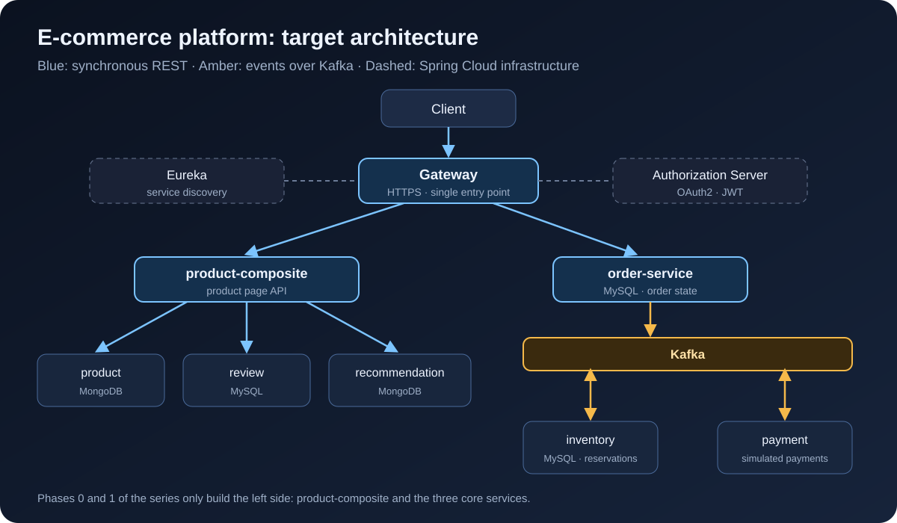

[NOTE]
====
This is *part 1* of a build-in-public series on an e-commerce microservices platform. I follow the book _Microservices with Spring Boot 3 and Spring Cloud_ (3rd edition, Magnus Larsson), but replace its example with a shop that has a cart, inventory, orders and payments. Every post has a git tag (`blog-01`, `blog-02`, ...) so you can check out the exact state of the code for that post.
====

I want to learn how to build a system that can scale, the kind of learning where you can actually do it afterwards. Reading a book and closing it means forgetting it quickly, so this time I am building a real project alongside each chapter and writing down every step. This series is that notebook.

By the end of this post you will have:

* The big picture of the system we build across the series.
* A machine with all the tools installed.
* A Gradle multi-project build that compiles, with two shared modules: `api` and `util`.

== Why microservices?

Honestly, a small shop is fine as a monolith, and that is usually the right choice. I picked microservices because the goal of this project is *to learn how to build a system that can scale*, and e-commerce is a great fit for that:

* *Load is uneven across the system.* The product pages can get a hundred times more requests than checkout. Split them apart and you can scale the catalog on its own.
* *Failures do not spread.* If the recommendation service goes down, customers must still be able to browse and buy.
* *Ordering is asynchronous by nature.* Create the order, reserve stock, charge the card, send the email: a chain of steps that can fail halfway, which makes it ideal for learning event-driven design and sagas.

The price is complexity: service discovery, a gateway, security between services, tracing, centralized logging. That is exactly what the book, and this series, are about.

== What the system will look like

The book builds four services: `product`, `review`, `recommendation` and `product-composite` (which aggregates the other three). That is really the *product detail page* of a shop, so I keep them and add the services needed to buy things:

[cols="2,2,1"]
|===
|Service |Role |Database

|`product-service` |Catalog: products and prices |MongoDB
|`review-service` |Product reviews |MySQL
|`recommendation-service` |Product recommendations |MongoDB
|`product-composite-service` |API for the product page |none
|`inventory-service` |Stock and reservations |MySQL
|`order-service` |Orders |MySQL
|`payment-service` |Payments (simulated) |none
|===

Around them sits the Spring Cloud infrastructure: *Eureka* (service discovery), *Spring Cloud Gateway* (the single entry point), *Spring Authorization Server* (OAuth2), and *Kafka* so services can talk to each other through events.

.Target architecture at the end of the Spring Cloud part of the series

The order flow will work like this:

. `order-service` creates the order in `PENDING` state and publishes an event to Kafka.
. `inventory-service` reserves the stock and answers `RESERVED` or `REJECTED`.
. `payment-service` charges the customer and answers `COMPLETED` or `FAILED`.
. `order-service` moves the order to `CONFIRMED` or `CANCELLED`; on failure, the stock is released.

The series has four parts:

. *Foundations* (posts 1 to 5): the first service, calls between services, Docker, API documentation.
. *Data and events* (posts 6 to 10): MongoDB, MySQL, reactive, Kafka, the order saga.
. *Spring Cloud* (posts 11 to 16): Eureka, Gateway, OAuth2, Config Server, Resilience4j, tracing.
. *Kubernetes and operations* (post 17 onwards): Helm, autoscaling, Istio, logging and monitoring.

== The stack, and where I differ from the book

The book targets Java 17, Spring Boot 3.0 and Spring Cloud 2022. Those versions are out of support, so I use newer ones. The APIs are almost unchanged, so you can still read the book side by side.

[cols="1,1,1"]
|===
|Component |Book |This series

|Java |17 |*21* (LTS)
|Spring Boot |3.0.x |*3.5.x*
|Spring Cloud |2022.0.x |*2025.0.x*
|Build |Gradle |Gradle 8.14
|Message broker |RabbitMQ and Kafka |*Kafka* (KRaft mode, no Zookeeper)
|===

Whenever the code differs from the book because of a newer version, I call it out right there.

== Installing the tools

This post only needs a JDK and Git. Docker is needed from post 4, but you might as well install it now:

[cols="1,2,1"]
|===
|Tool |Used for |Check

|JDK 21 (Temurin) |Building and running the services |`java -version`
|Git |Version control |`git --version`
|Docker Desktop or Docker Engine |Running the system with Docker Compose |`docker compose version`
|`curl`, `jq` |Testing the APIs from scripts |`jq --version`
|IntelliJ IDEA or VS Code |Writing code |
|===

On macOS I use Homebrew and SDKMAN:

[source,bash]
----
brew install git jq
brew install --cask docker
curl -s "https://get.sdkman.io" | bash
sdk install java 21-tem
----

On Windows, the book (chapter 22) recommends *WSL2 + Ubuntu* and then installing everything as on Linux. I recommend the same, because every bash script in this series runs in WSL2 without changes.

You do not need to install Gradle: the project uses the *Gradle Wrapper* (`./gradlew`), which downloads the right version for you.

== The Gradle multi-project skeleton

Each microservice is its own Spring Boot application. But to learn and run everything on one machine, the book puts them all in *one Gradle multi-project repository*: one build, while the services stay independent at runtime. By the end of the series the layout looks like this:

----
ecommerce-platform/
├── api/                  # shared REST interfaces, DTOs, events
├── util/                 # global error handling, utilities
├── microservices/        # business services (from post 2)
├── spring-cloud/         # eureka, gateway, authorization-server (from post 11)
├── build.gradle
├── settings.gradle
└── gradlew
----

=== Create the folders and the Gradle Wrapper

[source,bash]
----
mkdir ecommerce-platform && cd ecommerce-platform
git init
gradle wrapper --gradle-version 8.14.3   # needs Gradle installed, this one time only
mkdir -p api/src/main/java/com/ecommerce/api util/src/main/java/com/ecommerce/util
----

[TIP]
====
If you do not want to install Gradle, generate a project on https://start.spring.io[start.spring.io] (pick _Gradle - Groovy_) and copy `gradlew`, `gradlew.bat` and the `gradle/` folder over.
====

=== `settings.gradle`: declaring the modules

[source,groovy]
----
rootProject.name = 'ecommerce-platform'

include ':api'
include ':util'
----

Each following post adds an `include` line, for example `include ':microservices:product-service'` in post 2.

=== The root `build.gradle`: shared configuration in one place

This is where I differ slightly from the book. The book lets every module declare its own plugins and versions. I moved the repeated parts into the root file, so upgrading Spring Boot later means changing *one* line:

[source,groovy]
----
import org.springframework.boot.gradle.plugin.SpringBootPlugin

plugins {
    id 'org.springframework.boot' version '3.5.16' apply false // <1>
    id 'io.spring.dependency-management' version '1.1.7' apply false
}

ext {
    springCloudVersion = '2025.0.3'
    springdocVersion = '2.8.17'
    mapstructVersion = '1.6.3'
}

subprojects {
    // Grouping folders (microservices, spring-cloud) are not Java projects
    if (project.buildFile.exists() == false) return // <2>

    apply plugin: 'java'
    apply plugin: 'io.spring.dependency-management'

    group = 'com.ecommerce'
    version = '1.0.0-SNAPSHOT'

    java {
        toolchain {
            languageVersion = JavaLanguageVersion.of(21) // <3>
        }
    }

    repositories {
        mavenCentral()
    }

    dependencyManagement {
        imports { // <4>
            mavenBom SpringBootPlugin.BOM_COORDINATES
            mavenBom "org.springframework.cloud:spring-cloud-dependencies:${springCloudVersion}"
        }
    }

    tasks.withType(JavaCompile).configureEach {
        options.compilerArgs += ['-parameters'] // <5>
    }

    tasks.withType(Test).configureEach {
        useJUnitPlatform()
    }
}
----
<1> `apply false`: the Spring Boot plugin is resolved but not applied to any module yet. Only runnable services `apply plugin: 'org.springframework.boot'`. Library modules such as `api` and `util` do not, because the plugin packages a module as a fat jar, which a library does not need.
<2> Skip folders that only group other projects, such as `microservices/`.
<3> Gradle uses JDK 21 even if your machine's default JDK is a different version.
<4> The Spring Boot and Spring Cloud BOMs: dependencies need no version numbers, and the libraries are always compatible with each other.
<5> Keep parameter names when compiling, so Spring can read `@PathVariable int productId` without writing `@PathVariable("productId")`.

== The `api` module: the contract between services

`api` holds what services must *agree on*: REST interfaces, DTOs, and later on, events. In post 3, the composite service shares the `ProductService` interface with product-service, so the two sides cannot drift apart.

[source,groovy]
.api/build.gradle
----
plugins {
    id 'java-library'
}

dependencies {
    api 'org.springframework.boot:spring-boot-starter-webflux'
    api "org.springdoc:springdoc-openapi-starter-common:${springdocVersion}"
    api 'com.fasterxml.jackson.datatype:jackson-datatype-jsr310'
}
----

The `java-library` plugin and the `api` configuration (instead of `implementation`) make these libraries visible to every module that depends on `api`. The book uses WebFlux from chapter 3, and so do I. `springdoc-openapi-starter-common` only contains the documentation annotations, which we use in post 5.

The first DTO, written as a *Java record*:

[source,java]
.api/src/main/java/com/ecommerce/api/core/product/Product.java
----
package com.ecommerce.api.core.product;

import java.math.BigDecimal;

public record Product(int productId, String name, BigDecimal price, String serviceAddress) {
}
----

The book uses classes with getters and setters; records are shorter, immutable, and fully supported by Jackson. I added `price` as a `BigDecimal` because this is a shop: *never use `double` for money*. The `serviceAddress` field tells you which instance answered the request, which becomes very useful once we scale out in the Spring Cloud part.

The REST interface:

[source,java]
.api/src/main/java/com/ecommerce/api/core/product/ProductService.java
----
package com.ecommerce.api.core.product;

import org.springframework.web.bind.annotation.GetMapping;
import org.springframework.web.bind.annotation.PathVariable;
import reactor.core.publisher.Mono;

public interface ProductService {

    @GetMapping(value = "/product/{productId}", produces = "application/json")
    Mono<Product> getProduct(@PathVariable int productId);
}
----

The `@GetMapping` annotation sits on the interface itself, so in post 2 a controller only has to `implements ProductService` to get the endpoint. `Mono<Product>` means "one product, available at some point in the future"; that is enough for now, post 2 goes deeper.

Finally, the shared exceptions in the `com.ecommerce.api.exceptions` package:

[source,java]
----
package com.ecommerce.api.exceptions;

public class NotFoundException extends RuntimeException {

    public NotFoundException(String message) {
        super(message);
    }

    public NotFoundException(String message, Throwable cause) {
        super(message, cause);
    }
}
----

Create `InvalidInputException` (business-level invalid input, such as a negative id) and `BadRequestException` the same way.

== The `util` module: error handling once, for every service

[source,groovy]
.util/build.gradle
----
plugins {
    id 'java-library'
}

dependencies {
    api project(':api')
}
----

Instead of letting every service catch exceptions and return error JSON in its own format, we write one shared `@RestControllerAdvice`. First, the error format:

[source,java]
.util/src/main/java/com/ecommerce/util/http/HttpErrorInfo.java
----
package com.ecommerce.util.http;

import java.time.ZonedDateTime;
import org.springframework.http.HttpStatus;

public record HttpErrorInfo(ZonedDateTime timestamp, String path, HttpStatus httpStatus, String message) {

    public HttpErrorInfo(HttpStatus httpStatus, String path, String message) {
        this(ZonedDateTime.now(), path, httpStatus, message);
    }
}
----

Then the handler, which maps each exception to an HTTP status:

[source,java]
.util/src/main/java/com/ecommerce/util/http/GlobalControllerExceptionHandler.java
----
package com.ecommerce.util.http;

import static org.springframework.http.HttpStatus.BAD_REQUEST;
import static org.springframework.http.HttpStatus.NOT_FOUND;
import static org.springframework.http.HttpStatus.UNPROCESSABLE_ENTITY;

import com.ecommerce.api.exceptions.BadRequestException;
import com.ecommerce.api.exceptions.InvalidInputException;
import com.ecommerce.api.exceptions.NotFoundException;
import org.slf4j.Logger;
import org.slf4j.LoggerFactory;
import org.springframework.http.HttpStatus;
import org.springframework.http.server.reactive.ServerHttpRequest;
import org.springframework.web.bind.annotation.ExceptionHandler;
import org.springframework.web.bind.annotation.ResponseStatus;
import org.springframework.web.bind.annotation.RestControllerAdvice;

@RestControllerAdvice
class GlobalControllerExceptionHandler {

    private static final Logger LOG = LoggerFactory.getLogger(GlobalControllerExceptionHandler.class);

    @ResponseStatus(BAD_REQUEST)
    @ExceptionHandler(BadRequestException.class)
    public HttpErrorInfo handleBadRequestExceptions(ServerHttpRequest request, BadRequestException ex) {
        return createHttpErrorInfo(BAD_REQUEST, request, ex);
    }

    @ResponseStatus(NOT_FOUND)
    @ExceptionHandler(NotFoundException.class)
    public HttpErrorInfo handleNotFoundExceptions(ServerHttpRequest request, NotFoundException ex) {
        return createHttpErrorInfo(NOT_FOUND, request, ex);
    }

    @ResponseStatus(UNPROCESSABLE_ENTITY)
    @ExceptionHandler(InvalidInputException.class)
    public HttpErrorInfo handleInvalidInputException(ServerHttpRequest request, InvalidInputException ex) {
        return createHttpErrorInfo(UNPROCESSABLE_ENTITY, request, ex);
    }

    private HttpErrorInfo createHttpErrorInfo(HttpStatus httpStatus, ServerHttpRequest request, Exception ex) {
        final String path = request.getPath().pathWithinApplication().value();
        final String message = ex.getMessage();
        LOG.debug("Returning HTTP status: {} for path: {}, message: {}", httpStatus, path, message);
        return new HttpErrorInfo(httpStatus, path, message);
    }
}
----

With that in place, any service just needs to `throw new NotFoundException("No product found for productId: 13")` and the client always gets the same format:

[source,json]
----
{
  "timestamp": "2026-10-02T05:57:56.405471652Z",
  "path": "/product/13",
  "httpStatus": "NOT_FOUND",
  "message": "No product found for productId: 13"
}
----

[NOTE]
====
This class lives in the `com.ecommerce.util` package, which is not the package of any service. Spring Boot only scans the package of the `main` class by default, so in post 2 we add `@ComponentScan("com.ecommerce")` to pick up this handler.
====

Last, the `.gitignore`:

----
.gradle/
build/
!gradle/wrapper/gradle-wrapper.jar
.idea/
*.iml
.vscode/
out/
bin/
.DS_Store
----

== Checking the result

[source,bash]
----
./gradlew build
----

You should see `BUILD SUCCESSFUL`. No service runs yet, but the foundation is in place: one place to manage versions, a shared API contract, and consistent error handling. Commit it:

[source,bash]
----
git add .
git commit -m "Post 1: Gradle multi-project skeleton with api and util modules"
git tag blog-01
----

== Summary

* We know what we are building: seven business services, Eureka, Gateway, an Authorization Server and Kafka.
* The Gradle multi-project build is set up, with shared configuration in the root file.
* The `api` module holds records, REST interfaces and exceptions; `util` holds the global error handling.

In link:/en/blog/2026/ecommerce-microservices-02-product-service/[part 2], I create the first service, `product-service`: a controller written from the interface in `api`, tried out with `curl` and tested with `WebTestClient`.
