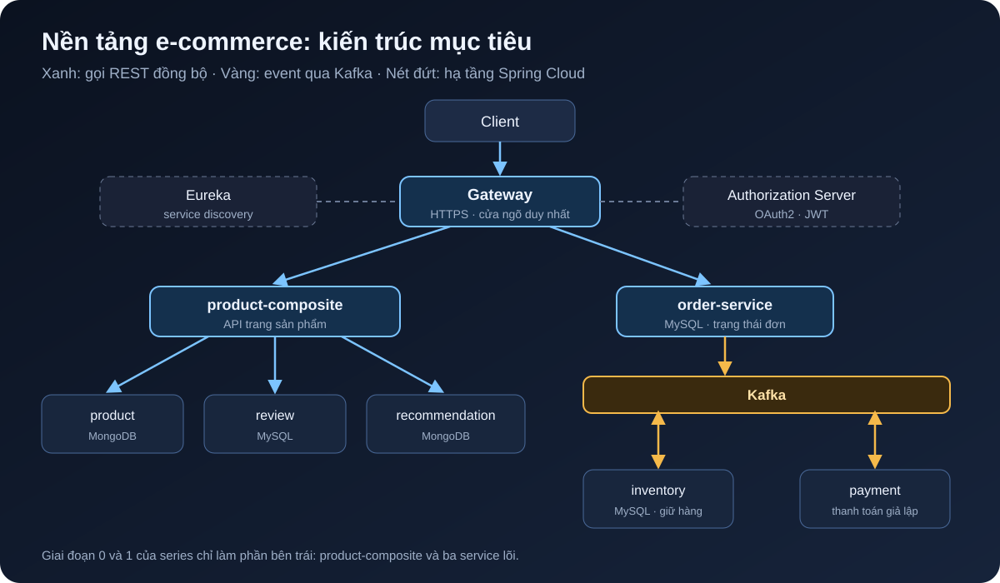

[NOTE]
====
Đây là *bài 1* trong series vừa làm vừa viết về một nền tảng e-commerce microservices. Mình bám theo cuốn _Microservices with Spring Boot 3 and Spring Cloud_ (3rd edition, Magnus Larsson), nhưng thay ví dụ trong sách bằng một shop có giỏ hàng, tồn kho, đặt hàng và thanh toán. Mỗi bài có một git tag (`blog-01`, `blog-02`, ...) để bạn checkout đúng trạng thái code của bài đó. Toàn bộ code nằm ở repo link:https://github.com/hoangluongtran0309/ecommerce-platform[ecommerce-platform] trên GitHub.
====

Mình muốn học cách xây một hệ thống có thể scale, theo kiểu học được thì làm được. Đọc sách xong rồi gấp lại thì quên rất nhanh, nên lần này mình làm một dự án thật song song với từng chương và ghi lại từng bước. Series này là cuốn sổ ghi chép đó.

Cuối bài này bạn sẽ có:

* Bức tranh tổng thể về hệ thống sẽ xây trong cả series.
* Máy đã cài đủ công cụ.
* Một project Gradle multi-project build được, với hai module dùng chung là `api` và `util`.

== Vì sao lại là microservices?

Nói thật, một shop nhỏ thì monolith là đủ, và thường là lựa chọn đúng. Mình chọn microservices vì mục tiêu của dự án là *học cách xây một hệ thống có thể scale*, và e-commerce là ví dụ rất hợp:

* *Tải không đều giữa các phần.* Trang xem sản phẩm có thể nhận gấp trăm lần request so với trang thanh toán. Tách ra thì scale riêng phần catalog được.
* *Lỗi không lan ra cả hệ thống.* Service gợi ý sản phẩm sập thì người dùng vẫn phải xem và mua được hàng.
* *Luồng đặt hàng vốn là bất đồng bộ.* Tạo đơn, giữ hàng trong kho, trừ tiền, gửi email là chuỗi bước có thể thất bại ở giữa, rất hợp để học event-driven và saga.

Cái giá phải trả là độ phức tạp: service discovery, gateway, bảo mật giữa các service, tracing, log tập trung. Đó cũng chính là nội dung của cả cuốn sách và cả series này.

== Hệ thống sẽ trông như thế nào

Sách xây bốn service: `product`, `review`, `recommendation` và `product-composite` (gộp ba service kia lại). Thực chất đó là *trang chi tiết sản phẩm* của một shop, nên mình giữ nguyên và thêm các service mua bán:

[cols="2,2,1"]
|===
|Service |Vai trò |Database

|`product-service` |Catalog: sản phẩm, giá |MongoDB
|`review-service` |Đánh giá sản phẩm |MySQL
|`recommendation-service` |Gợi ý sản phẩm |MongoDB
|`product-composite-service` |API cho trang sản phẩm |không có
|`inventory-service` |Tồn kho, giữ hàng |MySQL
|`order-service` |Đơn hàng |MySQL
|`payment-service` |Thanh toán (giả lập) |không có
|===

Bao quanh là hạ tầng của Spring Cloud: *Eureka* (service discovery), *Spring Cloud Gateway* (cửa ngõ duy nhất), *Spring Authorization Server* (OAuth2), và *Kafka* để các service nói chuyện với nhau bằng event.

.Kiến trúc mục tiêu khi kết thúc phần Spring Cloud của series

Luồng đặt hàng sẽ chạy như sau:

. `order-service` tạo đơn ở trạng thái `PENDING` và bắn event lên Kafka.
. `inventory-service` giữ hàng, báo `RESERVED` hoặc `REJECTED`.
. `payment-service` trừ tiền, báo `COMPLETED` hoặc `FAILED`.
. `order-service` chuyển đơn sang `CONFIRMED` hoặc `CANCELLED`; nếu thất bại thì kho trả lại hàng.

Series chia làm bốn phần:

. *Nền móng* (bài 1 đến 5): service đầu tiên, gọi giữa các service, Docker, tài liệu API.
. *Dữ liệu và sự kiện* (bài 6 đến 10): MongoDB, MySQL, reactive, Kafka, saga đặt hàng.
. *Spring Cloud* (bài 11 đến 16): Eureka, Gateway, OAuth2, Config Server, Resilience4j, tracing.
. *Kubernetes và vận hành* (bài 17 trở đi): Helm, autoscale, Istio, log và monitoring.

== Stack, và chỗ mình làm khác sách

Sách viết cho Java 17, Spring Boot 3.0 và Spring Cloud 2022. Các bản đó đã hết hỗ trợ, nên mình dùng bản mới hơn. API gần như giữ nguyên nên bạn vẫn đọc sách song song được.

[cols="1,1,1"]
|===
|Thành phần |Sách |Series này

|Java |17 |*21* (LTS)
|Spring Boot |3.0.x |*3.5.x*
|Spring Cloud |2022.0.x |*2025.0.x*
|Build |Gradle |Gradle 8.14
|Message broker |RabbitMQ và Kafka |*Kafka* (chế độ KRaft, không cần Zookeeper)
|===

Khi nào code khác sách vì phiên bản mới, mình sẽ ghi chú ngay chỗ đó.

== Cài công cụ

Bài này chỉ cần JDK và Git. Docker cần từ bài 4, nhưng cài luôn cho xong:

[cols="1,2,1"]
|===
|Công cụ |Dùng để |Kiểm tra

|JDK 21 (Temurin) |Build và chạy service |`java -version`
|Git |Quản lý code |`git --version`
|Docker Desktop hoặc Docker Engine |Chạy hệ thống bằng Docker Compose |`docker compose version`
|`curl`, `jq` |Test API trong script |`jq --version`
|IntelliJ IDEA hoặc VS Code |Viết code |
|===

Trên macOS mình dùng Homebrew và SDKMAN:

[source,bash]
----
brew install git jq
brew install --cask docker
curl -s "https://get.sdkman.io" | bash
sdk install java 21-tem
----

Trên Windows, sách (chương 22) khuyên dùng *WSL2 + Ubuntu*, rồi cài như Linux. Mình cũng khuyên vậy, vì các script bash của series đều chạy trong WSL2 mà không phải sửa gì.

Bạn không cần cài Gradle: project dùng *Gradle Wrapper* (`./gradlew`), nó sẽ tự tải đúng phiên bản.

== Dựng khung Gradle multi-project

Mỗi microservice là một ứng dụng Spring Boot riêng. Nhưng để học và chạy trên một máy, sách đặt tất cả vào *một repo Gradle multi-project*: build một lần, các service vẫn độc lập với nhau khi chạy. Cấu trúc thư mục khi xong series sẽ như sau:

----
ecommerce-platform/
├── api/                  # interface REST, DTO, event dùng chung
├── util/                 # xử lý lỗi toàn cục, tiện ích
├── microservices/        # các service nghiệp vụ (từ bài 2)
├── spring-cloud/         # eureka, gateway, authorization-server (từ bài 11)
├── build.gradle
├── settings.gradle
└── gradlew
----

=== Tạo thư mục và Gradle Wrapper

[source,bash]
----
mkdir ecommerce-platform && cd ecommerce-platform
git init
gradle wrapper --gradle-version 8.14.3   # cần Gradle cài sẵn, chỉ đúng lần này
mkdir -p api/src/main/java/com/ecommerce/api util/src/main/java/com/ecommerce/util
----

[TIP]
====
Nếu không muốn cài Gradle, tạo một project trên https://start.spring.io[start.spring.io] (chọn _Gradle - Groovy_), rồi copy `gradlew`, `gradlew.bat` và thư mục `gradle/` sang.
====

=== `settings.gradle`: khai báo các module

[source,groovy]
----
rootProject.name = 'ecommerce-platform'

include ':api'
include ':util'
----

Mỗi bài sau sẽ thêm một dòng `include`, ví dụ `include ':microservices:product-service'` ở bài 2.

=== `build.gradle` gốc: cấu hình chung một chỗ

Đây là chỗ mình khác sách một chút. Sách để mỗi module tự khai báo plugin và phiên bản. Mình gom phần lặp lại vào file gốc để sau này nâng Spring Boot chỉ phải sửa *một* dòng:

[source,groovy]
----
import org.springframework.boot.gradle.plugin.SpringBootPlugin

plugins {
    id 'org.springframework.boot' version '3.5.16' apply false // <1>
    id 'io.spring.dependency-management' version '1.1.7' apply false
}

ext {
    springCloudVersion = '2025.0.3'
    springdocVersion = '2.8.17'
    mapstructVersion = '1.6.3'
}

subprojects {
    // Thư mục nhóm (microservices, spring-cloud) không phải là project Java
    if (project.buildFile.exists() == false) return // <2>

    apply plugin: 'java'
    apply plugin: 'io.spring.dependency-management'

    group = 'com.ecommerce'
    version = '1.0.0-SNAPSHOT'

    java {
        toolchain {
            languageVersion = JavaLanguageVersion.of(21) // <3>
        }
    }

    repositories {
        mavenCentral()
    }

    dependencyManagement {
        imports { // <4>
            mavenBom SpringBootPlugin.BOM_COORDINATES
            mavenBom "org.springframework.cloud:spring-cloud-dependencies:${springCloudVersion}"
        }
    }

    tasks.withType(JavaCompile).configureEach {
        options.compilerArgs += ['-parameters'] // <5>
    }

    tasks.withType(Test).configureEach {
        useJUnitPlatform()
    }
}
----
<1> `apply false`: plugin Spring Boot chỉ được tải về, chưa áp vào module nào. Chỉ các service chạy được mới `apply plugin: 'org.springframework.boot'`. Module thư viện như `api` và `util` thì không, vì plugin này đóng gói module thành fat jar, mà thư viện thì không cần.
<2> Bỏ qua các thư mục chỉ dùng để nhóm như `microservices/`.
<3> Gradle sẽ dùng đúng JDK 21 dù JDK mặc định trên máy bạn là bản khác.
<4> Hai BOM của Spring Boot và Spring Cloud: khai báo dependency không cần ghi số phiên bản, và các thư viện luôn tương thích với nhau.
<5> Giữ tên tham số khi compile, để Spring đọc được `@PathVariable int productId` mà không cần ghi `@PathVariable("productId")`.

== Module `api`: hợp đồng giữa các service

`api` chứa những gì các service cần *thống nhất* với nhau: interface REST, DTO, và về sau là các event. Ở bài 3, composite service sẽ dùng chung interface `ProductService` với product-service, nên hai bên không thể lệch nhau.

[source,groovy]
.api/build.gradle
----
plugins {
    id 'java-library'
}

dependencies {
    api 'org.springframework.boot:spring-boot-starter-webflux'
    api "org.springdoc:springdoc-openapi-starter-common:${springdocVersion}"
    api 'com.fasterxml.jackson.datatype:jackson-datatype-jsr310'
}
----

Dùng plugin `java-library` và cấu hình `api` (thay vì `implementation`) để module nào phụ thuộc vào `api` cũng thấy luôn các thư viện này. Sách dùng WebFlux ngay từ chương 3, mình cũng vậy. `springdoc-openapi-starter-common` chỉ chứa các annotation tài liệu, ta sẽ dùng ở bài 5.

DTO đầu tiên, viết bằng *Java record*:

[source,java]
.api/src/main/java/com/ecommerce/api/core/product/Product.java
----
package com.ecommerce.api.core.product;

import java.math.BigDecimal;

public record Product(int productId, String name, BigDecimal price, String serviceAddress) {
}
----

Sách dùng class với getter và setter; record ngắn hơn, bất biến, và Jackson đã hỗ trợ đầy đủ. Mình thêm `price` kiểu `BigDecimal` vì đây là shop: *đừng bao giờ dùng `double` cho tiền*. Trường `serviceAddress` cho biết instance nào đã trả lời request, rất có ích khi scale ra nhiều instance ở phần Spring Cloud.

Interface REST:

[source,java]
.api/src/main/java/com/ecommerce/api/core/product/ProductService.java
----
package com.ecommerce.api.core.product;

import org.springframework.web.bind.annotation.GetMapping;
import org.springframework.web.bind.annotation.PathVariable;
import reactor.core.publisher.Mono;

public interface ProductService {

    @GetMapping(value = "/product/{productId}", produces = "application/json")
    Mono<Product> getProduct(@PathVariable int productId);
}
----

Annotation `@GetMapping` nằm ngay trên interface, nên ở bài 2 controller chỉ cần `implements ProductService` là có endpoint. `Mono<Product>` nghĩa là "một sản phẩm, sẽ có trong tương lai"; tạm hiểu vậy là đủ, bài 2 sẽ nói kỹ hơn.

Cuối cùng là các exception dùng chung trong package `com.ecommerce.api.exceptions`:

[source,java]
----
package com.ecommerce.api.exceptions;

public class NotFoundException extends RuntimeException {

    public NotFoundException(String message) {
        super(message);
    }

    public NotFoundException(String message, Throwable cause) {
        super(message, cause);
    }
}
----

Tạo tương tự `InvalidInputException` (dữ liệu đầu vào sai về nghiệp vụ, ví dụ id âm) và `BadRequestException`.

== Module `util`: xử lý lỗi một lần cho mọi service

[source,groovy]
.util/build.gradle
----
plugins {
    id 'java-library'
}

dependencies {
    api project(':api')
}
----

Thay vì để mỗi service tự bắt exception rồi trả JSON lỗi theo một kiểu khác nhau, ta viết một `@RestControllerAdvice` dùng chung. Đầu tiên là định dạng lỗi trả về:

[source,java]
.util/src/main/java/com/ecommerce/util/http/HttpErrorInfo.java
----
package com.ecommerce.util.http;

import java.time.ZonedDateTime;
import org.springframework.http.HttpStatus;

public record HttpErrorInfo(ZonedDateTime timestamp, String path, HttpStatus httpStatus, String message) {

    public HttpErrorInfo(HttpStatus httpStatus, String path, String message) {
        this(ZonedDateTime.now(), path, httpStatus, message);
    }
}
----

Rồi tới bộ xử lý lỗi, ánh xạ mỗi exception sang một HTTP status:

[source,java]
.util/src/main/java/com/ecommerce/util/http/GlobalControllerExceptionHandler.java
----
package com.ecommerce.util.http;

import static org.springframework.http.HttpStatus.BAD_REQUEST;
import static org.springframework.http.HttpStatus.NOT_FOUND;
import static org.springframework.http.HttpStatus.UNPROCESSABLE_ENTITY;

import com.ecommerce.api.exceptions.BadRequestException;
import com.ecommerce.api.exceptions.InvalidInputException;
import com.ecommerce.api.exceptions.NotFoundException;
import org.slf4j.Logger;
import org.slf4j.LoggerFactory;
import org.springframework.http.HttpStatus;
import org.springframework.http.server.reactive.ServerHttpRequest;
import org.springframework.web.bind.annotation.ExceptionHandler;
import org.springframework.web.bind.annotation.ResponseStatus;
import org.springframework.web.bind.annotation.RestControllerAdvice;

@RestControllerAdvice
class GlobalControllerExceptionHandler {

    private static final Logger LOG = LoggerFactory.getLogger(GlobalControllerExceptionHandler.class);

    @ResponseStatus(BAD_REQUEST)
    @ExceptionHandler(BadRequestException.class)
    public HttpErrorInfo handleBadRequestExceptions(ServerHttpRequest request, BadRequestException ex) {
        return createHttpErrorInfo(BAD_REQUEST, request, ex);
    }

    @ResponseStatus(NOT_FOUND)
    @ExceptionHandler(NotFoundException.class)
    public HttpErrorInfo handleNotFoundExceptions(ServerHttpRequest request, NotFoundException ex) {
        return createHttpErrorInfo(NOT_FOUND, request, ex);
    }

    @ResponseStatus(UNPROCESSABLE_ENTITY)
    @ExceptionHandler(InvalidInputException.class)
    public HttpErrorInfo handleInvalidInputException(ServerHttpRequest request, InvalidInputException ex) {
        return createHttpErrorInfo(UNPROCESSABLE_ENTITY, request, ex);
    }

    private HttpErrorInfo createHttpErrorInfo(HttpStatus httpStatus, ServerHttpRequest request, Exception ex) {
        final String path = request.getPath().pathWithinApplication().value();
        final String message = ex.getMessage();
        LOG.debug("Returning HTTP status: {} for path: {}, message: {}", httpStatus, path, message);
        return new HttpErrorInfo(httpStatus, path, message);
    }
}
----

Nhờ vậy, service nào cũng chỉ cần `throw new NotFoundException("No product found for productId: 13")` và client nhận về cùng một định dạng:

[source,json]
----
{
  "timestamp": "2026-10-02T05:57:56.405471652Z",
  "path": "/product/13",
  "httpStatus": "NOT_FOUND",
  "message": "No product found for productId: 13"
}
----

[NOTE]
====
Class này nằm ở package `com.ecommerce.util`, khác package của từng service. Spring Boot mặc định chỉ quét package chứa class `main`, nên ở bài 2 ta sẽ thêm `@ComponentScan("com.ecommerce")` để handler này được nạp.
====

Cuối cùng là `.gitignore`:

----
.gradle/
build/
!gradle/wrapper/gradle-wrapper.jar
.idea/
*.iml
.vscode/
out/
bin/
.DS_Store
----

== Kiểm tra

[source,bash]
----
./gradlew build
----

Kết quả mong đợi là `BUILD SUCCESSFUL`. Chưa có service nào chạy cả, nhưng nền móng đã sẵn: một chỗ quản lý phiên bản, một hợp đồng API dùng chung, và một cách xử lý lỗi thống nhất. Commit lại:

[source,bash]
----
git add .
git commit -m "Bài 1: khung Gradle multi-project với module api và util"
git tag blog-01
----

== Tổng kết

* Ta đã biết sẽ xây gì: bảy service nghiệp vụ, Eureka, Gateway, Authorization Server và Kafka.
* Dựng xong Gradle multi-project với cấu hình chung ở file gốc.
* Có module `api` (record, interface REST, exception) và `util` (xử lý lỗi toàn cục).

Ở link:/blog/2026/ecommerce-microservices-02-product-service/[bài 2], mình tạo `product-service` đầu tiên: controller viết từ interface trong `api`, chạy thử bằng `curl` và test bằng `WebTestClient`.
