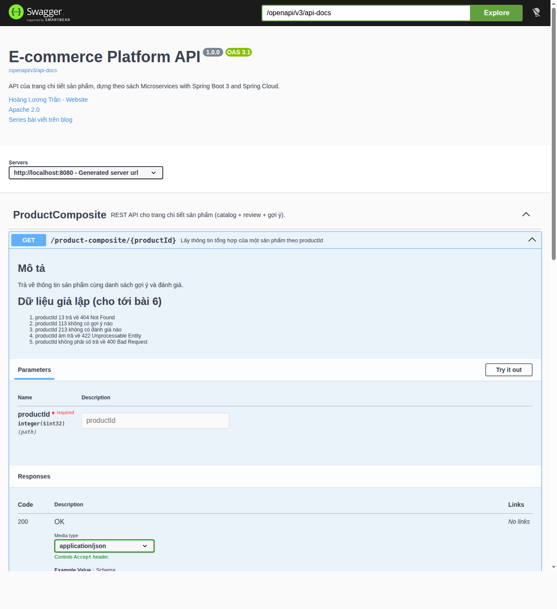

[NOTE]
====
This is *part 5* of the e-commerce microservices series, and the last post of the foundations part. The code for this post is at tag `blog-05`. Previous post: link:/en/blog/2026/ecommerce-microservices-04-docker-compose/[packaging with Docker].
====

An API without documentation leaves its users two options: read the code or ask the author. With microservices, the "user" may be you three months from now, or the frontend team. This post adds OpenAPI documentation to the composite service, plus Swagger UI to read and try the API in the browser.

By the end of this post you will have:

* An OpenAPI 3.1 specification generated from the code, in JSON and YAML.
* Swagger UI at `http://localhost:8080/openapi/swagger-ui.html`.
* The documentation text in a configuration file, with only reference keys left in the Java code.

== What springdoc-openapi does

https://springdoc.org[springdoc-openapi] inspects your Spring controllers at runtime, combines them with the annotations you add, and generates an OpenAPI specification. It supports WebFlux and ships with a bundled Swagger UI. You never write the specification YAML by hand, so the documentation cannot drift from the code.

I only document the *composite service*, because it is the only API exposed to the outside. The three core services are internal details, as in the book.

== Adding the dependency

The `api` module already has `springdoc-openapi-starter-common` from part 1. That artifact only contains the annotations, enough to document the interfaces without pulling Swagger UI into every service.

Only the composite needs the full WebFlux version with the UI:

[source,groovy]
.microservices/product-composite-service/build.gradle
----
dependencies {
    implementation project(':util')
    implementation 'org.springframework.boot:spring-boot-starter-actuator'
    implementation 'org.springframework.boot:spring-boot-starter-webflux'
    implementation "org.springdoc:springdoc-openapi-starter-webflux-ui:${springdocVersion}"
    // ...
}
----

`springdocVersion` is declared as `2.8.17` in the root `build.gradle`; the 2.8 line targets Spring Boot 3.5.

== General API information

Add an `OpenAPI` bean to the composite's main class. Its content comes from configuration through `@Value`:

[source,java]
.ProductCompositeServiceApplication.java
----
@SpringBootApplication
@ComponentScan("com.ecommerce")
public class ProductCompositeServiceApplication {

    @Value("${api.common.version}") String apiVersion;
    @Value("${api.common.title}") String apiTitle;
    @Value("${api.common.description}") String apiDescription;
    @Value("${api.common.license}") String apiLicense;
    @Value("${api.common.licenseUrl}") String apiLicenseUrl;
    @Value("${api.common.externalDocDesc}") String apiExternalDocDesc;
    @Value("${api.common.externalDocUrl}") String apiExternalDocUrl;
    @Value("${api.common.contact.name}") String apiContactName;
    @Value("${api.common.contact.url}") String apiContactUrl;

    /** General API information, shown at the top of the Swagger UI page. */
    @Bean
    public OpenAPI getOpenApiDocumentation() {
        return new OpenAPI()
            .info(new Info().title(apiTitle)
                .description(apiDescription)
                .version(apiVersion)
                .contact(new Contact().name(apiContactName).url(apiContactUrl))
                .license(new License().name(apiLicense).url(apiLicenseUrl)))
            .externalDocs(new ExternalDocumentation()
                .description(apiExternalDocDesc)
                .url(apiExternalDocUrl));
    }

    public static void main(String[] args) {
        SpringApplication.run(ProductCompositeServiceApplication.class, args);
    }
}
----

The `OpenAPI`, `Info`, `Contact`, `License` and `ExternalDocumentation` classes live in the `io.swagger.v3.oas.models` package.

== Per-endpoint documentation, right on the interface

This is where the design from part 1 pays off. The `ProductCompositeService` interface in the `api` module was already the contract; now it carries the documentation too:

[source,java]
.api/src/main/java/com/ecommerce/api/composite/product/ProductCompositeService.java
----
package com.ecommerce.api.composite.product;

import io.swagger.v3.oas.annotations.Operation;
import io.swagger.v3.oas.annotations.responses.ApiResponse;
import io.swagger.v3.oas.annotations.responses.ApiResponses;
import io.swagger.v3.oas.annotations.tags.Tag;
import org.springframework.web.bind.annotation.GetMapping;
import org.springframework.web.bind.annotation.PathVariable;
import reactor.core.publisher.Mono;

@Tag(name = "ProductComposite", description = "REST API cho trang chi tiết sản phẩm (catalog + review + gợi ý).")
public interface ProductCompositeService {

    @Operation(
        summary = "${api.product-composite.get-composite-product.description}",
        description = "${api.product-composite.get-composite-product.notes}")
    @ApiResponses(value = {
        @ApiResponse(responseCode = "200", description = "${api.responseCodes.ok.description}"),
        @ApiResponse(responseCode = "400", description = "${api.responseCodes.badRequest.description}"),
        @ApiResponse(responseCode = "404", description = "${api.responseCodes.notFound.description}"),
        @ApiResponse(responseCode = "422", description = "${api.responseCodes.unprocessableEntity.description}")
    })
    @GetMapping(value = "/product-composite/{productId}", produces = "application/json")
    Mono<ProductAggregate> getProduct(@PathVariable int productId);
}
----

Notice the `${...}` values. springdoc resolves them from configuration, just like `@Value`. The reason to move them out: API descriptions tend to be long, with line breaks and markdown, and that is hard to read and edit inside Java annotations. In YAML it stays tidy, and people who do not write Java can edit it too.

== Configuration

Add this to the composite's `application.yml`, in the default section (above the `---` of the `docker` profile):

[source,yaml]
----
springdoc:
  swagger-ui.path: /openapi/swagger-ui.html
  api-docs.path: /openapi/v3/api-docs
  packagesToScan: com.ecommerce.composite.product
  pathsToMatch: /**

api:
  common:
    version: 1.0.0
    title: E-commerce Platform API
    description: API của trang chi tiết sản phẩm, dựng theo sách Microservices with Spring Boot 3 and Spring Cloud.
    license: Apache 2.0
    licenseUrl: https://www.apache.org/licenses/LICENSE-2.0
    externalDocDesc: Series bài viết trên blog
    externalDocUrl: https://hoangluongtran.dev/
    contact:
      name: Hoàng Lương Trần
      url: https://hoangluongtran.dev/

  responseCodes:
    ok.description: OK
    badRequest.description: Request sai định dạng, xem message để biết chi tiết
    notFound.description: Không tìm thấy, xem message để biết chi tiết
    unprocessableEntity.description: Dữ liệu đầu vào không hợp lệ, xem message để biết chi tiết

  product-composite:
    get-composite-product:
      description: Lấy thông tin tổng hợp của một sản phẩm theo productId
      notes: |
        # Mô tả
        Trả về thông tin sản phẩm cùng danh sách gợi ý và đánh giá.

        # Dữ liệu giả lập (cho tới bài 6)
        1. productId 13 trả về 404 Not Found
        1. productId 113 không có gợi ý nào
        1. productId 213 không có đánh giá nào
        1. productId âm trả về 422 Unprocessable Entity
        1. productId không phải số trả về 400 Bad Request
----

[NOTE]
====
The descriptions in my project are in Vietnamese, because this series started out in Vietnamese. Write them in whatever language your API consumers read; only the keys matter to the code.
====

The two paths, `swagger-ui.path` and `api-docs.path`, share the `/openapi` prefix. Once we add a Gateway later in the series, a single `/openapi/**` route exposes all of the documentation. `packagesToScan` restricts springdoc to the composite's controllers, so no other endpoints leak in.

== The result

[source,bash]
----
./gradlew build
docker compose build
docker compose up -d
----

Open http://localhost:8080/openapi/swagger-ui.html in a browser. It redirects (302) to `/openapi/swagger-ui/index.html`:

.Swagger UI of the composite service; the descriptions come from application.yml

The _description_ and _simulated data_ sections are the markdown from `notes`. Click *Try it out*, enter `1` as `productId` and click *Execute*: Swagger UI sends a real request to the composite and shows the response. Try `13` and `-1` to see the error codes.

The raw specification is also available for other tools (client generators, importing into Postman):

[source,bash]
----
$ curl -s localhost:8080/openapi/v3/api-docs.yaml | head -20
openapi: 3.1.0
info:
  title: E-commerce Platform API
  description: "API của trang chi tiết sản phẩm, dựng theo sách Microservices with\
    \ Spring Boot 3 and Spring Cloud."
  contact:
    name: Hoàng Lương Trần
    url: https://hoangluongtran.dev/
  license:
    name: Apache 2.0
    url: https://www.apache.org/licenses/LICENSE-2.0
  version: 1.0.0
externalDocs:
  description: Series bài viết trên blog
  url: https://hoangluongtran.dev/
servers:
- url: http://localhost:8080
  description: Generated server url
tags:
- name: ProductComposite
  description: REST API cho trang chi tiết sản phẩm (catalog + review + gợi ý).
----

[NOTE]
====
*Different from the book:* the book uses springdoc 2.0.2, which generates OpenAPI 3.0. Since springdoc 2.8 (paired with Spring Boot 3.4 and later), the default is OpenAPI *3.1*, which is why Swagger UI shows an `OAS 3.1` badge. For our API it makes no difference.
====

== Adding it to the end-to-end test

Documentation is part of the API too, so I added a few checks at the end of `test-em-all.bash`:

[source,bash]
----
# Swagger UI and the OpenAPI documentation
assertCurl 302 "curl -s http://$HOST:$PORT/openapi/swagger-ui.html"
assertCurl 200 "curl -sL http://$HOST:$PORT/openapi/swagger-ui.html"
assertCurl 200 "curl -s http://$HOST:$PORT/openapi/swagger-ui/index.html"
assertCurl 200 "curl -s http://$HOST:$PORT/openapi/v3/api-docs"
assertEqual "1.0.0" "$(echo $RESPONSE | jq -r .info.version)"
assertEqual "http://$HOST:$PORT" "$(echo $RESPONSE | jq -r .servers[].url)"
assertCurl 200 "curl -s http://$HOST:$PORT/openapi/v3/api-docs.yaml"
----

[source,bash]
----
$ ./test-em-all.bash start stop
...
Test OK (HTTP Code: 302)
Test OK (HTTP Code: 200)
Test OK (HTTP Code: 200)
Test OK (HTTP Code: 200)
Test OK (actual value: 1.0.0)
Test OK (actual value: http://localhost:8080)
Test OK (HTTP Code: 200)
We are done, stopping the test environment...
End, all tests OK: Fri Oct 2 06:01:51 UTC 2026
----

Commit:

[source,bash]
----
git add .
git commit -m "Post 5: OpenAPI and Swagger UI"
git tag blog-05
----

== Looking back at the foundations

After five posts, we have:

* A Gradle multi-project build with shared configuration and two shared modules, `api` and `util`.
* Four WebFlux microservices with consistent error handling and automated tests.
* A composite that calls three services in parallel and survives a secondary service going down.
* The whole system running with one `docker compose up`, tested with `test-em-all.bash`.
* API documentation generated from code, readable and testable in Swagger UI.

The biggest weakness now is that all data is simulated: every product is called `name-<id>` and costs 199,000. Part 2 of the series starts by replacing it with real data: MongoDB for the catalog and recommendations, MySQL for reviews, one database per service, plus create and delete APIs through the composite.
