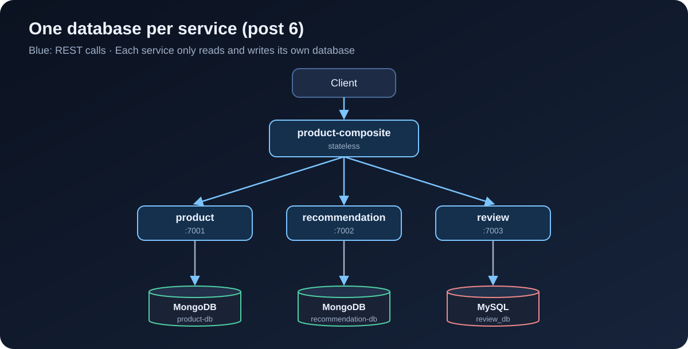

[NOTE]
====
This is *part 6* of the e-commerce microservices series, and the first post of part 2 (data and events). The code for this post is at tag `blog-06`. Previous post: link:/en/blog/2026/ecommerce-microservices-05-openapi-swagger/[OpenAPI and Swagger UI].
====

Up to post 5, every product was called `name-<id>` and cost 199,000, and there was no way to add a new one. This post gives each core service a real database, adds create and delete APIs, and tests all of it against real databases running in Docker.

By the end of this post you will have:

* product and recommendation stored in MongoDB, review stored in MySQL, each service with its own database.
* `POST` and `DELETE` APIs for each core service and for the composite.
* Persistence and integration tests running against real MongoDB and MySQL through Testcontainers.
* `docker compose up` that also starts MongoDB and MySQL, and a `test-em-all.bash` that creates its own test data.

== Database per service

The rule from here on: *each service owns its data*, and other services can only read or write it through that service's API. No service connects directly to another service's database.

.One database per service; the composite stores nothing

In exchange for that extra ceremony, each service picks the database that suits it, changes its schema without asking anyone, and a broken database cannot take down the other services. Here:

* *product* and *recommendation* are document-shaped data, read-heavy with few relations, so they use *MongoDB*.
* *review* uses *MySQL* so we have an SQL and JPA example. In post 7, inventory and order also use MySQL because they need proper transactions.

On a dev machine, product and recommendation share one MongoDB container but use two different databases (`product-db` and `recommendation-db`). That still follows the rule; it just saves RAM.

== Dependencies

For product (recommendation is identical), add reactive Spring Data MongoDB, MapStruct and Testcontainers:

[source,groovy]
.microservices/product-service/build.gradle
----
dependencies {
    implementation project(':util')
    implementation 'org.springframework.boot:spring-boot-starter-actuator'
    implementation 'org.springframework.boot:spring-boot-starter-webflux'
    implementation 'org.springframework.boot:spring-boot-starter-data-mongodb-reactive'
    implementation "org.mapstruct:mapstruct:${mapstructVersion}"
    annotationProcessor "org.mapstruct:mapstruct-processor:${mapstructVersion}"

    testImplementation 'org.springframework.boot:spring-boot-starter-test'
    testImplementation 'io.projectreactor:reactor-test'
    testImplementation 'org.springframework.boot:spring-boot-testcontainers'
    testImplementation 'org.testcontainers:junit-jupiter'
    testImplementation 'org.testcontainers:mongodb'
}
----

Review uses JPA and the MySQL driver:

[source,groovy]
.microservices/review-service/build.gradle
----
    implementation 'org.springframework.boot:spring-boot-starter-data-jpa'
    runtimeOnly 'com.mysql:mysql-connector-j'
    // ...
    testImplementation 'org.testcontainers:mysql'
----

`mapstructVersion` is `1.6.3`, declared in the root `build.gradle` since post 1. Spring Boot manages the Testcontainers version, so there is nothing to add.

[NOTE]
====
*Different from the book:* in chapter 6 the book uses blocking repositories, MongoDB included, and only switches to reactive in chapter 7. Since our services have run on WebFlux since post 2, I go straight to `ReactiveCrudRepository` for MongoDB and run JPA on a separate scheduler from this post on.
====

== Entities for MongoDB

Each service gets a `persistence` package with its entity and repository. The entity is completely separate from the `Product` record in the `api` module: the API is a contract with the outside world, the entity is an internal storage detail, and the two change for different reasons.

[source,java]
.ProductEntity.java
----
@Document(collection = "products")
public class ProductEntity {

    @Id
    private String id;

    @Version
    private Integer version;

    @Indexed(unique = true)
    private int productId;

    private String name;
    // By default Spring Data stores BigDecimal as a string; Decimal128 keeps it as a MongoDB decimal number
    @Field(targetType = FieldType.DECIMAL128)
    private BigDecimal price;

    // constructor, getter, setter
}
----

A few things worth noting:

* `id` is a technical key generated by MongoDB. `productId` is the business key, with a unique index so two products can never share an id.
* `@Version` turns on *optimistic locking*: every save bumps the version by one. If two requests read the same record and both write it, the later one carries a stale version and is rejected instead of silently overwriting the first one's data.
* `@Field(targetType = FieldType.DECIMAL128)` is a line I only added after looking inside the database. The first run without it stored the price like this:

[source,text]
----
{
  _id: ObjectId('6abf52b48c9d6c63afc5ad01'),
  version: 0,
  productId: 1,
  name: 'Giay sneaker',
  price: '899000',
  _class: 'com.ecommerce.core.product.persistence.ProductEntity'
}
----

The price is the string `'899000'`. The API still worked, because Spring can read it back, but you cannot query or sort by price, and anyone opening the database would wonder why. Add the annotation and run again:

[source,bash]
----
$ docker compose exec -T mongodb mongosh product-db --quiet --eval "db.products.find({productId: 1})"
[
  {
    _id: ObjectId('6abf53043b6bbc433455ceeb'),
    version: 0,
    productId: 1,
    name: 'Giay sneaker',
    price: Decimal128('899000'),
    _class: 'com.ecommerce.core.product.persistence.ProductEntity'
  }
]
----

Small lesson: always look at how your data is actually stored, rather than trusting that the API returns the right thing.

Recommendation is similar, but its business key has two columns, so it uses a compound index:

[source,java]
.RecommendationEntity.java
----
@Document(collection = "recommendations")
@CompoundIndex(name = "prod-rec-id", unique = true, def = "{'productId': 1, 'recommendationId' : 1}")
public class RecommendationEntity {

    @Id
    private String id;

    @Version
    private Integer version;

    private int productId;
    private int recommendationId;
    private String author;
    private int rating;
    private String content;
    // ...
}
----

The repository is just an interface; Spring Data generates the implementation from the method names:

[source,java]
----
public interface ProductRepository extends ReactiveCrudRepository<ProductEntity, String> {

    Mono<ProductEntity> findByProductId(int productId);
}
----

Connection settings, with `auto-index-creation` so Spring creates the indexes above at startup:

[source,yaml]
.product-service/src/main/resources/application.yml
----
spring.data.mongodb:
  host: localhost
  port: 27017
  database: product-db
  auto-index-creation: true

---
spring.config.activate.on-profile: docker

server.port: 8080
spring.data.mongodb.host: mongodb
----

== Entities for MySQL with JPA

[source,java]
.ReviewEntity.java
----
@Entity
@Table(name = "reviews", indexes = {
    @Index(name = "reviews_unique_idx", unique = true, columnList = "productId,reviewId")
})
public class ReviewEntity {

    @Id
    @GeneratedValue
    private int id;

    @Version
    private int version;

    private int productId;
    private int reviewId;
    private String author;
    private String subject;
    private String content;
    // ...
}
----

[source,java]
----
public interface ReviewRepository extends CrudRepository<ReviewEntity, Integer> {

    @Transactional(readOnly = true)
    List<ReviewEntity> findByProductId(int productId);
}
----

[source,yaml]
.review-service/src/main/resources/application.yml
----
# Use "update" only during development; production should use Flyway/Liquibase.
spring.jpa.hibernate.ddl-auto: update
spring.jpa.open-in-view: false

spring.datasource:
  url: jdbc:mysql://localhost/review_db
  username: ${MYSQL_USER:user}
  password: ${MYSQL_PASSWORD:pwd}
  hikari.initializationFailTimeout: 60000
----

`ddl-auto: update` lets Hibernate create the tables, which is handy while learning but not for production. `initializationFailTimeout` makes the service wait up to 60 seconds for MySQL instead of dying at startup.

== Mappers with MapStruct

Separate entity and API models mean code to convert between them. Writing it by hand is tedious and easy to get wrong, so we use https://mapstruct.org[MapStruct]: declare an interface, and the code is generated at compile time.

[source,java]
.ProductMapper.java
----
@Mapper(componentModel = "spring")
public interface ProductMapper {

    @Mappings({
        @Mapping(target = "serviceAddress", ignore = true)
    })
    Product entityToApi(ProductEntity entity);

    @Mappings({
        @Mapping(target = "id", ignore = true),
        @Mapping(target = "version", ignore = true)
    })
    ProductEntity apiToEntity(Product api);
}
----

The `ignore = true` entries spell out which fields are deliberately not mapped. If you later add a field on one side and forget the other, MapStruct warns at build time. MapStruct 1.6 works well with Java records, so `Product` does not need setters.

== A service on reactive MongoDB

Since the repository returns `Mono` and `Flux`, the service just chains the steps:

[source,java]
.ProductServiceImpl.java
----
@Override
public Mono<Product> createProduct(Product body) {
    if (body.productId() < 1) {
        throw new InvalidInputException("Invalid productId: " + body.productId());
    }
    ProductEntity entity = mapper.apiToEntity(body);
    return repository.save(entity)
        .onErrorMap(DuplicateKeyException.class,
            ex -> new InvalidInputException("Duplicate key, Product Id: " + body.productId()))
        .map(mapper::entityToApi);
}

@Override
public Mono<Product> getProduct(int productId) {
    if (productId < 1) {
        throw new InvalidInputException("Invalid productId: " + productId);
    }
    LOG.debug("Will get product info for id={}", productId);
    return repository.findByProductId(productId)
        .switchIfEmpty(Mono.error(new NotFoundException("No product found for productId: " + productId)))
        .map(mapper::entityToApi)
        .map(this::setServiceAddress);
}

@Override
public Mono<Void> deleteProduct(int productId) {
    if (productId < 1) {
        throw new InvalidInputException("Invalid productId: " + productId);
    }
    LOG.debug("deleteProduct: tries to delete an entity with productId: {}", productId);
    return repository.findByProductId(productId).map(repository::delete).flatMap(e -> e);
}
----

* A duplicate `productId` makes MongoDB throw `DuplicateKeyException` thanks to the unique index. We turn it into `InvalidInputException`, and the `GlobalControllerExceptionHandler` from post 2 returns 422.
* When nothing is found, `findByProductId` returns an empty `Mono`, and `switchIfEmpty` turns that into a 404.
* Deleting a product that does not exist does nothing and still returns 200. Delete is *idempotent*: calling it once or ten times leaves the same end result. That matters when the composite or a client has to retry after a network error.

== A service on JPA: don't block the event loop

JPA and JDBC are *blocking*: the thread that calls `repository.save()` has to sit and wait for MySQL. WebFlux has only a few event loop threads (usually one per CPU core) to serve every request. Run JPA on those threads, and a handful of slow queries is enough to freeze the whole service.

The fix: create a dedicated thread pool for JDBC and push every blocking call onto it.

[source,java]
.ReviewServiceApplication.java
----
/** JPA is blocking, so run it on a separate thread pool to keep the WebFlux event loop free. */
@Bean
public Scheduler jdbcScheduler(
        @Value("${app.threadPoolSize:10}") Integer threadPoolSize,
        @Value("${app.taskQueueSize:100}") Integer taskQueueSize) {
    return Schedulers.newBoundedElastic(threadPoolSize, taskQueueSize, "jdbc-pool");
}
----

[source,java]
.ReviewServiceImpl.java
----
@Override
public Mono<Review> createReview(Review body) {
    if (body.productId() < 1) {
        throw new InvalidInputException("Invalid productId: " + body.productId());
    }
    return Mono.fromCallable(() -> internalCreateReview(body)).subscribeOn(jdbcScheduler);
}

private Review internalCreateReview(Review body) {
    try {
        ReviewEntity entity = mapper.apiToEntity(body);
        ReviewEntity newEntity = repository.save(entity);
        LOG.debug("createReview: created a review entity: {}/{}", body.productId(), body.reviewId());
        return mapper.entityToApi(newEntity);
    } catch (DataIntegrityViolationException dive) {
        throw new InvalidInputException(
            "Duplicate key, Product Id: " + body.productId() + ", Review Id:" + body.reviewId());
    }
}

@Override
public Flux<Review> getReviews(int productId) {
    if (productId < 1) {
        throw new InvalidInputException("Invalid productId: " + productId);
    }
    LOG.info("Will get reviews for product with id={}", productId);
    return Mono.fromCallable(() -> internalGetReviews(productId))
        .flatMapMany(Flux::fromIterable)
        .subscribeOn(jdbcScheduler);
}
----

`Mono.fromCallable` wraps the blocking code and only runs it when someone subscribes. `subscribeOn(jdbcScheduler)` says that run happens on `jdbc-pool`, not on the event loop. To the caller, `createReview` looks like any other reactive method.

The pool is capped at 10 threads and a queue of 100 tasks. If MySQL is slow and the queue fills up, new requests are rejected right away instead of queueing forever and eating memory.

== Create and delete APIs

Each interface in the `api` module gains two methods. For product:

[source,java]
.ProductService.java
----
public interface ProductService {

    @PostMapping(value = "/product", consumes = "application/json", produces = "application/json")
    Mono<Product> createProduct(@RequestBody Product body);

    @GetMapping(value = "/product/{productId}", produces = "application/json")
    Mono<Product> getProduct(@PathVariable int productId);

    @DeleteMapping(value = "/product/{productId}")
    Mono<Void> deleteProduct(@PathVariable int productId);
}
----

Review and recommendation follow the same pattern, with `DELETE /review?productId=` and `DELETE /recommendation?productId=` to delete everything for a product.

The composite also gets `POST /product-composite` and `DELETE /product-composite/{productId}`, documented with OpenAPI as in post 5. Creating a product calls all three services in parallel:

[source,java]
.ProductCompositeServiceImpl.java
----
@Override
public Mono<Void> createProduct(ProductAggregate body) {
    LOG.info("Will create a new composite entity for product.id: {}", body.productId());

    List<Mono<?>> monoList = new ArrayList<>();
    monoList.add(integration.createProduct(new Product(body.productId(), body.name(), body.price(), null)));

    if (body.recommendations() != null) {
        body.recommendations().forEach(r -> monoList.add(integration.createRecommendation(
            new Recommendation(body.productId(), r.recommendationId(), r.author(), r.rate(), r.content(), null))));
    }

    if (body.reviews() != null) {
        body.reviews().forEach(r -> monoList.add(integration.createReview(
            new Review(body.productId(), r.reviewId(), r.author(), r.subject(), r.content(), null))));
    }

    return Mono.when(monoList)
        .doOnError(ex -> LOG.warn("createCompositeProduct failed: {}", ex.toString()));
}

@Override
public Mono<Void> deleteProduct(int productId) {
    LOG.info("Will delete a product aggregate for product.id: {}", productId);
    return Mono.when(
            integration.deleteProduct(productId),
            integration.deleteRecommendations(productId),
            integration.deleteReviews(productId))
        .doOnError(ex -> LOG.warn("delete failed: {}", ex.toString()));
}
----

`Mono.when` waits for all of them to complete. The matching HTTP call in `ProductCompositeIntegration` looks just like the GET calls from post 3:

[source,java]
----
@Override
public Mono<Product> createProduct(Product body) {
    return webClient.post().uri(productServiceUrl).bodyValue(body).retrieve()
        .bodyToMono(Product.class)
        .onErrorMap(WebClientResponseException.class, this::handleException);
}
----

[WARNING]
====
There is a real problem here: if creating the product succeeds but creating a review fails, the services end up out of sync, and no transaction can span several databases. Post 8 moves create and delete to events over Kafka to deal with this. For now we accept it, and because delete is idempotent we can always delete and create again.
====

== Testing with Testcontainers

Mocking the repository would never catch a price stored as a string, or a unique index that was never created. So I test against real databases. https://testcontainers.com[Testcontainers] starts MongoDB and MySQL in Docker when the tests start and cleans them up afterwards.

The product persistence test only boots Spring's MongoDB slice with `@DataMongoTest`:

[source,java]
.product-service/src/test/java/.../PersistenceTests.java
----
@Testcontainers
@DataMongoTest
class PersistenceTests {

    @Container
    @ServiceConnection
    static MongoDBContainer database = new MongoDBContainer("mongo:7.0");

    @Autowired
    private ProductRepository repository;

    private ProductEntity savedEntity;

    @BeforeEach
    void setupDb() {
        StepVerifier.create(repository.deleteAll()).verifyComplete();

        ProductEntity entity = new ProductEntity(1, "n", new BigDecimal("199000"));
        StepVerifier.create(repository.save(entity))
            .consumeNextWith(created -> savedEntity = created)
            .verifyComplete();
    }

    @Test
    void duplicateError() {
        ProductEntity entity = new ProductEntity(savedEntity.getProductId(), "n", new BigDecimal("1"));
        StepVerifier.create(repository.save(entity)).expectError(DuplicateKeyException.class).verify();
    }

    @Test
    void optimisticLockError() {
        // Read the same entity into two different variables
        ProductEntity entity1 = repository.findById(savedEntity.getId()).block();
        ProductEntity entity2 = repository.findById(savedEntity.getId()).block();

        // Update through the first one, version goes up to 1
        entity1.setName("n1");
        repository.save(entity1).block();

        // The second one still has the old version, so it must be rejected
        entity2.setName("n2");
        StepVerifier.create(repository.save(entity2)).expectError(OptimisticLockingFailureException.class).verify();

        StepVerifier.create(repository.findById(savedEntity.getId()))
            .expectNextMatches(found -> found.getVersion() == 1 && found.getName().equals("n1"))
            .verifyComplete();
    }

    // create, update, delete, getByProductId ...
}
----

`@ServiceConnection` (since Spring Boot 3.1) reads the container's host and port and configures `spring.data.mongodb.*` for the test. reactor-test's `StepVerifier` checks a `Mono` or `Flux`: what it emits, and whether it completes normally or with which error.

For MySQL, `@DataJpaTest` by default swaps the database for in-memory H2 and wraps each test in a transaction that is rolled back. We turn both off, so tests run on real MySQL and see real commits:

[source,java]
.review-service/src/test/java/.../PersistenceTests.java
----
@Testcontainers
@DataJpaTest
@AutoConfigureTestDatabase(replace = AutoConfigureTestDatabase.Replace.NONE)
@Transactional(propagation = Propagation.NOT_SUPPORTED)
class PersistenceTests {

    @Container
    @ServiceConnection
    static MySQLContainer<?> database = new MySQLContainer<>("mysql:8.4");
    // ...
}
----

The `*ServiceApplicationTests` integration tests use `@SpringBootTest` with the same container declaration and call the API through `WebTestClient`, as in post 2.

[NOTE]
====
*Different from the book:* the book writes base classes `MySqlTestBase` and `MongoDbTestBase` with `@DynamicPropertySource` to register the container's URL, username and password. Since Spring Boot 3.1, `@ServiceConnection` does that, so I dropped those classes. The trade-off is that each test class starts its own container, a few seconds slower than the book's shared container. The database versions are newer too: `mongo:7.0` and `mysql:8.4` instead of 6.0 and 8.0 in the book.
====

[source,bash]
----
./gradlew build
----

Docker has to be running. The first run is slower because Testcontainers pulls the images. All 35 tests pass, none skipped.

== Docker Compose

Add MongoDB and MySQL to `docker-compose.yml`, with health checks so services only start once their database is ready:

[source,yaml]
.docker-compose.yml
----
  review:
    build: microservices/review-service
    mem_limit: 512m
    environment:
      - SPRING_PROFILES_ACTIVE=docker
      - MYSQL_USER=${MYSQL_USER}
      - MYSQL_PASSWORD=${MYSQL_PASSWORD}
    depends_on:
      mysql:
        condition: service_healthy

  mongodb:
    image: mongo:7.0
    mem_limit: 512m
    ports:
      - "27017:27017"
    command: mongod
    healthcheck:
      test: ["CMD", "mongosh", "--quiet", "--eval", "db.runCommand('ping').ok"]
      interval: 5s
      timeout: 2s
      retries: 60

  mysql:
    image: mysql:8.4
    mem_limit: 512m
    ports:
      - "3306:3306"
    environment:
      - MYSQL_ROOT_PASSWORD=${MYSQL_ROOT_PASSWORD}
      - MYSQL_DATABASE=review_db
      - MYSQL_USER=${MYSQL_USER}
      - MYSQL_PASSWORD=${MYSQL_PASSWORD}
    healthcheck:
      test: ["CMD", "mysqladmin", "ping", "-uroot", "-p${MYSQL_ROOT_PASSWORD}", "-h", "localhost"]
      interval: 5s
      timeout: 2s
      retries: 60
----

product and recommendation get `depends_on: mongodb` the same way review depends on mysql. Passwords come from a `.env` file next to `docker-compose.yml`, which Docker Compose reads automatically:

[source,properties]
.env
----
# Local development only. Never use these passwords in a real environment.
MYSQL_ROOT_PASSWORD=rootpwd
MYSQL_USER=user
MYSQL_PASSWORD=pwd
----

I expose ports 27017 and 3306 on the host only to make it easy to inspect the data with familiar tools. Inside compose, services still reach each other as `mongodb` and `mysql`.

== Updating the end-to-end test

With no simulated data left, `test-em-all.bash` has to create its own data before checking anything. `recreateComposite` deletes and recreates a product through the composite:

[source,bash]
----
function recreateComposite() {
  local productId=$1
  local composite=$2

  assertCurl 200 "curl -X DELETE http://$HOST:$PORT/product-composite/${productId} -s"
  assertEqual 200 $(curl -X POST -s http://$HOST:$PORT/product-composite -H "Content-Type: application/json" \
    --data "$composite" -w "%{http_code}")
}
----

`setupTestdata` uses it to recreate three products matching the cases from post 3: product `113` has no recommendations, `213` has no reviews, and product `1`, "Giay sneaker" at 899000, has three of each. Product `13` is never created, so it still returns 404 as before.

One detail when waiting for startup. The script used to wait until `GET /product-composite/1` returned 200, but product 1 does not exist yet at that point. And the composite can be up while product or review is still connecting to its database. The book's answer is to wait on a `DELETE`: it only succeeds once the composite *and* all three core services can respond.

[source,bash]
----
# DELETE on the composite only succeeds once the composite and all three core services are ready
waitForService curl -X DELETE http://$HOST:$PORT/product-composite/$PROD_ID_NOT_FOUND
----

Idempotent delete checks go at the end:

[source,bash]
----
# Delete is idempotent: deleting twice returns 200 both times, then the product is gone
assertCurl 200 "curl -X DELETE http://$HOST:$PORT/product-composite/$PROD_ID_NO_REVS -s"
assertCurl 200 "curl -X DELETE http://$HOST:$PORT/product-composite/$PROD_ID_NO_REVS -s"
assertCurl 404 "curl http://$HOST:$PORT/product-composite/$PROD_ID_NO_REVS -s"
----

Run it:

[source,bash]
----
$ ./gradlew build && docker compose build
$ ./test-em-all.bash start
...
Wait for: curl -X DELETE http://localhost:8080/product-composite/13... , retry #1 , retry #2 , retry #3 , retry #4 DONE, continues...
...
End, all tests OK: Fri Oct 2 06:45:26 UTC 2026
----

== Looking inside the databases

With everything still running, let's look at the databases. MongoDB has a unique index on `productId`:

[source,bash]
----
$ docker compose exec -T mongodb mongosh product-db --quiet --eval "db.products.getIndexes()"
...
  { v: 2, key: { _id: 1 }, name: '_id_' },
  { v: 2, key: { productId: 1 }, name: 'productId', unique: true }
----

MySQL has a `reviews` table created by Hibernate, with a `version` column on each row:

[source,bash]
----
$ docker compose exec -T mysql mysql -uuser -ppwd \
    -e "select id, version, product_id, review_id, author from review_db.reviews"
id	version	product_id	review_id	author
1	0	113	3	author 3
2	0	113	1	author 1
3	0	113	2	author 2
4	0	1	1	author 1
5	0	1	3	author 3
6	0	1	2	author 2
----

Notice that the `review_id` values for one product are not stored in order 1, 2, 3. The composite sends the three create requests in parallel, and whichever arrives first is stored first. That is a normal consequence of `Mono.when`, and a reason why an API should never depend on the order of auto-incremented `id` values.

Commit:

[source,bash]
----
git add .
git commit -m "Post 6: persistence with MongoDB and MySQL"
git tag blog-06
----

== Summary

* Each core service has its own database; product and recommendation on MongoDB, review on MySQL.
* Entities are separate from the API model, and MapStruct handles the conversion.
* Unique indexes block duplicates, `@Version` blocks lost updates, and delete is idempotent.
* MongoDB uses reactive repositories; blocking JPA runs on `jdbc-pool` so it never blocks the event loop.
* Tests run against real databases with Testcontainers and `@ServiceConnection`.

The next post adds two new services for the e-commerce side: link:/en/blog/2026/ecommerce-microservices-07-inventory-order/[inventory-service to track stock, and order-service to accept orders], both on MySQL.
