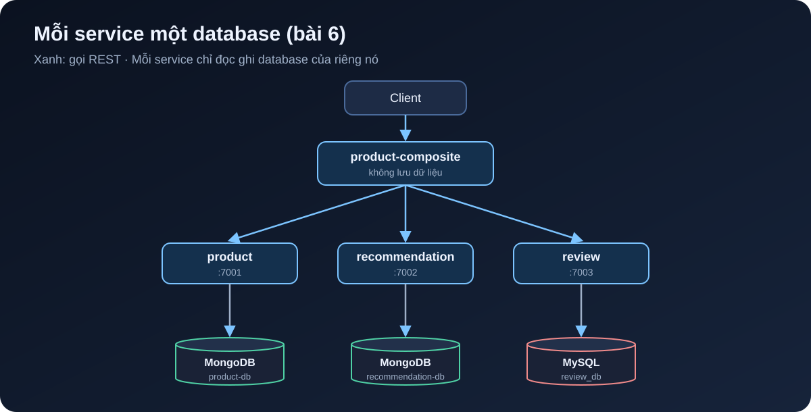

[NOTE]
====
Đây là *bài 6* trong series microservices e-commerce, bài đầu tiên của phần 2 (dữ liệu và sự kiện). Code của bài ở tag `blog-06`. Bài trước: link:/blog/2026/ecommerce-microservices-05-openapi-swagger/[OpenAPI và Swagger UI].
====

Tới bài 5, mọi sản phẩm đều tên `name-<id>`, giá 199.000, và không có cách nào thêm sản phẩm mới. Bài này cho mỗi service lõi một database thật, thêm API tạo và xoá, và kiểm tra tất cả bằng test chạy trên database thật trong Docker.

Cuối bài bạn sẽ có:

* product và recommendation lưu trên MongoDB, review lưu trên MySQL, mỗi service một database riêng.
* API `POST` và `DELETE` cho từng service lõi, và cho composite.
* Test persistence và test tích hợp chạy trên MongoDB, MySQL thật nhờ Testcontainers.
* `docker compose up` dựng thêm MongoDB và MySQL, `test-em-all.bash` tự tạo dữ liệu test.

== Database-per-service

Nguyên tắc của phần này: *mỗi service sở hữu dữ liệu của mình*, và service khác chỉ được đọc ghi qua API của nó. Không service nào được nối thẳng vào database của service khác.

.Mỗi service một database, composite không lưu gì

Đổi lại sự rườm rà đó, mỗi service được tự chọn loại database hợp với nó, đổi schema mà không phải hỏi ai, và hỏng database này không kéo sập service kia. Ở đây:

* *product* và *recommendation* là dữ liệu dạng document, đọc nhiều, ít quan hệ, nên dùng *MongoDB*.
* *review* dùng *MySQL* để có ví dụ về SQL và JPA. Sang bài 7, inventory và order cũng dùng MySQL vì cần transaction chặt.

Trên máy dev, product và recommendation dùng chung một container MongoDB nhưng hai database khác nhau (`product-db` và `recommendation-db`). Như vậy vẫn đúng nguyên tắc, chỉ tiết kiệm RAM.

== Thêm dependency

Với product (recommendation giống hệt), thêm Spring Data MongoDB bản reactive, MapStruct và Testcontainers:

[source,groovy]
.microservices/product-service/build.gradle
----
dependencies {
    implementation project(':util')
    implementation 'org.springframework.boot:spring-boot-starter-actuator'
    implementation 'org.springframework.boot:spring-boot-starter-webflux'
    implementation 'org.springframework.boot:spring-boot-starter-data-mongodb-reactive'
    implementation "org.mapstruct:mapstruct:${mapstructVersion}"
    annotationProcessor "org.mapstruct:mapstruct-processor:${mapstructVersion}"

    testImplementation 'org.springframework.boot:spring-boot-starter-test'
    testImplementation 'io.projectreactor:reactor-test'
    testImplementation 'org.springframework.boot:spring-boot-testcontainers'
    testImplementation 'org.testcontainers:junit-jupiter'
    testImplementation 'org.testcontainers:mongodb'
}
----

Review dùng JPA và driver MySQL:

[source,groovy]
.microservices/review-service/build.gradle
----
    implementation 'org.springframework.boot:spring-boot-starter-data-jpa'
    runtimeOnly 'com.mysql:mysql-connector-j'
    // ...
    testImplementation 'org.testcontainers:mysql'
----

`mapstructVersion` là `1.6.3`, khai trong `build.gradle` gốc từ bài 1. Phiên bản Testcontainers do Spring Boot quản lý, không cần ghi.

[NOTE]
====
*Chỗ khác sách:* ở chương 6, sách dùng repository blocking cho cả MongoDB, rồi sang chương 7 mới chuyển sang reactive. Vì các service của mình đã chạy WebFlux từ bài 2, mình dùng thẳng `ReactiveCrudRepository` cho MongoDB, và chạy JPA trên một scheduler riêng ngay từ bài này.
====

== Entity cho MongoDB

Mỗi service có một package `persistence` chứa entity và repository. Entity tách biệt hoàn toàn với record `Product` trong module `api`: API là hợp đồng với bên ngoài, entity là chi tiết lưu trữ bên trong, hai thứ thay đổi vì những lý do khác nhau.

[source,java]
.ProductEntity.java
----
@Document(collection = "products")
public class ProductEntity {

    @Id
    private String id;

    @Version
    private Integer version;

    @Indexed(unique = true)
    private int productId;

    private String name;
    // Mặc định Spring Data lưu BigDecimal thành chuỗi; Decimal128 giữ đúng kiểu số thập phân của MongoDB
    @Field(targetType = FieldType.DECIMAL128)
    private BigDecimal price;

    // constructor, getter, setter
}
----

Vài điểm đáng chú ý:

* `id` là khoá kỹ thuật do MongoDB sinh. `productId` là khoá nghiệp vụ, có unique index để không thể có hai sản phẩm trùng mã.
* `@Version` bật *optimistic locking*: mỗi lần lưu, version tăng thêm 1. Nếu hai request cùng đọc một bản ghi rồi cùng ghi, request ghi sau mang version cũ và bị từ chối thay vì âm thầm đè lên dữ liệu của request trước.
* `@Field(targetType = FieldType.DECIMAL128)` là dòng mình chỉ thêm sau khi nhìn vào database. Lần chạy đầu không có nó, MongoDB lưu giá như thế này:

[source,text]
----
{
  _id: ObjectId('6abf52b48c9d6c63afc5ad01'),
  version: 0,
  productId: 1,
  name: 'Giay sneaker',
  price: '899000',
  _class: 'com.ecommerce.core.product.persistence.ProductEntity'
}
----

Giá là chuỗi `'899000'`. API vẫn chạy đúng vì Spring đọc ngược lại được, nhưng không query hay sắp xếp theo giá được, và ai mở database ra xem cũng sẽ thắc mắc. Thêm annotation rồi chạy lại:

[source,bash]
----
$ docker compose exec -T mongodb mongosh product-db --quiet --eval "db.products.find({productId: 1})"
[
  {
    _id: ObjectId('6abf53043b6bbc433455ceeb'),
    version: 0,
    productId: 1,
    name: 'Giay sneaker',
    price: Decimal128('899000'),
    _class: 'com.ecommerce.core.product.persistence.ProductEntity'
  }
]
----

Bài học nhỏ: luôn mở database ra xem dữ liệu thật sự được lưu thế nào, đừng chỉ tin vào việc API trả đúng.

Recommendation tương tự, nhưng khoá nghiệp vụ gồm hai cột nên dùng compound index:

[source,java]
.RecommendationEntity.java
----
@Document(collection = "recommendations")
@CompoundIndex(name = "prod-rec-id", unique = true, def = "{'productId': 1, 'recommendationId' : 1}")
public class RecommendationEntity {

    @Id
    private String id;

    @Version
    private Integer version;

    private int productId;
    private int recommendationId;
    private String author;
    private int rating;
    private String content;
    // ...
}
----

Repository chỉ cần khai báo interface, Spring Data tự sinh phần cài đặt từ tên method:

[source,java]
----
public interface ProductRepository extends ReactiveCrudRepository<ProductEntity, String> {

    Mono<ProductEntity> findByProductId(int productId);
}
----

Cấu hình kết nối, kèm `auto-index-creation` để Spring tạo các index ở trên khi khởi động:

[source,yaml]
.product-service/src/main/resources/application.yml
----
spring.data.mongodb:
  host: localhost
  port: 27017
  database: product-db
  auto-index-creation: true

---
spring.config.activate.on-profile: docker

server.port: 8080
spring.data.mongodb.host: mongodb
----

== Entity cho MySQL với JPA

[source,java]
.ReviewEntity.java
----
@Entity
@Table(name = "reviews", indexes = {
    @Index(name = "reviews_unique_idx", unique = true, columnList = "productId,reviewId")
})
public class ReviewEntity {

    @Id
    @GeneratedValue
    private int id;

    @Version
    private int version;

    private int productId;
    private int reviewId;
    private String author;
    private String subject;
    private String content;
    // ...
}
----

[source,java]
----
public interface ReviewRepository extends CrudRepository<ReviewEntity, Integer> {

    @Transactional(readOnly = true)
    List<ReviewEntity> findByProductId(int productId);
}
----

[source,yaml]
.review-service/src/main/resources/application.yml
----
# Chỉ dùng "update" khi phát triển; production nên dùng Flyway/Liquibase.
spring.jpa.hibernate.ddl-auto: update
spring.jpa.open-in-view: false

spring.datasource:
  url: jdbc:mysql://localhost/review_db
  username: ${MYSQL_USER:user}
  password: ${MYSQL_PASSWORD:pwd}
  hikari.initializationFailTimeout: 60000
----

`ddl-auto: update` để Hibernate tự tạo bảng, tiện khi học nhưng không nên dùng cho production. `initializationFailTimeout` cho service chờ tối đa 60 giây nếu MySQL chưa sẵn sàng, thay vì chết ngay khi khởi động.

== Mapper với MapStruct

Có entity và API model riêng thì phải có code chuyển qua lại. Viết tay thì chán và dễ sót field, nên dùng https://mapstruct.org[MapStruct]: chỉ khai báo interface, code được sinh lúc compile.

[source,java]
.ProductMapper.java
----
@Mapper(componentModel = "spring")
public interface ProductMapper {

    @Mappings({
        @Mapping(target = "serviceAddress", ignore = true)
    })
    Product entityToApi(ProductEntity entity);

    @Mappings({
        @Mapping(target = "id", ignore = true),
        @Mapping(target = "version", ignore = true)
    })
    ProductEntity apiToEntity(Product api);
}
----

Các `ignore = true` nói rõ field nào cố ý không map. Nếu sau này thêm field vào một bên mà quên bên kia, MapStruct sẽ cảnh báo lúc build. MapStruct 1.6 làm việc tốt với Java record, nên `Product` không cần setter.

== Service với MongoDB reactive

Vì repository trả về `Mono` và `Flux`, service chỉ việc nối các bước lại:

[source,java]
.ProductServiceImpl.java
----
@Override
public Mono<Product> createProduct(Product body) {
    if (body.productId() < 1) {
        throw new InvalidInputException("Invalid productId: " + body.productId());
    }
    ProductEntity entity = mapper.apiToEntity(body);
    return repository.save(entity)
        .onErrorMap(DuplicateKeyException.class,
            ex -> new InvalidInputException("Duplicate key, Product Id: " + body.productId()))
        .map(mapper::entityToApi);
}

@Override
public Mono<Product> getProduct(int productId) {
    if (productId < 1) {
        throw new InvalidInputException("Invalid productId: " + productId);
    }
    LOG.debug("Will get product info for id={}", productId);
    return repository.findByProductId(productId)
        .switchIfEmpty(Mono.error(new NotFoundException("No product found for productId: " + productId)))
        .map(mapper::entityToApi)
        .map(this::setServiceAddress);
}

@Override
public Mono<Void> deleteProduct(int productId) {
    if (productId < 1) {
        throw new InvalidInputException("Invalid productId: " + productId);
    }
    LOG.debug("deleteProduct: tries to delete an entity with productId: {}", productId);
    return repository.findByProductId(productId).map(repository::delete).flatMap(e -> e);
}
----

* Trùng `productId` thì MongoDB ném `DuplicateKeyException` nhờ unique index, ta đổi nó thành `InvalidInputException`, và `GlobalControllerExceptionHandler` từ bài 2 trả về 422.
* Không tìm thấy thì `findByProductId` trả về `Mono` rỗng, `switchIfEmpty` biến nó thành lỗi 404.
* Xoá sản phẩm không tồn tại thì không làm gì và vẫn trả 200. Thao tác xoá *idempotent*: gọi một lần hay mười lần thì kết quả cuối như nhau. Điều này quan trọng khi composite hoặc client phải gọi lại sau lỗi mạng.

== Service với JPA: đừng chặn event loop

JPA và JDBC là *blocking*: thread gọi `repository.save()` phải đứng chờ MySQL trả lời. WebFlux chỉ có vài thread event loop (thường bằng số nhân CPU) để phục vụ tất cả request. Nếu chạy JPA trên những thread này, vài query chậm là đủ làm cả service đứng hình.

Cách xử lý: tạo một thread pool riêng cho JDBC, rồi đẩy mọi lời gọi blocking sang đó.

[source,java]
.ReviewServiceApplication.java
----
/** JPA là blocking, nên chạy trên một thread pool riêng để không chặn event loop của WebFlux. */
@Bean
public Scheduler jdbcScheduler(
        @Value("${app.threadPoolSize:10}") Integer threadPoolSize,
        @Value("${app.taskQueueSize:100}") Integer taskQueueSize) {
    return Schedulers.newBoundedElastic(threadPoolSize, taskQueueSize, "jdbc-pool");
}
----

[source,java]
.ReviewServiceImpl.java
----
@Override
public Mono<Review> createReview(Review body) {
    if (body.productId() < 1) {
        throw new InvalidInputException("Invalid productId: " + body.productId());
    }
    return Mono.fromCallable(() -> internalCreateReview(body)).subscribeOn(jdbcScheduler);
}

private Review internalCreateReview(Review body) {
    try {
        ReviewEntity entity = mapper.apiToEntity(body);
        ReviewEntity newEntity = repository.save(entity);
        LOG.debug("createReview: created a review entity: {}/{}", body.productId(), body.reviewId());
        return mapper.entityToApi(newEntity);
    } catch (DataIntegrityViolationException dive) {
        throw new InvalidInputException(
            "Duplicate key, Product Id: " + body.productId() + ", Review Id:" + body.reviewId());
    }
}

@Override
public Flux<Review> getReviews(int productId) {
    if (productId < 1) {
        throw new InvalidInputException("Invalid productId: " + productId);
    }
    LOG.info("Will get reviews for product with id={}", productId);
    return Mono.fromCallable(() -> internalGetReviews(productId))
        .flatMapMany(Flux::fromIterable)
        .subscribeOn(jdbcScheduler);
}
----

`Mono.fromCallable` gói đoạn code blocking lại, và chỉ chạy nó khi có người subscribe. `subscribeOn(jdbcScheduler)` nói rằng việc chạy đó diễn ra trên `jdbc-pool`, không phải event loop. Với bên gọi, `createReview` trông y như một method reactive bình thường.

Pool có giới hạn 10 thread và hàng đợi 100 task. Nếu MySQL chậm và hàng đợi đầy, request mới bị từ chối ngay thay vì xếp hàng vô hạn và làm cạn bộ nhớ.

== API tạo và xoá

Mỗi interface trong module `api` thêm hai method. Ví dụ với product:

[source,java]
.ProductService.java
----
public interface ProductService {

    @PostMapping(value = "/product", consumes = "application/json", produces = "application/json")
    Mono<Product> createProduct(@RequestBody Product body);

    @GetMapping(value = "/product/{productId}", produces = "application/json")
    Mono<Product> getProduct(@PathVariable int productId);

    @DeleteMapping(value = "/product/{productId}")
    Mono<Void> deleteProduct(@PathVariable int productId);
}
----

Review và recommendation tương tự, với `DELETE /review?productId=` và `DELETE /recommendation?productId=` để xoá tất cả theo sản phẩm.

Composite cũng có `POST /product-composite` và `DELETE /product-composite/{productId}`, tài liệu hoá bằng OpenAPI như ở bài 5. Tạo sản phẩm thì gọi song song tới cả ba service:

[source,java]
.ProductCompositeServiceImpl.java
----
@Override
public Mono<Void> createProduct(ProductAggregate body) {
    LOG.info("Will create a new composite entity for product.id: {}", body.productId());

    List<Mono<?>> monoList = new ArrayList<>();
    monoList.add(integration.createProduct(new Product(body.productId(), body.name(), body.price(), null)));

    if (body.recommendations() != null) {
        body.recommendations().forEach(r -> monoList.add(integration.createRecommendation(
            new Recommendation(body.productId(), r.recommendationId(), r.author(), r.rate(), r.content(), null))));
    }

    if (body.reviews() != null) {
        body.reviews().forEach(r -> monoList.add(integration.createReview(
            new Review(body.productId(), r.reviewId(), r.author(), r.subject(), r.content(), null))));
    }

    return Mono.when(monoList)
        .doOnError(ex -> LOG.warn("createCompositeProduct failed: {}", ex.toString()));
}

@Override
public Mono<Void> deleteProduct(int productId) {
    LOG.info("Will delete a product aggregate for product.id: {}", productId);
    return Mono.when(
            integration.deleteProduct(productId),
            integration.deleteRecommendations(productId),
            integration.deleteReviews(productId))
        .doOnError(ex -> LOG.warn("delete failed: {}", ex.toString()));
}
----

`Mono.when` chờ tất cả hoàn tất. Lời gọi HTTP tương ứng trong `ProductCompositeIntegration` giống hệt cách gọi GET ở bài 3:

[source,java]
----
@Override
public Mono<Product> createProduct(Product body) {
    return webClient.post().uri(productServiceUrl).bodyValue(body).retrieve()
        .bodyToMono(Product.class)
        .onErrorMap(WebClientResponseException.class, this::handleException);
}
----

[WARNING]
====
Ở đây có một vấn đề thật: nếu tạo product thành công nhưng tạo review thất bại, dữ liệu bị lệch giữa các service, và không có transaction nào bao trùm được nhiều database. Bài 8 sẽ chuyển việc tạo, xoá sang event qua Kafka để giải quyết chuyện này. Hiện tại ta chấp nhận, và nhờ xoá là idempotent nên luôn có thể xoá đi tạo lại.
====

== Test với Testcontainers

Mock repository thì không phát hiện được lỗi như giá bị lưu thành chuỗi, hay unique index không được tạo. Nên mình test trên database thật. https://testcontainers.com[Testcontainers] khởi động MongoDB, MySQL trong Docker khi test bắt đầu và dọn đi khi test xong.

Test persistence cho product, chỉ dựng phần MongoDB của Spring với `@DataMongoTest`:

[source,java]
.product-service/src/test/java/.../PersistenceTests.java
----
@Testcontainers
@DataMongoTest
class PersistenceTests {

    @Container
    @ServiceConnection
    static MongoDBContainer database = new MongoDBContainer("mongo:7.0");

    @Autowired
    private ProductRepository repository;

    private ProductEntity savedEntity;

    @BeforeEach
    void setupDb() {
        StepVerifier.create(repository.deleteAll()).verifyComplete();

        ProductEntity entity = new ProductEntity(1, "n", new BigDecimal("199000"));
        StepVerifier.create(repository.save(entity))
            .consumeNextWith(created -> savedEntity = created)
            .verifyComplete();
    }

    @Test
    void duplicateError() {
        ProductEntity entity = new ProductEntity(savedEntity.getProductId(), "n", new BigDecimal("1"));
        StepVerifier.create(repository.save(entity)).expectError(DuplicateKeyException.class).verify();
    }

    @Test
    void optimisticLockError() {
        // Đọc cùng một entity vào hai biến khác nhau
        ProductEntity entity1 = repository.findById(savedEntity.getId()).block();
        ProductEntity entity2 = repository.findById(savedEntity.getId()).block();

        // Cập nhật bằng biến thứ nhất, version tăng lên 1
        entity1.setName("n1");
        repository.save(entity1).block();

        // Biến thứ hai vẫn giữ version cũ nên phải bị từ chối
        entity2.setName("n2");
        StepVerifier.create(repository.save(entity2)).expectError(OptimisticLockingFailureException.class).verify();

        StepVerifier.create(repository.findById(savedEntity.getId()))
            .expectNextMatches(found -> found.getVersion() == 1 && found.getName().equals("n1"))
            .verifyComplete();
    }

    // create, update, delete, getByProductId ...
}
----

`@ServiceConnection` (có từ Spring Boot 3.1) đọc host, port của container rồi tự cấu hình `spring.data.mongodb.*` cho test. `StepVerifier` của reactor-test giúp kiểm tra một `Mono`, `Flux`: nó phát ra gì, kết thúc bình thường hay báo lỗi gì.

Với MySQL, `@DataJpaTest` mặc định thay database bằng H2 trong bộ nhớ và bọc mỗi test trong transaction rồi rollback. Ta tắt cả hai, để test chạy trên MySQL thật và thấy được hành vi commit thật:

[source,java]
.review-service/src/test/java/.../PersistenceTests.java
----
@Testcontainers
@DataJpaTest
@AutoConfigureTestDatabase(replace = AutoConfigureTestDatabase.Replace.NONE)
@Transactional(propagation = Propagation.NOT_SUPPORTED)
class PersistenceTests {

    @Container
    @ServiceConnection
    static MySQLContainer<?> database = new MySQLContainer<>("mysql:8.4");
    // ...
}
----

Test tích hợp `*ServiceApplicationTests` dùng `@SpringBootTest` với cùng cách khai báo container, rồi gọi API qua `WebTestClient` như ở bài 2.

[NOTE]
====
*Chỗ khác sách:* sách viết các lớp cơ sở `MySqlTestBase`, `MongoDbTestBase` với `@DynamicPropertySource` để tự đăng ký URL, username, password của container. Từ Spring Boot 3.1, `@ServiceConnection` làm việc đó, nên mình bỏ được hai lớp này. Đổi lại, mỗi lớp test khởi động container riêng, chậm hơn vài giây so với cách dùng chung một container của sách. Phiên bản database cũng mới hơn: `mongo:7.0` và `mysql:8.4` thay cho 6.0 và 8.0 trong sách.
====

[source,bash]
----
./gradlew build
----

Cần Docker đang chạy. Lần đầu Testcontainers kéo image nên lâu hơn. Toàn bộ 35 test qua, không test nào bị bỏ qua.

== Docker Compose

Thêm MongoDB và MySQL vào `docker-compose.yml`, kèm healthcheck để service chỉ khởi động khi database đã sẵn sàng:

[source,yaml]
.docker-compose.yml
----
  review:
    build: microservices/review-service
    mem_limit: 512m
    environment:
      - SPRING_PROFILES_ACTIVE=docker
      - MYSQL_USER=${MYSQL_USER}
      - MYSQL_PASSWORD=${MYSQL_PASSWORD}
    depends_on:
      mysql:
        condition: service_healthy

  mongodb:
    image: mongo:7.0
    mem_limit: 512m
    ports:
      - "27017:27017"
    command: mongod
    healthcheck:
      test: ["CMD", "mongosh", "--quiet", "--eval", "db.runCommand('ping').ok"]
      interval: 5s
      timeout: 2s
      retries: 60

  mysql:
    image: mysql:8.4
    mem_limit: 512m
    ports:
      - "3306:3306"
    environment:
      - MYSQL_ROOT_PASSWORD=${MYSQL_ROOT_PASSWORD}
      - MYSQL_DATABASE=review_db
      - MYSQL_USER=${MYSQL_USER}
      - MYSQL_PASSWORD=${MYSQL_PASSWORD}
    healthcheck:
      test: ["CMD", "mysqladmin", "ping", "-uroot", "-p${MYSQL_ROOT_PASSWORD}", "-h", "localhost"]
      interval: 5s
      timeout: 2s
      retries: 60
----

product và recommendation có `depends_on: mongodb` giống cách review phụ thuộc vào mysql. Mật khẩu lấy từ file `.env` cạnh `docker-compose.yml`, Docker Compose tự đọc file này:

[source,properties]
.env
----
# Chỉ dùng khi phát triển trên máy. Không dùng mật khẩu này ở môi trường thật.
MYSQL_ROOT_PASSWORD=rootpwd
MYSQL_USER=user
MYSQL_PASSWORD=pwd
----

Mình mở cổng 27017 và 3306 ra máy host chỉ để tiện xem dữ liệu bằng công cụ quen thuộc. Các service trong compose vẫn nói chuyện với nhau qua tên `mongodb`, `mysql`.

== Cập nhật test end-to-end

Không còn dữ liệu giả lập, nên `test-em-all.bash` phải tự tạo dữ liệu trước khi kiểm tra. Hàm `recreateComposite` xoá rồi tạo lại một sản phẩm qua composite:

[source,bash]
----
function recreateComposite() {
  local productId=$1
  local composite=$2

  assertCurl 200 "curl -X DELETE http://$HOST:$PORT/product-composite/${productId} -s"
  assertEqual 200 $(curl -X POST -s http://$HOST:$PORT/product-composite -H "Content-Type: application/json" \
    --data "$composite" -w "%{http_code}")
}
----

`setupTestdata` dùng nó để tạo lại ba sản phẩm giống các trường hợp ở bài 3: sản phẩm `113` không có gợi ý, `213` không có đánh giá, và sản phẩm `1` "Giay sneaker" giá 899000 có đủ ba gợi ý, ba đánh giá. Sản phẩm `13` không được tạo, nên vẫn trả 404 như trước.

Có một chi tiết khi chờ hệ thống khởi động. Trước đây script chờ `GET /product-composite/1` trả 200, nhưng giờ sản phẩm 1 chưa tồn tại lúc đó. Composite cũng có thể đã chạy trong khi product, review chưa kết nối xong database. Cách của sách là chờ một lệnh `DELETE`: nó chỉ thành công khi composite *và* cả ba service lõi đều trả lời được.

[source,bash]
----
# Gọi DELETE tới composite: chỉ thành công khi composite và cả ba service lõi đều đã sẵn sàng
waitForService curl -X DELETE http://$HOST:$PORT/product-composite/$PROD_ID_NOT_FOUND
----

Thêm kiểm tra xoá idempotent ở cuối:

[source,bash]
----
# Xoá là idempotent: xoá hai lần đều trả về 200, sau đó sản phẩm không còn
assertCurl 200 "curl -X DELETE http://$HOST:$PORT/product-composite/$PROD_ID_NO_REVS -s"
assertCurl 200 "curl -X DELETE http://$HOST:$PORT/product-composite/$PROD_ID_NO_REVS -s"
assertCurl 404 "curl http://$HOST:$PORT/product-composite/$PROD_ID_NO_REVS -s"
----

Chạy:

[source,bash]
----
$ ./gradlew build && docker compose build
$ ./test-em-all.bash start
...
Wait for: curl -X DELETE http://localhost:8080/product-composite/13... , retry #1 , retry #2 , retry #3 , retry #4 DONE, continues...
...
End, all tests OK: Fri Oct 2 06:45:26 UTC 2026
----

== Nhìn vào database

Hệ thống còn chạy, mở database ra xem. MongoDB có unique index trên `productId`:

[source,bash]
----
$ docker compose exec -T mongodb mongosh product-db --quiet --eval "db.products.getIndexes()"
...
  { v: 2, key: { _id: 1 }, name: '_id_' },
  { v: 2, key: { productId: 1 }, name: 'productId', unique: true }
----

MySQL có bảng `reviews` do Hibernate tạo, mỗi dòng có cột `version`:

[source,bash]
----
$ docker compose exec -T mysql mysql -uuser -ppwd \
    -e "select id, version, product_id, review_id, author from review_db.reviews"
id	version	product_id	review_id	author
1	0	113	3	author 3
2	0	113	1	author 1
3	0	113	2	author 2
4	0	1	1	author 1
5	0	1	3	author 3
6	0	1	2	author 2
----

Để ý `review_id` của cùng một sản phẩm không được lưu theo thứ tự 1, 2, 3. Composite gửi ba request tạo review song song, request nào tới trước thì được lưu trước. Đây là hệ quả bình thường của `Mono.when`, và là lý do API không nên dựa vào thứ tự tự tăng của `id`.

Commit:

[source,bash]
----
git add .
git commit -m "Bài 6: lưu dữ liệu với MongoDB và MySQL"
git tag blog-06
----

== Tóm lại

* Mỗi service lõi có database riêng; product và recommendation trên MongoDB, review trên MySQL.
* Entity tách khỏi API model, MapStruct lo phần chuyển đổi.
* Unique index chặn dữ liệu trùng, `@Version` chặn ghi đè lẫn nhau, xoá thì idempotent.
* MongoDB dùng repository reactive; JPA blocking chạy trên `jdbc-pool` để không chặn event loop.
* Test chạy trên database thật nhờ Testcontainers và `@ServiceConnection`.

Bài tiếp theo thêm hai service mới cho bài toán e-commerce: link:/blog/2026/ecommerce-microservices-07-inventory-order/[inventory-service quản lý tồn kho và order-service nhận đơn hàng], đều trên MySQL.
