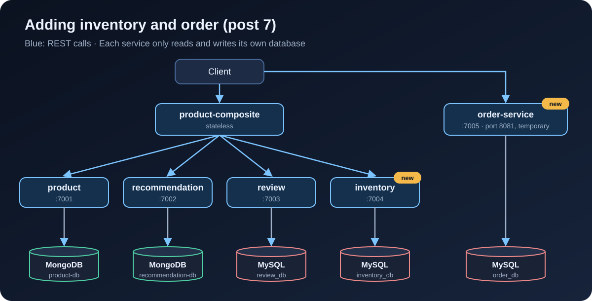

[NOTE]
====
This is *part 7* of the e-commerce microservices series, part 2 (data and events). The code for this post is at tag link:https://github.com/hoangluongtran0309/ecommerce-platform/tree/blog-07[`blog-07`]. Previous post: link:/en/blog/2026/ecommerce-microservices-06-persistence/[MongoDB, MySQL and database per service].

This post is an *extension*: the book only has product, review and recommendation. Inventory and order are what a real e-commerce system needs, and they are the foundation for the order saga in post 10.
====

A shop has to answer two questions: is it in stock, and what did the customer order. This post adds a service for each:

* *inventory-service* keeps the stock level of each product.
* *order-service* accepts orders and stores them in the `PENDING` state.

By the end of this post you will have:

* A product page (`GET /product-composite/{id}`) with a new `stock` field.
* Product creation through the composite, including the initial stock.
* `POST /order` and `GET /order/{orderId}` on port 8081.
* One MySQL server holding three separate databases: `review_db`, `inventory_db`, `order_db`.

.The system after post 7

== Two new projects

Same as creating review-service in post 6: copy the folder, rename the package, port and database name. Then register them in `settings.gradle`:

[source,groovy]
.settings.gradle
----
include ':microservices:inventory-service'
include ':microservices:order-service'
----

[cols="1,1,1"]
|===
|Service |Local port |Database

|inventory-service |7004 |`inventory_db`
|order-service |7005 |`order_db`
|===

Both use JPA on MySQL, so their `build.gradle` matches review-service. Inventory skips MapStruct because it only has two fields; mapping by hand is simpler.

Both also get the `jdbcScheduler` bean like review, for the reason from post 6: JPA is blocking.

== The API contract

As with every other service, the API lives in the `api` module:

[source,java]
.api/src/main/java/com/ecommerce/api/core/inventory/
----
public record Inventory(int productId, int quantity, String serviceAddress) {
}

public interface InventoryService {

    /** Set the stock level of a product: create it if missing, overwrite it if present. */
    @PostMapping(value = "/inventory", consumes = "application/json", produces = "application/json")
    Mono<Inventory> setStock(@RequestBody Inventory body);

    @GetMapping(value = "/inventory/{productId}", produces = "application/json")
    Mono<Inventory> getInventory(@PathVariable int productId);

    @DeleteMapping(value = "/inventory/{productId}")
    Mono<Void> deleteInventory(@PathVariable int productId);
}
----

[source,java]
.api/src/main/java/com/ecommerce/api/core/order/
----
public record Order(
    String orderId,
    String customerId,
    List<OrderLine> lines,
    BigDecimal total,
    OrderStatus status,
    String serviceAddress) {
}

public record OrderLine(int productId, int quantity, BigDecimal unitPrice) {

    public BigDecimal lineTotal() {
        return unitPrice.multiply(BigDecimal.valueOf(quantity));
    }
}

public enum OrderStatus {
    PENDING,
    CONFIRMED,
    CANCELLED
}

public interface OrderService {

    /** Creates an order in PENDING state. orderId and total come from the server, never from the client. */
    @PostMapping(value = "/order", consumes = "application/json", produces = "application/json")
    Mono<Order> createOrder(@RequestBody Order body);

    @GetMapping(value = "/order/{orderId}", produces = "application/json")
    Mono<Order> getOrder(@PathVariable String orderId);
}
----

An order has three states. This post only creates `PENDING` orders. Moving to `CONFIRMED` (stock reserved, payment done) or `CANCELLED` is the saga's job in post 10.

== inventory-service

The entity has a unique `productId`, and `@Version` so two requests changing the stock cannot overwrite each other. For stock this matters far more than for reviews: two customers buying the last item is a real scenario.

[source,java]
.InventoryEntity.java
----
@Entity
@Table(name = "inventory")
public class InventoryEntity {

    @Id
    @GeneratedValue
    private int id;

    /** Optimistic locking: two requests changing the same product stock cannot overwrite each other. */
    @Version
    private int version;

    @Column(unique = true)
    private int productId;

    private int quantity;
    // ...
}
----

[source,java]
----
public interface InventoryRepository extends CrudRepository<InventoryEntity, Integer> {

    @Transactional(readOnly = true)
    Optional<InventoryEntity> findByProductId(int productId);
}
----

`setStock` is an *upsert*: create when missing, update when present. Calling it again with the same data gives the same result, like the idempotent delete from post 6.

[source,java]
.InventoryServiceImpl.java
----
@Override
public Mono<Inventory> setStock(Inventory body) {
    if (body.productId() < 1) {
        throw new InvalidInputException("Invalid productId: " + body.productId());
    }
    if (body.quantity() < 0) {
        throw new InvalidInputException("Invalid quantity: " + body.quantity());
    }
    return Mono.fromCallable(() -> {
        // Upsert: update the stock if the product has one, create it otherwise
        InventoryEntity entity = repository.findByProductId(body.productId())
            .orElseGet(() -> new InventoryEntity(body.productId(), 0));
        entity.setQuantity(body.quantity());
        InventoryEntity saved = repository.save(entity);
        LOG.debug("setStock: productId={} quantity={}", saved.getProductId(), saved.getQuantity());
        return toApi(saved);
    }).subscribeOn(jdbcScheduler);
}

@Override
public Mono<Inventory> getInventory(int productId) {
    if (productId < 1) {
        throw new InvalidInputException("Invalid productId: " + productId);
    }
    return Mono.fromCallable(() -> repository.findByProductId(productId)
            .map(this::toApi)
            .orElseThrow(() -> new NotFoundException("No inventory found for productId: " + productId)))
        .subscribeOn(jdbcScheduler);
}

@Override
public Mono<Void> deleteInventory(int productId) {
    if (productId < 1) {
        throw new InvalidInputException("Invalid productId: " + productId);
    }
    return Mono.fromRunnable(() -> repository.findByProductId(productId).ifPresent(repository::delete))
        .subscribeOn(jdbcScheduler).then();
}
----

A negative quantity returns 422. A product with no stock entry returns 404, not "zero in stock": "unknown" and "sold out" are different things.

== order-service

=== Storing orders with JPA

An order has many lines. A line means nothing outside its order, so I use `@ElementCollection` instead of a separate entity with a `@OneToMany` relation:

[source,java]
.OrderEntity.java
----
@Entity
@Table(name = "orders")
public class OrderEntity {

    @Id
    private String orderId;

    @Version
    private Integer version;

    private String customerId;

    @Column(precision = 12, scale = 2)
    private BigDecimal total;

    @Enumerated(EnumType.STRING)
    private OrderStatus status;

    @ElementCollection(fetch = FetchType.EAGER)
    @CollectionTable(name = "order_lines", joinColumns = @JoinColumn(name = "order_id"))
    private List<OrderLineEmbeddable> lines = new ArrayList<>();
    // ...
}
----

[source,java]
.OrderLineEmbeddable.java
----
@Embeddable
public class OrderLineEmbeddable {

    private int productId;
    private int quantity;

    @Column(precision = 12, scale = 2)
    private BigDecimal unitPrice;
    // ...
}
----

A few choices here:

* `orderId` is a UUID generated by the service, not a MySQL auto-increment number. Order ids leak out (emails, URLs), and sequential numbers reveal your sales volume and make other people's order ids easy to guess.
* `@Enumerated(EnumType.STRING)` stores `PENDING` rather than `0`. JPA's default stores the ordinal, and the moment someone inserts a value in the middle of the enum, old data changes meaning.
* Money is `BigDecimal` with `precision = 12, scale = 2`, never `double`.

`OrderRepository` is just a `CrudRepository<OrderEntity, String>`. `OrderMapper` uses MapStruct as in post 6, and MapStruct knows how to convert `List<OrderLine>` to `List<OrderLineEmbeddable>` on its own.

=== The server decides, not the client

The most important part of order-service is what it does *not* take from the client:

[source,java]
.OrderServiceImpl.java
----
@Override
public Mono<Order> createOrder(Order body) {
    validate(body);

    // The server creates orderId, computes total and sets the status; whatever the client sent is ignored
    BigDecimal total = body.lines().stream()
        .map(OrderLine::lineTotal)
        .reduce(BigDecimal.ZERO, BigDecimal::add);
    Order order = new Order(UUID.randomUUID().toString(), body.customerId(), body.lines(), total,
        OrderStatus.PENDING, null);

    return Mono.fromCallable(() -> {
        Order saved = mapper.entityToApi(repository.save(mapper.apiToEntity(order)));
        LOG.info("Order {} created for customer {}, total {}", saved.orderId(), saved.customerId(), saved.total());
        return withServiceAddress(saved);
    }).subscribeOn(jdbcScheduler);
}

private void validate(Order body) {
    if (body.customerId() == null || body.customerId().isBlank()) {
        throw new InvalidInputException("customerId is required");
    }
    if (body.lines() == null || body.lines().isEmpty()) {
        throw new InvalidInputException("An order must contain at least one line");
    }
    for (OrderLine line : body.lines()) {
        if (line.productId() < 1 || line.quantity() < 1 || line.unitPrice() == null
                || line.unitPrice().signum() <= 0) {
            throw new InvalidInputException("Invalid order line: " + line);
        }
    }
}
----

If the client sends `"total": 1` or `"status": "CONFIRMED"`, the server ignores it. The integration test checks exactly that:

[source,java]
.OrderServiceApplicationTests.java
----
@Test
void createAndGetOrder() {
    // The client tries to send orderId, total and status: the server must ignore all three
    Order request = new Order("hacked-id", "customer-1",
        List.of(new OrderLine(1, 2, new BigDecimal("199000")), new OrderLine(2, 1, new BigDecimal("499000"))),
        BigDecimal.ONE, OrderStatus.CONFIRMED, null);

    Order created = client.post().uri("/order").bodyValue(request).accept(APPLICATION_JSON).exchange()
        .expectStatus().isOk()
        .expectBody(Order.class).returnResult().getResponseBody();

    assertNotEquals("hacked-id", created.orderId());
    assertEquals(OrderStatus.PENDING, created.status());
    assertEquals(0, new BigDecimal("897000").compareTo(created.total()));
    // ...
}
----

[WARNING]
====
One hole remains: each line's `unitPrice` still comes from the client. Edit the request and you can buy sneakers for 1 dong. The right fix is for order-service to take prices from the catalog (product-service) instead of trusting the client. I am leaving this hole open on purpose until post 10, when order, inventory and payment talk through events, because that is the natural place to check prices and reserve stock.
====

== The composite shows stock

`ProductAggregate` gets a `stock` field. It is `Integer`, not `int`, so it can be `null`:

[source,java]
.ProductAggregate.java
----
/**
 * stock: the initial stock when creating a product; the current stock when reading (null if inventory-service does not answer).
 */
public record ProductAggregate(
    int productId,
    String name,
    BigDecimal price,
    Integer stock,
    List<RecommendationSummary> recommendations,
    List<ReviewSummary> reviews,
    ServiceAddresses serviceAddresses) {
}
----

In `ProductCompositeIntegration`, inventory is called the same way as recommendation in post 3: on error, return empty, because a missing stock number is no reason to hide the product page.

[source,java]
.ProductCompositeIntegration.java
----
/** Stock is secondary information: if inventory fails or has no data, return empty. */
public Mono<Inventory> getInventory(int productId) {
    return webClient.get().uri(inventoryServiceUrl + "/" + productId).retrieve()
        .bodyToMono(Inventory.class)
        .onErrorResume(ex -> {
            LOG.warn("Got an exception while requesting inventory, return no stock info: {}", ex.getMessage());
            return Mono.empty();
        });
}
----

`setStock` and `deleteInventory` are written like `createProduct` and `deleteProduct`. The inventory address comes from `app.inventory-service.host` and `port` in `application.yml` (`localhost:7004`, or `inventory:8080` in the docker profile).

Now a trap in `Mono.zip`. If any of the `Mono` sources is *empty* (emits no value), `zip` emits nothing at all, and the composite returns an empty response. And `getInventory` returns empty whenever it fails. The fix is to wrap the result in an `Optional`, so there is always exactly one value:

[source,java]
.ProductCompositeServiceImpl.java
----
@Override
public Mono<ProductAggregate> getProduct(int productId) {
    // Call the services in parallel, wait for every result, then merge.
    // An empty Mono would make the whole zip empty, so wrap the stock in an Optional
    Mono<Optional<Integer>> stock = integration.getInventory(productId)
        .map(inventory -> Optional.of(inventory.quantity()))
        .defaultIfEmpty(Optional.empty());

    return Mono.zip(
            integration.getProduct(productId),
            integration.getRecommendations(productId).collectList(),
            integration.getReviews(productId).collectList(),
            stock)
        .map(t -> createProductAggregate(t.getT1(), t.getT2(), t.getT3(), t.getT4().orElse(null),
            serviceUtil.getServiceAddress()));
}
----

Recommendations and reviews do not have this problem, because `collectList()` on an empty `Flux` still emits an empty list.

Create and delete include inventory too:

[source,java]
----
// in createProduct, after the reviews
if (body.stock() != null) {
    monoList.add(integration.setStock(body.productId(), body.stock()));
}

// deleteProduct
return Mono.when(
        integration.deleteProduct(productId),
        integration.deleteRecommendations(productId),
        integration.deleteReviews(productId),
        integration.deleteInventory(productId))
    .doOnError(ex -> LOG.warn("delete failed: {}", ex.toString()));
----

== Three databases on one MySQL

The MySQL image only creates one database through `MYSQL_DATABASE`. To get `inventory_db` and `order_db` as well, use the `/docker-entrypoint-initdb.d/` folder: scripts there run *once*, when MySQL initializes an empty volume.

[source,bash]
.docker/mysql/init-databases.sh
----
#!/bin/bash
# Runs once, when the MySQL container initializes an empty volume.
# review_db is already created through MYSQL_DATABASE; here we add the databases
# for inventory and order, and grant MYSQL_USER access to them.
set -e

mysql -uroot -p"$MYSQL_ROOT_PASSWORD" <<-EOSQL
  CREATE DATABASE IF NOT EXISTS inventory_db;
  CREATE DATABASE IF NOT EXISTS order_db;
  GRANT ALL PRIVILEGES ON inventory_db.* TO '$MYSQL_USER'@'%';
  GRANT ALL PRIVILEGES ON order_db.* TO '$MYSQL_USER'@'%';
EOSQL
----

I use a shell script rather than a `.sql` file so it can read the user name from the environment instead of hard-coding `'user'` in two places.

The three services share one MySQL *server*, but each has its own database, and none reads another's. In production each database can move to its own server with no code changes, only a different URL.

[source,yaml]
.docker-compose.yml
----
  inventory:
    build: microservices/inventory-service
    mem_limit: 512m
    environment:
      - SPRING_PROFILES_ACTIVE=docker
      - MYSQL_USER=${MYSQL_USER}
      - MYSQL_PASSWORD=${MYSQL_PASSWORD}
    depends_on:
      mysql:
        condition: service_healthy

  order:
    build: microservices/order-service
    mem_limit: 512m
    # Exposed for now so we can call it; removed once the Gateway arrives (part 3).
    ports:
      - "8081:8080"
    environment:
      - SPRING_PROFILES_ACTIVE=docker
      - MYSQL_USER=${MYSQL_USER}
      - MYSQL_PASSWORD=${MYSQL_PASSWORD}
    depends_on:
      mysql:
        condition: service_healthy

  # ...

  mysql:
    image: mysql:8.4
    # ... as in post 6, plus:
    volumes:
      - ./docker/mysql/init-databases.sh:/docker-entrypoint-initdb.d/init-databases.sh:ro
----

order-service does not go through the composite, because placing an order has nothing to do with the product details page. For now I expose port 8081 to call it directly. Post 12 puts everything behind the Gateway, and this port closes again.

[TIP]
====
The init script only runs when the volume is empty. If you already ran MySQL from post 6, remove the old container first with `docker compose down -v`; otherwise `inventory_db` and `order_db` are never created and the two new services fail to start.
====

== End-to-end tests

Product `1` in `setupTestdata` now gets `"stock":10`, plus a few new checks:

[source,bash]
----
# Normal product
assertEqual 10 $(echo $RESPONSE | jq .stock)

# Product without a stock entry: stock is null, not an error
assertEqual null $(echo $RESPONSE | jq .stock)
----

Order runs on a different port, so there is a new `ORDER_PORT` variable (default 8081). order-service has no endpoint that returns 200 without writing data, so I added a `waitForHttpCode` function that waits until an unknown order returns exactly 404:

[source,bash]
----
# Order: an unknown order returns 404
waitForHttpCode 404 http://$HOST:$ORDER_PORT/order/unknown
assertCurl 404 "curl http://$HOST:$ORDER_PORT/order/unknown -s"

# Create an order: the server generates orderId, computes total and sets PENDING
order='{"customerId":"c-1","lines":[{"productId":1,"quantity":1,"unitPrice":899000}]}'
assertCurl 200 "curl -X POST -s http://$HOST:$ORDER_PORT/order -H \"Content-Type: application/json\" --data '$order'"
ORDER_ID=$(echo $RESPONSE | jq -r .orderId)
assertEqual "PENDING" "$(echo $RESPONSE | jq -r .status)"
assertEqual 899000 $(echo $RESPONSE | jq .total)

assertCurl 200 "curl http://$HOST:$ORDER_PORT/order/$ORDER_ID -s"
assertEqual "$ORDER_ID" "$(echo $RESPONSE | jq -r .orderId)"

# An order without lines: 422
assertCurl 422 "curl -X POST -s http://$HOST:$ORDER_PORT/order -H \"Content-Type: application/json\" --data '{\"customerId\":\"c-1\",\"lines\":[]}'"
assertEqual "\"An order must contain at least one line\"" "$(echo $RESPONSE | jq .message)"
----

[source,bash]
----
$ ./gradlew build && docker compose build
$ docker compose down -v
$ ./test-em-all.bash start
...
Test OK (actual value: 10)
...
Test OK (actual value: null)
...
Wait for: http://localhost:8081/order/unknown... DONE, continues...
Test OK (HTTP Code: 404)
Test OK (HTTP Code: 200)
Test OK (actual value: PENDING)
Test OK (actual value: 899000)
Test OK (HTTP Code: 200)
Test OK (actual value: dc3c121d-b8b4-44e0-81ab-cb4677e189bb)
Test OK (HTTP Code: 422)
Test OK (actual value: "An order must contain at least one line")
...
End, all tests OK: Fri Oct 2 06:53:07 UTC 2026
----

`./gradlew build` now runs 43 tests, all passing.

== Trying it by hand

The product page with stock:

[source,bash]
----
$ curl -s localhost:8080/product-composite/1 | jq '{productId,name,price,stock,serviceAddresses}'
{
  "productId": 1,
  "name": "Giay sneaker",
  "price": 899000,
  "stock": 10,
  "serviceAddresses": {
    "cmp": "c5ebe0a5fcfb/172.18.0.2:8080",
    "pro": "d9bb6bfdce1c/172.18.0.9:8080",
    "rev": "3a58c2d4912f/172.18.0.6:8080",
    "rec": "78bb6604b146/172.18.0.8:8080"
  }
}
----

Placing an order, deliberately sending a fake `orderId`, `total` and `status`:

[source,bash]
----
$ curl -s -X POST localhost:8081/order -H "Content-Type: application/json" --data '{
    "orderId":"hack","customerId":"c-42","total":1,"status":"CONFIRMED",
    "lines":[{"productId":1,"quantity":1,"unitPrice":899000},
             {"productId":113,"quantity":2,"unitPrice":199000}]}' | jq .
{
  "orderId": "82c330f5-220c-4db7-8d2b-f81b1f596ab6",
  "customerId": "c-42",
  "lines": [
    {
      "productId": 1,
      "quantity": 1,
      "unitPrice": 899000
    },
    {
      "productId": 113,
      "quantity": 2,
      "unitPrice": 199000
    }
  ],
  "total": 1297000,
  "status": "PENDING",
  "serviceAddress": "5334a9d52499/172.18.0.5:8080"
}
----

The server ignored all three fake values: the order id is a fresh UUID, the total is 899,000 + 2 × 199,000 = 1,297,000, and the status is `PENDING`.

A line with quantity 0:

[source,bash]
----
$ curl -s -X POST localhost:8081/order -H "Content-Type: application/json" \
    --data '{"customerId":"c-42","lines":[{"productId":1,"quantity":0,"unitPrice":899000}]}' | jq .
{
  "timestamp": "2026-10-02T06:53:17.650129108Z",
  "path": "/order",
  "httpStatus": "UNPROCESSABLE_ENTITY",
  "message": "Invalid order line: OrderLine[productId=1, quantity=0, unitPrice=899000]"
}
----

In MySQL, the three databases sit side by side:

[source,bash]
----
$ docker compose exec -T mysql mysql -uuser -ppwd -e "SHOW DATABASES;"
Database
information_schema
inventory_db
order_db
performance_schema
review_db

$ docker compose exec -T mysql mysql -uuser -ppwd order_db \
    -e "SELECT order_id,customer_id,total,status,version FROM orders; SELECT * FROM order_lines;"
order_id	customer_id	total	status	version
82c330f5-220c-4db7-8d2b-f81b1f596ab6	c-42	1297000.00	PENDING	0
dc3c121d-b8b4-44e0-81ab-cb4677e189bb	c-1	899000.00	PENDING	0
order_id	product_id	quantity	unit_price
dc3c121d-b8b4-44e0-81ab-cb4677e189bb	1	1	899000.00
82c330f5-220c-4db7-8d2b-f81b1f596ab6	1	1	899000.00
82c330f5-220c-4db7-8d2b-f81b1f596ab6	113	2	199000.00
----

The status is stored as the text `PENDING`, and money keeps its two decimal places.

== When inventory goes down

Stop inventory and open the product page:

[source,bash]
----
$ docker compose stop inventory
$ curl -s localhost:8080/product-composite/1
{"productId":1,"name":"Giay sneaker","price":899000,"stock":null,"recommendations":[...
----

The page still renders, just without the stock number, as designed. But look at the composite's log:

[source,text]
----
WARN ... Got an exception while requesting inventory, return no stock info: connection timed out after 30000 ms: inventory/172.18.0.7:8080
----

That request took *30 seconds* to return. The fallback is there, but the user waits half a minute to see it. Post 15 uses Resilience4j (time limiter, circuit breaker) to cut that wait short. For now, remember that returning empty on errors is only half of fault tolerance.

Commit:

[source,bash]
----
git add .
git commit -m "Post 7: inventory-service and order-service"
git tag blog-07
----

== Summary

* inventory-service keeps stock with an upsert and optimistic locking. "No data yet" is a 404, different from "sold out".
* order-service generates the order id, computes the total, sets the `PENDING` state, and trusts none of those from the client.
* The composite shows `stock`; an `Optional` keeps one empty source from emptying the whole `Mono.zip`.
* One MySQL server, three separate databases, created by a script in `docker-entrypoint-initdb.d`.

Two problems are still open: creating a product across several services has no shared transaction, and orders do not reserve stock yet. Both need asynchronous communication. Post 8 brings Kafka into the system, starting with creating and deleting products through events.
