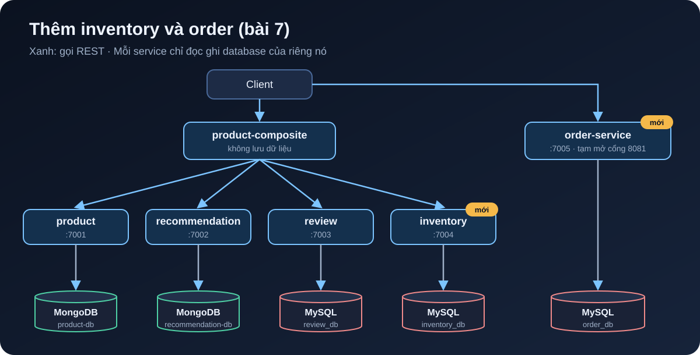

[NOTE]
====
Đây là *bài 7* trong series microservices e-commerce, phần 2 (dữ liệu và sự kiện). Code của bài ở tag link:https://github.com/hoangluongtran0309/ecommerce-platform/tree/blog-07[`blog-07`]. Bài trước: link:/blog/2026/ecommerce-microservices-06-persistence/[MongoDB, MySQL và database-per-service].

Bài này là phần *mở rộng*: sách chỉ có product, review, recommendation. Inventory và order là thứ một hệ thống e-commerce thật cần, và là nền cho saga đặt hàng ở bài 10.
====

Một trang bán hàng phải trả lời được hai câu: còn hàng không, và khách đã đặt gì. Bài này thêm hai service cho hai câu đó:

* *inventory-service* giữ số lượng tồn kho của từng sản phẩm.
* *order-service* nhận đơn hàng, lưu lại ở trạng thái `PENDING`.

Cuối bài bạn sẽ có:

* Trang sản phẩm (`GET /product-composite/{id}`) có thêm trường `stock`.
* Tạo sản phẩm qua composite kèm tồn kho ban đầu.
* `POST /order` và `GET /order/{orderId}` chạy trên cổng 8081.
* Một MySQL chứa ba database tách biệt: `review_db`, `inventory_db`, `order_db`.

.Hệ thống sau bài 7

== Tạo hai project mới

Làm giống hệt cách tạo review-service ở bài 6: copy thư mục, đổi tên package, port, tên database. Rồi khai báo trong `settings.gradle`:

[source,groovy]
.settings.gradle
----
include ':microservices:inventory-service'
include ':microservices:order-service'
----

[cols="1,1,1"]
|===
|Service |Port khi chạy local |Database

|inventory-service |7004 |`inventory_db`
|order-service |7005 |`order_db`
|===

Cả hai dùng JPA với MySQL, nên `build.gradle` giống review-service. Inventory không cần MapStruct vì chỉ có hai field, chuyển tay cho gọn.

Cả hai cũng có bean `jdbcScheduler` như review, vì lý do đã nói ở bài 6: JPA là blocking.

== Hợp đồng API

Như mọi service khác, API nằm trong module `api`:

[source,java]
.api/src/main/java/com/ecommerce/api/core/inventory/
----
public record Inventory(int productId, int quantity, String serviceAddress) {
}

public interface InventoryService {

    /** Đặt số lượng tồn kho của một sản phẩm: tạo mới nếu chưa có, ghi đè nếu đã có. */
    @PostMapping(value = "/inventory", consumes = "application/json", produces = "application/json")
    Mono<Inventory> setStock(@RequestBody Inventory body);

    @GetMapping(value = "/inventory/{productId}", produces = "application/json")
    Mono<Inventory> getInventory(@PathVariable int productId);

    @DeleteMapping(value = "/inventory/{productId}")
    Mono<Void> deleteInventory(@PathVariable int productId);
}
----

[source,java]
.api/src/main/java/com/ecommerce/api/core/order/
----
public record Order(
    String orderId,
    String customerId,
    List<OrderLine> lines,
    BigDecimal total,
    OrderStatus status,
    String serviceAddress) {
}

public record OrderLine(int productId, int quantity, BigDecimal unitPrice) {

    public BigDecimal lineTotal() {
        return unitPrice.multiply(BigDecimal.valueOf(quantity));
    }
}

public enum OrderStatus {
    PENDING,
    CONFIRMED,
    CANCELLED
}

public interface OrderService {

    /** Tạo đơn ở trạng thái PENDING. orderId và total do server tạo, không lấy từ client. */
    @PostMapping(value = "/order", consumes = "application/json", produces = "application/json")
    Mono<Order> createOrder(@RequestBody Order body);

    @GetMapping(value = "/order/{orderId}", produces = "application/json")
    Mono<Order> getOrder(@PathVariable String orderId);
}
----

Đơn có ba trạng thái. Bài này chỉ tạo đơn `PENDING`. Chuyển sang `CONFIRMED` (đã giữ được hàng, đã thanh toán) hay `CANCELLED` là việc của saga ở bài 10.

== inventory-service

Entity có `productId` là duy nhất, và `@Version` để hai request cùng sửa tồn kho không đè lên nhau. Với tồn kho, chuyện này quan trọng hơn ở review nhiều: hai khách cùng mua món cuối cùng là tình huống có thật.

[source,java]
.InventoryEntity.java
----
@Entity
@Table(name = "inventory")
public class InventoryEntity {

    @Id
    @GeneratedValue
    private int id;

    /** Optimistic locking: hai request cùng sửa tồn kho của một sản phẩm sẽ không ghi đè lẫn nhau. */
    @Version
    private int version;

    @Column(unique = true)
    private int productId;

    private int quantity;
    // ...
}
----

[source,java]
----
public interface InventoryRepository extends CrudRepository<InventoryEntity, Integer> {

    @Transactional(readOnly = true)
    Optional<InventoryEntity> findByProductId(int productId);
}
----

`setStock` là một *upsert*: chưa có thì tạo, có rồi thì cập nhật. Như vậy gọi lại nhiều lần với cùng dữ liệu vẫn cho cùng kết quả, giống tính idempotent của thao tác xoá ở bài 6.

[source,java]
.InventoryServiceImpl.java
----
@Override
public Mono<Inventory> setStock(Inventory body) {
    if (body.productId() < 1) {
        throw new InvalidInputException("Invalid productId: " + body.productId());
    }
    if (body.quantity() < 0) {
        throw new InvalidInputException("Invalid quantity: " + body.quantity());
    }
    return Mono.fromCallable(() -> {
        // Upsert: sản phẩm đã có tồn kho thì cập nhật, chưa có thì tạo mới
        InventoryEntity entity = repository.findByProductId(body.productId())
            .orElseGet(() -> new InventoryEntity(body.productId(), 0));
        entity.setQuantity(body.quantity());
        InventoryEntity saved = repository.save(entity);
        LOG.debug("setStock: productId={} quantity={}", saved.getProductId(), saved.getQuantity());
        return toApi(saved);
    }).subscribeOn(jdbcScheduler);
}

@Override
public Mono<Inventory> getInventory(int productId) {
    if (productId < 1) {
        throw new InvalidInputException("Invalid productId: " + productId);
    }
    return Mono.fromCallable(() -> repository.findByProductId(productId)
            .map(this::toApi)
            .orElseThrow(() -> new NotFoundException("No inventory found for productId: " + productId)))
        .subscribeOn(jdbcScheduler);
}

@Override
public Mono<Void> deleteInventory(int productId) {
    if (productId < 1) {
        throw new InvalidInputException("Invalid productId: " + productId);
    }
    return Mono.fromRunnable(() -> repository.findByProductId(productId).ifPresent(repository::delete))
        .subscribeOn(jdbcScheduler).then();
}
----

Tồn kho âm trả về 422. Sản phẩm chưa khai báo tồn kho trả về 404, không phải "tồn kho bằng 0": "chưa biết" và "hết hàng" là hai chuyện khác nhau.

== order-service

=== Lưu đơn hàng với JPA

Một đơn có nhiều dòng hàng. Dòng hàng không có ý nghĩa nếu tách khỏi đơn, nên mình dùng `@ElementCollection` thay vì một entity riêng với quan hệ `@OneToMany`:

[source,java]
.OrderEntity.java
----
@Entity
@Table(name = "orders")
public class OrderEntity {

    @Id
    private String orderId;

    @Version
    private Integer version;

    private String customerId;

    @Column(precision = 12, scale = 2)
    private BigDecimal total;

    @Enumerated(EnumType.STRING)
    private OrderStatus status;

    @ElementCollection(fetch = FetchType.EAGER)
    @CollectionTable(name = "order_lines", joinColumns = @JoinColumn(name = "order_id"))
    private List<OrderLineEmbeddable> lines = new ArrayList<>();
    // ...
}
----

[source,java]
.OrderLineEmbeddable.java
----
@Embeddable
public class OrderLineEmbeddable {

    private int productId;
    private int quantity;

    @Column(precision = 12, scale = 2)
    private BigDecimal unitPrice;
    // ...
}
----

Vài lựa chọn ở đây:

* `orderId` là chuỗi UUID do service tự sinh, không dùng số tự tăng của MySQL. Mã đơn hay lộ ra ngoài (email, URL), số tự tăng thì để lộ doanh số và dễ đoán mã đơn của người khác.
* `@Enumerated(EnumType.STRING)` lưu `PENDING` thay vì `0`. Mặc định của JPA là lưu số thứ tự, và chỉ cần ai đó chèn một giá trị vào giữa enum là dữ liệu cũ đổi nghĩa.
* Tiền dùng `BigDecimal` với `precision = 12, scale = 2`, không bao giờ dùng `double`.

`OrderRepository` chỉ là `CrudRepository<OrderEntity, String>`. `OrderMapper` dùng MapStruct như bài 6, và MapStruct tự biết chuyển `List<OrderLine>` sang `List<OrderLineEmbeddable>`.

=== Server quyết định, không tin client

Phần quan trọng nhất của order-service là những gì nó *không* nhận từ client:

[source,java]
.OrderServiceImpl.java
----
@Override
public Mono<Order> createOrder(Order body) {
    validate(body);

    // Server tự tạo orderId, tính total và đặt trạng thái; các giá trị client gửi lên bị bỏ qua
    BigDecimal total = body.lines().stream()
        .map(OrderLine::lineTotal)
        .reduce(BigDecimal.ZERO, BigDecimal::add);
    Order order = new Order(UUID.randomUUID().toString(), body.customerId(), body.lines(), total,
        OrderStatus.PENDING, null);

    return Mono.fromCallable(() -> {
        Order saved = mapper.entityToApi(repository.save(mapper.apiToEntity(order)));
        LOG.info("Order {} created for customer {}, total {}", saved.orderId(), saved.customerId(), saved.total());
        return withServiceAddress(saved);
    }).subscribeOn(jdbcScheduler);
}

private void validate(Order body) {
    if (body.customerId() == null || body.customerId().isBlank()) {
        throw new InvalidInputException("customerId is required");
    }
    if (body.lines() == null || body.lines().isEmpty()) {
        throw new InvalidInputException("An order must contain at least one line");
    }
    for (OrderLine line : body.lines()) {
        if (line.productId() < 1 || line.quantity() < 1 || line.unitPrice() == null
                || line.unitPrice().signum() <= 0) {
            throw new InvalidInputException("Invalid order line: " + line);
        }
    }
}
----

Client gửi `"total": 1` hay `"status": "CONFIRMED"` thì server cũng bỏ qua. Test tích hợp kiểm tra đúng điều đó:

[source,java]
.OrderServiceApplicationTests.java
----
@Test
void createAndGetOrder() {
    // Client cố gửi orderId, total và status: server phải bỏ qua cả ba
    Order request = new Order("hacked-id", "customer-1",
        List.of(new OrderLine(1, 2, new BigDecimal("199000")), new OrderLine(2, 1, new BigDecimal("499000"))),
        BigDecimal.ONE, OrderStatus.CONFIRMED, null);

    Order created = client.post().uri("/order").bodyValue(request).accept(APPLICATION_JSON).exchange()
        .expectStatus().isOk()
        .expectBody(Order.class).returnResult().getResponseBody();

    assertNotEquals("hacked-id", created.orderId());
    assertEquals(OrderStatus.PENDING, created.status());
    assertEquals(0, new BigDecimal("897000").compareTo(created.total()));
    // ...
}
----

[WARNING]
====
Vẫn còn một lỗ hổng: `unitPrice` của từng dòng vẫn do client gửi lên. Người dùng sửa request là mua được giày giá 1 đồng. Cách đúng là order-service lấy giá từ catalog (product-service) chứ không tin giá client gửi. Mình cố ý để lại lỗ hổng này tới bài 10, khi order, inventory và payment nói chuyện với nhau qua event, vì lúc đó mới có chỗ hợp lý để kiểm tra giá và giữ hàng.
====

== Composite hiện tồn kho

`ProductAggregate` thêm trường `stock`. Dùng `Integer` chứ không phải `int` để có thể là `null`:

[source,java]
.ProductAggregate.java
----
/**
 * stock: khi tạo sản phẩm là tồn kho ban đầu; khi đọc là tồn kho hiện tại (null nếu inventory-service không trả lời).
 */
public record ProductAggregate(
    int productId,
    String name,
    BigDecimal price,
    Integer stock,
    List<RecommendationSummary> recommendations,
    List<ReviewSummary> reviews,
    ServiceAddresses serviceAddresses) {
}
----

Trong `ProductCompositeIntegration`, gọi inventory giống cách gọi recommendation ở bài 3: lỗi thì trả về rỗng, vì thiếu số tồn kho không phải lý do để không hiển thị trang sản phẩm.

[source,java]
.ProductCompositeIntegration.java
----
/** Tồn kho là thông tin phụ: inventory lỗi hoặc chưa có dữ liệu thì trả về rỗng. */
public Mono<Inventory> getInventory(int productId) {
    return webClient.get().uri(inventoryServiceUrl + "/" + productId).retrieve()
        .bodyToMono(Inventory.class)
        .onErrorResume(ex -> {
            LOG.warn("Got an exception while requesting inventory, return no stock info: {}", ex.getMessage());
            return Mono.empty();
        });
}
----

`setStock` và `deleteInventory` viết giống `createProduct`, `deleteProduct`. Địa chỉ inventory lấy từ `app.inventory-service.host` và `port` trong `application.yml` (`localhost:7004`, profile docker là `inventory:8080`).

Giờ tới một cái bẫy của `Mono.zip`. Nếu một trong các `Mono` *rỗng* (không phát ra giá trị nào), `zip` không phát ra gì cả, và composite trả về response rỗng. Mà `getInventory` trả về rỗng mỗi khi lỗi. Cách xử lý là bọc kết quả trong `Optional`, để luôn có đúng một giá trị:

[source,java]
.ProductCompositeServiceImpl.java
----
@Override
public Mono<ProductAggregate> getProduct(int productId) {
    // Gọi song song cả 3 service, chờ đủ kết quả rồi mới gộp.
    // Mono rỗng sẽ làm cả zip rỗng theo, nên bọc tồn kho trong Optional
    Mono<Optional<Integer>> stock = integration.getInventory(productId)
        .map(inventory -> Optional.of(inventory.quantity()))
        .defaultIfEmpty(Optional.empty());

    return Mono.zip(
            integration.getProduct(productId),
            integration.getRecommendations(productId).collectList(),
            integration.getReviews(productId).collectList(),
            stock)
        .map(t -> createProductAggregate(t.getT1(), t.getT2(), t.getT3(), t.getT4().orElse(null),
            serviceUtil.getServiceAddress()));
}
----

Recommendation và review không gặp vấn đề này vì `collectList()` của một `Flux` rỗng vẫn phát ra một danh sách rỗng.

Tạo và xoá cũng thêm inventory:

[source,java]
----
// trong createProduct, sau phần reviews
if (body.stock() != null) {
    monoList.add(integration.setStock(body.productId(), body.stock()));
}

// deleteProduct
return Mono.when(
        integration.deleteProduct(productId),
        integration.deleteRecommendations(productId),
        integration.deleteReviews(productId),
        integration.deleteInventory(productId))
    .doOnError(ex -> LOG.warn("delete failed: {}", ex.toString()));
----

== Ba database trên một MySQL

Image MySQL chỉ tạo được một database qua biến `MYSQL_DATABASE`. Để có thêm `inventory_db` và `order_db`, dùng thư mục `/docker-entrypoint-initdb.d/`: các script ở đây chạy *một lần* khi MySQL khởi tạo volume rỗng.

[source,bash]
.docker/mysql/init-databases.sh
----
#!/bin/bash
# Chạy một lần khi container MySQL khởi tạo volume rỗng.
# review_db đã được tạo qua MYSQL_DATABASE; ở đây tạo thêm database
# cho inventory và order, rồi cấp quyền cho MYSQL_USER.
set -e

mysql -uroot -p"$MYSQL_ROOT_PASSWORD" <<-EOSQL
  CREATE DATABASE IF NOT EXISTS inventory_db;
  CREATE DATABASE IF NOT EXISTS order_db;
  GRANT ALL PRIVILEGES ON inventory_db.* TO '$MYSQL_USER'@'%';
  GRANT ALL PRIVILEGES ON order_db.* TO '$MYSQL_USER'@'%';
EOSQL
----

Mình dùng script shell chứ không phải file `.sql` để đọc được tên user từ biến môi trường, khỏi viết cứng `'user'` vào hai nơi.

Ba service dùng chung một MySQL *server*, nhưng mỗi service một database, và không service nào đọc database của service khác. Ở production, mỗi database có thể nằm trên server riêng mà code không đổi gì, chỉ đổi URL.

[source,yaml]
.docker-compose.yml
----
  inventory:
    build: microservices/inventory-service
    mem_limit: 512m
    environment:
      - SPRING_PROFILES_ACTIVE=docker
      - MYSQL_USER=${MYSQL_USER}
      - MYSQL_PASSWORD=${MYSQL_PASSWORD}
    depends_on:
      mysql:
        condition: service_healthy

  order:
    build: microservices/order-service
    mem_limit: 512m
    # Tạm mở cổng ra ngoài để gọi thử; khi có Gateway (phần 3) sẽ bỏ.
    ports:
      - "8081:8080"
    environment:
      - SPRING_PROFILES_ACTIVE=docker
      - MYSQL_USER=${MYSQL_USER}
      - MYSQL_PASSWORD=${MYSQL_PASSWORD}
    depends_on:
      mysql:
        condition: service_healthy

  # ...

  mysql:
    image: mysql:8.4
    # ... như bài 6, thêm:
    volumes:
      - ./docker/mysql/init-databases.sh:/docker-entrypoint-initdb.d/init-databases.sh:ro
----

order-service không đi qua composite, vì đặt hàng không liên quan tới trang chi tiết sản phẩm. Tạm thời mình mở cổng 8081 để gọi trực tiếp. Bài 12 sẽ đặt mọi thứ sau Gateway, và cổng này sẽ đóng lại.

[TIP]
====
Script init chỉ chạy khi volume còn trống. Nếu bạn đã chạy MySQL từ bài 6, xoá container cũ trước: `docker compose down -v`, nếu không `inventory_db` và `order_db` sẽ không được tạo và hai service mới không khởi động được.
====

== Test end-to-end

Sản phẩm `1` trong `setupTestdata` thêm `"stock":10`, và có thêm vài kiểm tra:

[source,bash]
----
# Sản phẩm bình thường
assertEqual 10 $(echo $RESPONSE | jq .stock)

# Sản phẩm chưa khai báo tồn kho: stock là null, không phải lỗi
assertEqual null $(echo $RESPONSE | jq .stock)
----

Order chạy ở cổng khác, nên thêm biến `ORDER_PORT` (mặc định 8081). Order-service chưa có endpoint nào trả 200 mà không ghi dữ liệu, nên mình thêm hàm `waitForHttpCode`, chờ tới khi đơn không tồn tại trả về đúng 404:

[source,bash]
----
# Order: đơn không tồn tại trả về 404
waitForHttpCode 404 http://$HOST:$ORDER_PORT/order/unknown
assertCurl 404 "curl http://$HOST:$ORDER_PORT/order/unknown -s"

# Tạo đơn: server tự sinh orderId, tính total và đặt trạng thái PENDING
order='{"customerId":"c-1","lines":[{"productId":1,"quantity":1,"unitPrice":899000}]}'
assertCurl 200 "curl -X POST -s http://$HOST:$ORDER_PORT/order -H \"Content-Type: application/json\" --data '$order'"
ORDER_ID=$(echo $RESPONSE | jq -r .orderId)
assertEqual "PENDING" "$(echo $RESPONSE | jq -r .status)"
assertEqual 899000 $(echo $RESPONSE | jq .total)

assertCurl 200 "curl http://$HOST:$ORDER_PORT/order/$ORDER_ID -s"
assertEqual "$ORDER_ID" "$(echo $RESPONSE | jq -r .orderId)"

# Đơn không có dòng hàng nào: 422
assertCurl 422 "curl -X POST -s http://$HOST:$ORDER_PORT/order -H \"Content-Type: application/json\" --data '{\"customerId\":\"c-1\",\"lines\":[]}'"
assertEqual "\"An order must contain at least one line\"" "$(echo $RESPONSE | jq .message)"
----

[source,bash]
----
$ ./gradlew build && docker compose build
$ docker compose down -v
$ ./test-em-all.bash start
...
Test OK (actual value: 10)
...
Test OK (actual value: null)
...
Wait for: http://localhost:8081/order/unknown... DONE, continues...
Test OK (HTTP Code: 404)
Test OK (HTTP Code: 200)
Test OK (actual value: PENDING)
Test OK (actual value: 899000)
Test OK (HTTP Code: 200)
Test OK (actual value: dc3c121d-b8b4-44e0-81ab-cb4677e189bb)
Test OK (HTTP Code: 422)
Test OK (actual value: "An order must contain at least one line")
...
End, all tests OK: Fri Oct 2 06:53:07 UTC 2026
----

`./gradlew build` giờ chạy 43 test, tất cả đều qua.

== Thử bằng tay

Trang sản phẩm có tồn kho:

[source,bash]
----
$ curl -s localhost:8080/product-composite/1 | jq '{productId,name,price,stock,serviceAddresses}'
{
  "productId": 1,
  "name": "Giay sneaker",
  "price": 899000,
  "stock": 10,
  "serviceAddresses": {
    "cmp": "c5ebe0a5fcfb/172.18.0.2:8080",
    "pro": "d9bb6bfdce1c/172.18.0.9:8080",
    "rev": "3a58c2d4912f/172.18.0.6:8080",
    "rec": "78bb6604b146/172.18.0.8:8080"
  }
}
----

Đặt hàng, cố tình gửi kèm `orderId`, `total` và `status` giả:

[source,bash]
----
$ curl -s -X POST localhost:8081/order -H "Content-Type: application/json" --data '{
    "orderId":"hack","customerId":"c-42","total":1,"status":"CONFIRMED",
    "lines":[{"productId":1,"quantity":1,"unitPrice":899000},
             {"productId":113,"quantity":2,"unitPrice":199000}]}' | jq .
{
  "orderId": "82c330f5-220c-4db7-8d2b-f81b1f596ab6",
  "customerId": "c-42",
  "lines": [
    {
      "productId": 1,
      "quantity": 1,
      "unitPrice": 899000
    },
    {
      "productId": 113,
      "quantity": 2,
      "unitPrice": 199000
    }
  ],
  "total": 1297000,
  "status": "PENDING",
  "serviceAddress": "5334a9d52499/172.18.0.5:8080"
}
----

Server bỏ qua cả ba giá trị giả: mã đơn là UUID mới, tổng tiền là 899.000 + 2 × 199.000 = 1.297.000, trạng thái `PENDING`.

Dòng hàng có số lượng 0:

[source,bash]
----
$ curl -s -X POST localhost:8081/order -H "Content-Type: application/json" \
    --data '{"customerId":"c-42","lines":[{"productId":1,"quantity":0,"unitPrice":899000}]}' | jq .
{
  "timestamp": "2026-10-02T06:53:17.650129108Z",
  "path": "/order",
  "httpStatus": "UNPROCESSABLE_ENTITY",
  "message": "Invalid order line: OrderLine[productId=1, quantity=0, unitPrice=899000]"
}
----

Nhìn vào MySQL, ba database nằm cạnh nhau:

[source,bash]
----
$ docker compose exec -T mysql mysql -uuser -ppwd -e "SHOW DATABASES;"
Database
information_schema
inventory_db
order_db
performance_schema
review_db

$ docker compose exec -T mysql mysql -uuser -ppwd order_db \
    -e "SELECT order_id,customer_id,total,status,version FROM orders; SELECT * FROM order_lines;"
order_id	customer_id	total	status	version
82c330f5-220c-4db7-8d2b-f81b1f596ab6	c-42	1297000.00	PENDING	0
dc3c121d-b8b4-44e0-81ab-cb4677e189bb	c-1	899000.00	PENDING	0
order_id	product_id	quantity	unit_price
dc3c121d-b8b4-44e0-81ab-cb4677e189bb	1	1	899000.00
82c330f5-220c-4db7-8d2b-f81b1f596ab6	1	1	899000.00
82c330f5-220c-4db7-8d2b-f81b1f596ab6	113	2	199000.00
----

Trạng thái lưu dạng chữ `PENDING`, tiền có đủ hai chữ số thập phân.

== Khi inventory sập

Thử dừng inventory rồi mở trang sản phẩm:

[source,bash]
----
$ docker compose stop inventory
$ curl -s localhost:8080/product-composite/1
{"productId":1,"name":"Giay sneaker","price":899000,"stock":null,"recommendations":[...
----

Trang vẫn hiển thị, chỉ thiếu số tồn kho, đúng như thiết kế. Nhưng hãy nhìn log của composite:

[source,text]
----
WARN ... Got an exception while requesting inventory, return no stock info: connection timed out after 30000 ms: inventory/172.18.0.7:8080
----

Request đó mất *30 giây* mới trả về. Fallback có, nhưng người dùng phải chờ nửa phút để thấy nó. Bài 15 dùng Resilience4j (time limiter, circuit breaker) để cắt ngắn khoảng chờ này. Bây giờ, chỉ cần nhớ rằng trả về rỗng khi lỗi mới là một nửa của khả năng chịu lỗi.

Commit:

[source,bash]
----
git add .
git commit -m "Bài 7: inventory-service và order-service"
git tag blog-07
----

== Tóm lại

* inventory-service giữ tồn kho với upsert và optimistic locking. "Chưa có dữ liệu" là 404, khác với "hết hàng".
* order-service tự sinh mã đơn, tự tính tổng tiền, đặt trạng thái `PENDING`, và không tin các giá trị đó từ client.
* Composite hiện `stock`; dùng `Optional` để một nguồn rỗng không làm cả `Mono.zip` rỗng theo.
* Một MySQL server, ba database tách biệt, tạo bằng script trong `docker-entrypoint-initdb.d`.

Còn hai vấn đề để ngỏ: tạo sản phẩm qua nhiều service không có transaction chung, và đơn hàng chưa giữ hàng trong kho. Cả hai cần giao tiếp bất đồng bộ. Bài 8 đưa Kafka vào hệ thống, bắt đầu bằng việc tạo và xoá sản phẩm qua event.
