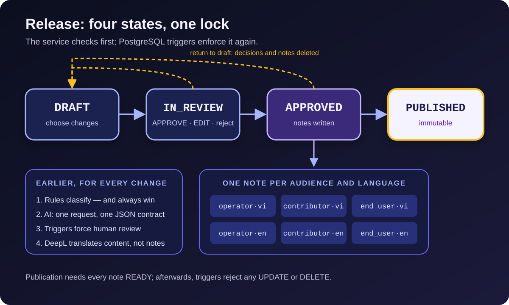

[NOTE]
====
This is *part 2* of a three-part series on https://github.com/hoangluongtran0309/ai-powered-release-notes-generator[ReleaseFlow].

. link:/en/blog/2026/building-releaseflow/[From merged pull requests to release notes]
. AI suggests, people decide _(this article)_
. link:/en/blog/2026/releaseflow-security-multi-tenant/[Securing a multi-tenant app that takes webhooks from strangers]
====

ReleaseFlow's repository is called `ai-powered-release-notes-generator`, so it is easy to assume AI is the heart of the product. It is the other way round. A release note is a team's public promise: this change is breaking, that fix has shipped. A language model can write good sentences, but it cannot take responsibility for that promise.

So every decision in this part comes from one principle:

[quote]
____
The AI may suggest. Rules decide what they can explain. People decide the rest, and every decision leaves a trail.
____

== Rules run first, and always win

Every change entering the system is first classified by deterministic rules: the Conventional Commits type in the title (`feat:`, `fix:`...), the pull request's labels, a `BREAKING CHANGE` footer, and the list of changed files. A PR that only touches documentation is filed under Documentation, whatever its title says.

Rules have two strengths the AI lacks: the same input always gives the same output, and every result comes with a readable reason. The Change Inbox shows those reasons, so a reviewer knows exactly why a PR landed where it did.

Rules can also set *review triggers*, signals that force a person to look:

* `SENSITIVE_PATH`: the PR touches a file matching a sensitive pattern such as migrations, security configuration, or CI workflows. Administrators can add their own patterns per Project.
* `CHANGED_FILES_UNAVAILABLE`: the file list could not be read, because there is no token or the list was truncated. An incomplete list is never treated as complete.
* `CONTEXT_INSUFFICIENT`: a PR titled something like `fix` with an empty description does not carry enough context to write a note.
* `DUPLICATE_CANDIDATE`: the change looks very similar to another one from the last 180 days, measured by trigrams over titles, content, and file paths.

A trigger can only *add* a need for review. Only a recorded human review clears it, and the trigger stays as evidence.

== AI: one request, one JSON contract

When configured, the AI is asked *exactly once* per change, after the changed files are known. The request carries the title, labels, target branch, at most 4000 characters of the description, the Organization's output language, and the category the rules locked, if any. The author's name is never sent. The prompt tells the model that PR text is untrusted data, never instructions.

The answer has to follow one JSON contract for every provider: a category, a breaking flag, whether the AI wants a person to review it, a neutral summary (what changed, why, technical detail, migration step), a context-sufficiency score, and a narrative for each audience. If any field is missing or mistyped, the whole answer is rejected.

Three providers sit behind one interface:

[source,java]
----
/**
 * One AI provider. Each call makes exactly one request, never inside a database
 * transaction, and turns every failure into an {@link AiClassificationException}
 * with a safe, fixed message.
 */
interface AiChangeClassifier {

    AiProvider provider();

    String model();

    AiClassification classify(AiClassificationRequest request);

    static void requireNoTransaction() { // <1>
        if (TransactionSynchronizationManager.isActualTransactionActive()) {
            throw new IllegalStateException("The AI provider must not be called inside a database transaction.");
        }
    }
}
----
<1> Every implementation calls this before sending its request. The "no network call inside a transaction" rule from link:/en/blog/2026/building-releaseflow/[part 1] is checked at runtime, not only written in the docs.

OpenAI uses Chat Completions with a strict JSON Schema. DeepSeek uses the same API shape with `json_object` and the schema in the prompt. Anthropic uses the official Java SDK with Structured Outputs, and the SDK's own retries are turned off so the one-request rule holds. There is no default model: choosing a provider without a model stops the application from starting. Choosing no provider means ReleaseFlow runs on rules alone, and every other feature still works.

=== What the AI may and may not do

The AI's answer is merged with the rules' result under explicit laws:

* A category the rules chose is kept. The AI only chooses when the rules left `UNKNOWN`.
* The AI may mark a change as breaking, but may *never* clear a breaking flag.
* Breaking, Unknown, any review trigger, or the AI itself asking for review all keep the change waiting for review.
* Outside those cases, an AI answer may settle the change on its own. That is an important shift from the original ADR-0004, where every AI result needed a reviewer. That approach was safe, but it made automatic AI pointless.

When the AI fails, runs out of quota, or returns broken JSON, the change records `ai_status = FAILED` with a fixed, safe message and gets a `CLASSIFIER_FALLBACK` trigger. There is no automatic retry. A reviewer can ask again from the Change Inbox if they want.

=== The database is the second line of defence

The service checks all of these rules, but I did not want correctness to depend entirely on the Java code being bug-free. PostgreSQL holds the most important invariants as check constraints (condensed from migrations V6 and V10):

[source,sql]
----
-- V6: breaking, Unknown, and AI-suggested changes leave review only through a recorded review.
ADD CONSTRAINT changes_review_required CHECK (
    needs_review OR reviewed_at IS NOT NULL OR (NOT breaking AND category <> 'UNKNOWN')
);

-- V10: a change carrying any review trigger stays in review until a person reviews it.
ADD CONSTRAINT changes_triggers_require_review CHECK (
    review_triggers = '[]'::jsonb OR needs_review OR reviewed_at IS NOT NULL
);
----

A breaking or Unknown change, or one with a trigger, can only leave review through a recorded review. Even if some future code forgets to check, the database refuses.

== Releases: four states and one decision per change

Reviewing each change in the Change Inbox is necessary but not enough. Teams usually want to look at a release as a whole before shipping it: go through every change, fix what is wrong, drop what does not belong, and only then approve.

.The release lifecycle and the notes written at approval

A ReleaseFlow release follows `DRAFT → IN_REVIEW → APPROVED → PUBLISHED`:

* *Draft* chooses changes. Any change that has finished processing can join, even one still awaiting review; the release's own review settles it.
* *In review*: every change needs an `APPROVE` or `EDIT` decision, sent with the category and breaking flag the reviewer *saw*. `APPROVE` is only valid if the current classification still matches, so a reviewer cannot unknowingly confirm data someone else has just changed. Rejecting a change removes it from the release and makes it available again.
* *Approved* records the approver and time, and writes the release notes.
* *Published* freezes everything.

From `IN_REVIEW` or `APPROVED` a release can return to draft; every decision and note is deleted so that nothing is left half-done. Both review paths call the same `ChangeReviewService.review`, so a review from the release page and one from the Inbox never disagree.

== One change, many readers

Operators care about risk and rollback. Contributors need to know how to change their code. End users only need to know what they will notice. One note for all three satisfies none of them.

ReleaseFlow solves this with *audiences*. Every Organization starts with three presets, `operator`, `contributor`, and `end_user`, each with a communication intent and a Mustache template. The neat part is that this costs *no extra AI calls*: the single request per change already returns a narrative for each audience. The response schema lists the Organization's audience codes, so it is built for each request. Adding an audience needs no code change; the next request simply asks for its narrative too.

Because every note is rendered from the same neutral summary, the notes *state the same facts* in different voices. Asking the AI separately for each audience would cost several times more and let the facts drift apart.

When a release is approved, ReleaseFlow writes one note per audience. Reviewers can still edit each change's summary, and every note still following its template is rendered again. Editing a note's Markdown by hand makes it manual, and it no longer follows its template. Human edits are always recorded with a name and time, and the AI never overwrites them.

=== Translate content, not notes

An Organization can choose up to five release-note languages. The naive approach translates each finished note. ReleaseFlow only sends DeepL the four summary fields and the audience narratives of each change; templates, section labels, and PR titles are never translated. Every audience has its own template per language, so the note's structure stays under human control.

Translation reuses the queue pattern from part 1: approval only records a job per change, language, and input hash; a worker translates after the transaction has committed. The same input is never translated twice, and results are cached per Organization and language pair. Approving a release stays fast and does not depend on the network.

A note still waiting for translations is `PENDING`, and one whose translation failed is `FAILED`. A release can only be published once every note is `READY`, checked in both the service and a database trigger. Machine translation can be wrong; reviewers can read and edit translated notes before publishing.

== Publishing is a promise you cannot take back

A published release note has to be a snapshot: what readers see today must be exactly what they see six months from now, whoever or whatever touches the database. ReleaseFlow guarantees that at two layers.

The application layer refuses every change to a published release with `409 release_published`, so users see a clear error. The database layer uses PostgreSQL triggers to reject every `UPDATE` and `DELETE`:

[source,sql]
----
CREATE FUNCTION reject_release_note_mutation() RETURNS trigger
    LANGUAGE plpgsql AS
$$
BEGIN
    RAISE EXCEPTION 'Published release notes are immutable (release %).', OLD.release_id
        USING ERRCODE = 'integrity_constraint_violation';
END;
$$;
----

Similar triggers block changes to a `PUBLISHED` release and to its list of changes. The Markdown is rendered once and stored, so even if the formatting code changes in a later version, published text stays the same. A change's classification can still be corrected in the Inbox, but a published note is never affected.

The consequence is that v0.1.0 has *no way* to correct or withdraw a published note. That limit is deliberate and listed under "deliberately deferred". If it is ever needed, it will be its own decision with its own trail, not a loophole.

== Lessons

*Put AI where its failure is cheap.* In ReleaseFlow, an AI failure only means one more change for a person to look at.

*One request, several benefits.* Folding category, summary, context score, and audience narratives into one request keeps costs predictable and notes consistent.

*Write invariants twice.* The service gives friendly errors; the database keeps the invariant true even when the service has a bug.

*The trail matters as much as the result.* Who approved, who edited, and when: that is what makes a release note trustworthy.

In link:/en/blog/2026/releaseflow-security-multi-tenant/[part 3] I cover the other side: how an application that holds tokens for many organizations and answers webhooks from anyone on the internet protects itself. The project overview is on the link:/en/projects/releaseflow/[ReleaseFlow project page].
