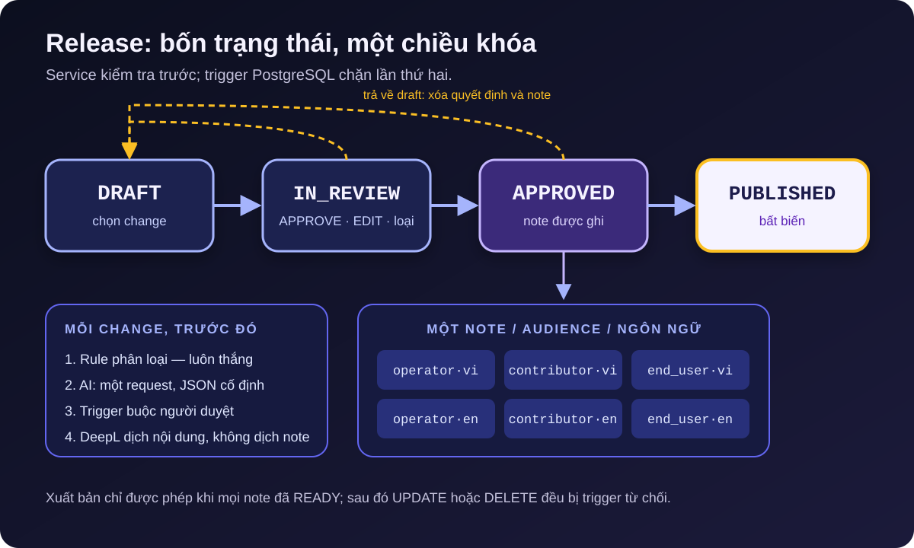

[NOTE]
====
Đây là *phần 2* trong series ba bài về https://github.com/hoangluongtran0309/ai-powered-release-notes-generator[ReleaseFlow].

. link:/blog/2026/building-releaseflow/[Từ pull request đã merge đến release note]
. AI đề xuất, con người quyết định _(bài này)_
. link:/blog/2026/releaseflow-security-multi-tenant/[Bảo mật một ứng dụng multi-tenant nhận webhook từ người lạ]
====

Tên repository của ReleaseFlow là `ai-powered-release-notes-generator`, nên người ta dễ nghĩ AI là trung tâm của sản phẩm. Thực tế ngược lại. Một release note là lời cam kết công khai của team: thay đổi này là breaking, bản sửa lỗi kia đã có. Một mô hình ngôn ngữ có thể viết câu hay, nhưng không thể chịu trách nhiệm cho lời cam kết đó.

Vì vậy mọi quyết định trong phần này xuất phát từ cùng một nguyên tắc:

[quote]
____
AI được đề xuất. Rule được quyết định những gì nó có thể giải thích. Con người quyết định phần còn lại, và mọi quyết định đều để lại dấu vết.
____

== Rule chạy trước, và luôn thắng

Mỗi change khi vào hệ thống được phân loại trước hết bằng rule xác định: loại trong tiêu đề theo Conventional Commits (`feat:`, `fix:`...), label của PR, footer `BREAKING CHANGE`, và danh sách file đã đổi. Một PR chỉ sửa tài liệu được xếp vào Documentation, bất kể tiêu đề ghi gì.

Rule có hai ưu điểm mà AI không có: cùng input luôn cho cùng output, và mỗi kết quả đi kèm lý do có thể đọc được. Change Inbox hiển thị các lý do đó, nên người duyệt biết chính xác vì sao một PR bị xếp vào nhóm nào.

Rule cũng có thể đặt *review trigger*, những tín hiệu buộc phải có người xem:

* `SENSITIVE_PATH`: PR chạm vào file khớp mẫu nhạy cảm như migration, cấu hình bảo mật, CI workflow. Admin có thể thêm mẫu riêng cho từng Project.
* `CHANGED_FILES_UNAVAILABLE`: không lấy được danh sách file, vì không có token hoặc danh sách bị cắt. Một danh sách không đầy đủ không bao giờ được coi là đầy đủ.
* `CONTEXT_INSUFFICIENT`: PR có tiêu đề kiểu `fix` và mô tả trống, không đủ ngữ cảnh để viết note.
* `DUPLICATE_CANDIDATE`: change trông rất giống một change khác trong 180 ngày gần nhất, tính bằng trigram trên tiêu đề, nội dung và đường dẫn file.

Trigger chỉ có thể *thêm* nhu cầu review. Chỉ một lần review do con người ghi nhận mới xóa được nhu cầu đó, và trigger vẫn được giữ lại làm bằng chứng.

== AI: một request, một hợp đồng JSON

Khi được cấu hình, AI được gọi *đúng một lần* cho mỗi change, sau khi đã biết danh sách file. Request gửi đi tiêu đề, label, nhánh đích, tối đa 4000 ký tự mô tả, ngôn ngữ đầu ra của tổ chức và category mà rule đã khóa nếu có. Tên tác giả không bao giờ được gửi. Prompt yêu cầu mô hình coi nội dung PR là dữ liệu chứ không phải chỉ dẫn.

Câu trả lời phải theo một hợp đồng JSON chung cho mọi nhà cung cấp: category, cờ breaking, AI có muốn người xem không, một bản tóm tắt trung lập (thay đổi gì, vì sao, chi tiết kỹ thuật, bước migration), điểm đủ ngữ cảnh, và một đoạn văn riêng cho mỗi audience. Thiếu hoặc sai kiểu bất kỳ trường nào, cả câu trả lời bị loại.

Ba nhà cung cấp nằm sau cùng một interface:

[source,java]
----
/**
 * One AI provider. Each call makes exactly one request, never inside a database
 * transaction, and turns every failure into an {@link AiClassificationException}
 * with a safe, fixed message.
 */
interface AiChangeClassifier {

    AiProvider provider();

    String model();

    AiClassification classify(AiClassificationRequest request);

    static void requireNoTransaction() { // <1>
        if (TransactionSynchronizationManager.isActualTransactionActive()) {
            throw new IllegalStateException("The AI provider must not be called inside a database transaction.");
        }
    }
}
----
<1> Mỗi implementation gọi hàm này trước khi gửi request. Quy tắc "không gọi mạng trong transaction" từ link:/blog/2026/building-releaseflow/[phần 1] được kiểm tra lúc chạy, không chỉ nằm trong tài liệu.

OpenAI dùng Chat Completions với JSON Schema strict. DeepSeek dùng cùng dạng API với `json_object` và schema trong prompt. Anthropic dùng Java SDK chính thức với Structured Outputs, và retry của SDK bị tắt để không vi phạm quy tắc một request. Không có model mặc định: chọn provider mà không đặt model thì ứng dụng từ chối khởi động. Không chọn provider thì ReleaseFlow chạy bằng rule, và mọi tính năng khác vẫn hoạt động.

=== AI được làm gì, không được làm gì

Kết quả của AI được hợp nhất với kết quả rule theo những luật rõ ràng:

* Category rule đã chọn được giữ nguyên. AI chỉ chọn khi rule để `UNKNOWN`.
* AI có thể đánh dấu một change là breaking, nhưng *không bao giờ* được xóa cờ breaking.
* Breaking, Unknown, bất kỳ review trigger nào, hoặc chính AI yêu cầu review, đều giữ change ở trạng thái chờ duyệt.
* Ngoài những trường hợp đó, câu trả lời của AI có thể tự hoàn tất change. Đây là thay đổi quan trọng so với ADR-0004 ban đầu, nơi mọi kết quả AI đều cần người duyệt. Cách đó an toàn nhưng làm AI tự động trở nên vô nghĩa.

Khi AI thất bại, hết quota hoặc trả về JSON hỏng, change ghi `ai_status = FAILED` với một thông điệp cố định và an toàn, thêm trigger `CLASSIFIER_FALLBACK`. Không có retry tự động. Người duyệt có thể bấm thử lại từ Change Inbox nếu muốn.

=== Database là tuyến phòng thủ thứ hai

Service kiểm tra tất cả các luật trên, nhưng mình không muốn tính đúng đắn phụ thuộc hoàn toàn vào việc không có bug trong Java. PostgreSQL giữ các bất biến quan trọng nhất bằng check constraint (rút gọn từ migration V6 và V10):

[source,sql]
----
-- V6: breaking, Unknown, and AI-suggested changes leave review only through a recorded review.
ADD CONSTRAINT changes_review_required CHECK (
    needs_review OR reviewed_at IS NOT NULL OR (NOT breaking AND category <> 'UNKNOWN')
);

-- V10: a change carrying any review trigger stays in review until a person reviews it.
ADD CONSTRAINT changes_triggers_require_review CHECK (
    review_triggers = '[]'::jsonb OR needs_review OR reviewed_at IS NOT NULL
);
----

Một change breaking hoặc Unknown, hoặc có trigger, chỉ có thể rời trạng thái chờ duyệt khi có một lần review được ghi nhận. Dù một đoạn code tương lai quên kiểm tra, database vẫn từ chối.

== Release: bốn trạng thái và một quyết định cho mỗi change

Review từng change trong Change Inbox là cần nhưng chưa đủ. Team thường muốn nhìn một release như một tổng thể trước khi phát hành: đi qua mọi change, sửa chỗ sai, bỏ những gì không thuộc về nó, rồi mới duyệt.

.Vòng đời release và các note được sinh khi duyệt

Release trong ReleaseFlow đi theo `DRAFT → IN_REVIEW → APPROVED → PUBLISHED`:

* *Draft* chọn change. Bất kỳ change nào đã xử lý xong đều vào được, kể cả change còn chờ duyệt; vòng review của release sẽ giải quyết nó.
* *In review*: mỗi change cần một quyết định `APPROVE` hoặc `EDIT`, gửi kèm category và cờ breaking mà người duyệt *đã nhìn thấy*. `APPROVE` chỉ hợp lệ khi phân loại hiện tại vẫn khớp, nên hai người duyệt cùng lúc không vô tình xác nhận dữ liệu đã bị người kia sửa. Loại một change ra khỏi release trả nó về danh sách chờ.
* *Approved* ghi lại người duyệt, thời điểm, và sinh release note.
* *Published* đóng băng mọi thứ.

Từ `IN_REVIEW` hoặc `APPROVED` có thể trả release về draft; mọi quyết định và note bị xóa để tránh trạng thái nửa vời. Cả hai đường review đều gọi cùng `ChangeReviewService.review`, nên review từ release và review từ Inbox không bao giờ mâu thuẫn nhau.

== Một change, nhiều người đọc

Operator quan tâm đến rủi ro và cách rollback. Contributor cần biết phải sửa code của họ thế nào. Người dùng cuối chỉ cần biết họ sẽ thấy gì khác. Một note chung cho cả ba nhóm sẽ làm không nhóm nào hài lòng.

ReleaseFlow giải quyết bằng *audience*. Mỗi tổ chức bắt đầu với ba preset `operator`, `contributor`, `end_user`, mỗi audience có một "ý định giao tiếp" và một template Mustache. Cái khéo nằm ở chỗ *không gọi AI thêm lần nào*: chính request duy nhất cho mỗi change đã trả về một đoạn văn cho từng audience. Schema của câu trả lời liệt kê mã audience của tổ chức, nên được dựng lại cho từng request. Thêm audience mới không cần sửa code; request tiếp theo sẽ tự hỏi thêm đoạn văn cho nó.

Vì mọi note đều được render từ cùng một bản tóm tắt trung lập, các note *nói cùng một sự thật* bằng những giọng khác nhau. Hỏi AI riêng cho từng audience sẽ tốn gấp nhiều lần và để các sự thật trôi lệch nhau.

Khi release được duyệt, ReleaseFlow ghi một note cho mỗi audience. Người duyệt vẫn có thể sửa tóm tắt của từng change, và mọi note còn theo template được render lại. Sửa tay Markdown của một note thì note đó thành "thủ công" và không theo template nữa. Sửa của con người luôn được ghi lại kèm tên và thời gian, và AI không bao giờ ghi đè lên.

=== Dịch nội dung, không dịch note

Một tổ chức có thể chọn tối đa năm ngôn ngữ cho release note. Cách ngây thơ là dịch từng note hoàn chỉnh. ReleaseFlow chỉ gửi DeepL bốn trường tóm tắt và các đoạn văn audience của mỗi change; template, nhãn mục và tiêu đề PR không bao giờ được dịch. Mỗi audience có template riêng cho từng ngôn ngữ, nên cấu trúc note vẫn do con người kiểm soát.

Việc dịch dùng lại mẫu hàng đợi từ phần 1: lúc duyệt chỉ ghi job cho mỗi change, ngôn ngữ và hash của input; worker dịch sau khi transaction đã commit. Cùng một input không bao giờ được dịch hai lần, và kết quả được cache theo tổ chức và cặp ngôn ngữ. Duyệt release vẫn nhanh và không phụ thuộc mạng.

Note chưa dịch xong có trạng thái `PENDING`, dịch lỗi là `FAILED`. Release chỉ được xuất bản khi mọi note đã `READY`, và điều này được kiểm tra ở cả service lẫn trigger database. Bản dịch máy có thể sai; người duyệt đọc và sửa được note đã dịch trước khi xuất bản.

== Xuất bản là một lời hứa không rút lại

Release note đã xuất bản phải là snapshot: những gì người đọc thấy hôm nay phải giống hệt những gì họ thấy sáu tháng sau, bất kể ai hoặc cái gì chạm vào database. ReleaseFlow bảo đảm điều đó ở hai tầng.

Tầng ứng dụng từ chối mọi thao tác sửa release đã xuất bản với `409 release_published`, để người dùng thấy lỗi rõ ràng. Tầng database dùng trigger PostgreSQL chặn mọi `UPDATE` và `DELETE`:

[source,sql]
----
CREATE FUNCTION reject_release_note_mutation() RETURNS trigger
    LANGUAGE plpgsql AS
$$
BEGIN
    RAISE EXCEPTION 'Published release notes are immutable (release %).', OLD.release_id
        USING ERRCODE = 'integrity_constraint_violation';
END;
$$;
----

Các trigger tương tự chặn thay đổi release đã `PUBLISHED` và danh sách change của nó. Markdown được render một lần và lưu lại, nên kể cả khi code format thay đổi ở phiên bản sau, văn bản đã xuất bản vẫn không đổi. Classification của một change vẫn có thể được sửa trong Inbox, nhưng note đã xuất bản không bao giờ bị ảnh hưởng.

Hệ quả là v0.1.0 *không có cách nào* sửa hoặc gỡ một note đã xuất bản. Đó là giới hạn có chủ đích và được ghi trong danh sách "cố ý chưa làm". Nếu sau này cần, nó sẽ là một quyết định riêng với dấu vết riêng, không phải một lỗ hổng.

== Bài học

*Đặt AI ở nơi thất bại của nó rẻ.* Trong ReleaseFlow, AI thất bại chỉ có nghĩa là thêm một change cần người xem.

*Một request, nhiều lợi ích.* Gom category, tóm tắt, điểm ngữ cảnh và đoạn văn audience vào một request giúp chi phí dự đoán được và các note nhất quán.

*Viết bất biến hai lần.* Service cho lỗi thân thiện; database bảo đảm bất biến vẫn đúng ngay cả khi service có bug.

*Dấu vết quan trọng như kết quả.* Ai duyệt, ai sửa, lúc nào: đó là thứ khiến một release note đáng tin.

Ở link:/blog/2026/releaseflow-security-multi-tenant/[phần 3], mình sẽ nói về mặt còn lại: một ứng dụng giữ token của nhiều tổ chức và trả lời webhook từ bất kỳ ai trên internet thì phải tự bảo vệ thế nào. Tổng quan dự án có tại link:/projects/releaseflow/[trang project ReleaseFlow].
