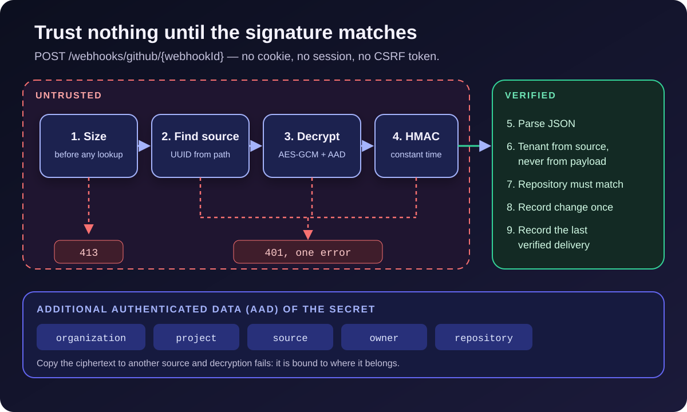

[NOTE]
====
This is *part 3* of a three-part series on https://github.com/hoangluongtran0309/ai-powered-release-notes-generator[ReleaseFlow].

. link:/en/blog/2026/building-releaseflow/[From merged pull requests to release notes]
. link:/en/blog/2026/releaseflow-ai-human-review/[AI suggests, people decide]
. Securing a multi-tenant app that takes webhooks from strangers _(this article)_
====

From a security point of view, ReleaseFlow has an uncomfortable profile. It keeps data for many organizations in one database. It stores access tokens for GitHub, GitLab, Linear, and Jira, plus credentials for Slack, Notion, Confluence, Teams, and Zendesk. And it has endpoints that *anyone on the internet* can call: webhooks with no cookie, no session, and no login.

The last article in the series walks through how ReleaseFlow handles each of those. Nothing here is novel; what is worth talking about is that the rules are written as code and tests, so they do not depend on the author's memory.

== Tenant isolation: explicit instead of magic

The Organization is the tenant boundary. ADR-0001, the project's first decision, chose *one shared PostgreSQL schema*: every tenant-owned row carries an `organization_id` column. A database or schema per tenant would add provisioning and migration complexity the product does not need yet.

The more interesting choice is what ReleaseFlow does *not* use: Hibernate's implicit tenant filter. An implicit filter makes repository behaviour hard to see when reading code and easy to bypass on access paths that do not go through Hibernate, such as native queries. Instead there are three rules:

* *The tenant only comes from the server-created principal.* Request DTOs never accept a tenant ID. For webhooks, the tenant comes from the source whose signature was verified.
* *Every repository operation on tenant-owned data takes `organizationId`*, even when looking up an ID that is already globally unique, for example `findByIdAndOrganizationId(id, organizationId)`. The tenant scope is visible right at the call site.
* *The database is the second line.* Composite foreign keys such as `(reviewed_by, organization_id) → app_users (id, organization_id)` make recording a reviewer from another organization impossible at the storage level.

This still leaves room to forget a tenant predicate. The ADR says so plainly and adds a compensating requirement: *every new tenant-owned capability needs negative integration tests* proving organization A cannot read or modify organization B's data.

== Webhooks: trust nothing until the signature matches

A webhook arrives at a URL like `POST /webhooks/github/{webhookId}`. Everything in that request is controlled by a stranger: the path, the headers, the body. The design question is: *what may we read, and in what order?*

.The order in which a webhook earns trust

The GitHub webhook service follows exactly that order:

[source,java]
----
WebhookOutcome receive(String webhookId, String signature, String event, String deliveryId, byte[] body) {
    // Checked before the source is looked up, so the limit says nothing about what exists.
    webhookBody.requireWithinLimit(body); // <1>
    // Nothing else from the request is trusted before this source's own secret verifies it.
    VerifiedWebhook webhook = verifier.verify(webhookId, signature, body) // <2>
            .orElseThrow(WebhookSignatureInvalidException::new);
    if (event == null || event.isBlank()) {
        throw new MalformedWebhookPayloadException("error.webhook_payload_malformed.githubEventHeader");
    }
    JsonNode payload = parse(body); // <3>
    requireConfiguredRepository(webhook, event, payload); // <4>
    ...
}
----
<1> An oversized body is refused with `413` *before* any database lookup, so that response reveals nothing about which webhook IDs exist.
<2> An unknown webhook ID, the wrong source type, a secret that will not decrypt, or a wrong signature all return `Optional.empty()` and the same `401`. A scanner cannot tell them apart.
<3> The JSON is parsed only after the raw bytes have been verified.
<4> The payload must describe the repository configured for this source; a valid signature is not enough to record a change for a different repository.

The signature is compared with `MessageDigest.isEqual`, a constant-time comparison, so response timing does not leak how many bytes were right. Each provider proves itself differently: GitHub and Linear sign an HMAC over the raw body, GitLab uses signed headers, and ReleaseFlow's own automation webhook signs the timestamp, delivery ID, *method*, *path*, and body digest, with a five-minute clock-skew limit against replays.

== Secrets: one key per connection, one owner per ciphertext

If every source shared one signing secret, leaking one connection would leak them all. ADR-0002 gives *every* source a globally unique webhook UUID. For GitHub and GitLab, ReleaseFlow also generates a separate 256-bit secret; the plaintext appears exactly once, in the response that creates the source, and every later read only says that a secret exists. Linear generates its own secret, so the user enters it and ReleaseFlow never returns it.

Secrets and tokens are encrypted with AES-256-GCM before they are stored, with a random 12-byte nonce per encryption. The key detail is the *additional authenticated data* (AAD):

[source,java]
----
cipher.init(Cipher.ENCRYPT_MODE, key, new GCMParameterSpec(TAG_LENGTH_BITS, nonce));
cipher.updateAAD(additionalAuthenticatedData);
----

AAD is not encrypted, but it is authenticated together with the ciphertext. ReleaseFlow puts the organization ID, project ID, source ID, repository owner, and repository name into it. Suppose an attacker who can write to the database copies organization A's ciphertext onto one of organization B's sources: decryption fails because the AAD does not match. The ciphertext is bound to where it belongs. Access tokens use the same scheme plus a purpose line such as `github-access-token`, so a source's webhook secret and its token cannot be swapped either.

The 32-byte master key comes only from the `RELEASEFLOW_CREDENTIAL_MASTER_KEY` environment variable. If it is missing or malformed, the application refuses to start instead of running half-configured. The ADR states the consequence clearly: losing the master key means losing access to every stored credential, and key rotation is a workflow that has not been built yet.

== CSRF is never disabled

ReleaseFlow's sessions are cookies, so every write must carry a CSRF token. But GitHub cannot send a token it has never seen, so the webhook filter chain originally used `csrf().disable()`.

CodeQL reports that as a High finding. On a closer look it is not exploitable: the webhook chain really is cookie-free, and tests assert that no `Set-Cookie` comes back. I fixed it anyway, because `disable()` says more than it needs to. It exempts *everything* the chain will ever match, including a path somebody adds later that does use a cookie. The old chain also allowed *any method on any path* under `/webhooks/`.

ADR-0023 replaces it with narrow, named rules:

* CSRF is always on; the exemption is written out: `csrf.ignoringRequestMatchers("/webhooks/**")`. Widening it later is a deliberate edit, not a silent consequence.
* The webhook chain permits only the endpoints that exist: `POST` to GitHub, GitLab, Linear, and automation, plus one signed `GET`. Everything else under `/webhooks/` is denied, so a new controller mapped there is refused until someone decides otherwise.
* The session cookie stays the second line: `HttpOnly`, `SameSite=Lax`, and `Secure` over HTTPS.

The rule worth remembering: *a path that proves itself with a signature may be exempted; a path that relies on a cookie never may.*

== What goes out must be limited too

Security is not only about blocking incoming requests. ReleaseFlow calls out to many places, and many destination addresses are user input:

* A Slack webhook URL is checked against the deployment's host allowlist, `hooks.slack.com` and `hooks.slack-gov.com` by default, both when it is saved and *before every delivery*.
* Every outbound HTTP client sets `HttpClient.Redirect.NEVER` explicitly, including clients that had relied on the JDK default. A redirect cannot turn a Slack call into a call to the internal network. Since v0.1.1, a Slack webhook that answers with a redirect is recorded as `FAILED` instead of delivered: the redirect was never followed, so nothing was posted.
* Each automation action's secret is encrypted with AAD made of the organization, rule, action, action type, and purpose. A run snapshots only the ciphertext, never the secret.
* Run history stores only fixed error codes, never a provider's message or an exception, so tokens or sensitive data never end up in the database by accident. AI failures follow the same principle: one fixed, safe message.

CodeQL also found three regular expressions that could take quadratic time on user-submitted input. None was exploitable, because the input was length-capped beforehand and only an administrator could submit it. I still rewrote them to run in linear time: the code is faster and plainer, and it leaves no dangerous shape for someone to copy later.

== Metrics must not become a leak

When adding observability, the biggest risk for a multi-tenant application is labels. A Prometheus label is a permanent, unauthenticated read of whatever is put in it. ADR-0026 sets hard limits:

* Actuator runs on *its own port*, 8081 bound to loopback by default, exposing only `health` (without details) and `prometheus`. The application port serves none of it.
* Only four metrics, and *no label ever carries an organization, project, release, rule, model, or error text*. The series are built from enums at startup, so there is nowhere for such a value to go, and unit tests assert that the set of label names is exactly what is documented.
* `FAILED` and `UNKNOWN` are kept apart: a delivery with an unknown outcome may have arrived, so folding it into the failure rate would report something untrue.

A question about one specific organization cannot be answered from metrics, and that is by design. It needs a product feature with its own authorization story, not a label.

== The supply chain is attack surface too

A public repository means pull requests, build tooling, and base images can all be targeted. ReleaseFlow's GitHub Actions run five workflows on every push and pull request: build and test with Testcontainers plus `npm audit`, CodeQL for Java and JavaScript, Dependency Review, Gitleaks over the entire Git history, and Trivy over the container image.

Every third-party action is pinned to a commit SHA, every base image to a digest, and command-line tools are checked against SHA-256 checksums. Workflows default to `contents: read`. The container runs as the non-root UID `65534`, and Docker Compose refuses to start until the database password, master key, and Grafana password are set.

A release has to be verifiable too. Under ADR-0030, the Release workflow runs only from a `v<version>` tag that sits on `main` and matches the POM, then attaches the JAR, a CycloneDX SBOM of the image, `SHA256SUMS`, and a provenance attestation; the image on GHCR is referenced by digest. Since v0.2.0, the quickstart (ADR-0031) follows the same rules: `compose.yaml` pins the image by digest, and both files are listed in `SHA256SUMS` so people check them before running them instead of piping `curl` into `bash`. The script writes `.env` with new secrets on the first run and never overwrites it, ignores any `RELEASEFLOW_*` or `COMPOSE_*` variable from the shell, and refuses to start when the database exists but `.env` is gone, because new secrets cannot open data encrypted under the old master key.

== Lessons to close the series

*Write down the order of trust.* "Trust nothing until the signature matches" is simple enough to break by accident; the comments and line order in `receive` make it something a reviewer can check.

*Exemptions should be narrow and named.* `ignoringRequestMatchers("/webhooks/**")` and `disable()` behave the same today, but only one of them stays correct as the codebase grows.

*Bind encrypted data to its owner.* AAD is a few lines of code, but it turns a database write bug into a decryption error instead of a cross-tenant leak.

*Fix warnings that are not exploitable.* Not out of fear, but because the code gets cleaner and leaves no bad pattern behind.

Across these three articles, I hope ReleaseFlow shows one thing: most of a system's value is not in its flashiest feature, but in boundaries that are drawn clearly and defended at more than one layer. You can visit the link:/en/projects/releaseflow/[ReleaseFlow project page], read the https://github.com/hoangluongtran0309/ai-powered-release-notes-generator[source and all 31 ADRs on GitHub], or try the https://github.com/hoangluongtran0309/ai-powered-release-notes-generator/releases/latest[latest release] with the Docker-only quickstart. If you find a weakness, `SECURITY.md` in the repository explains how to report it privately.
