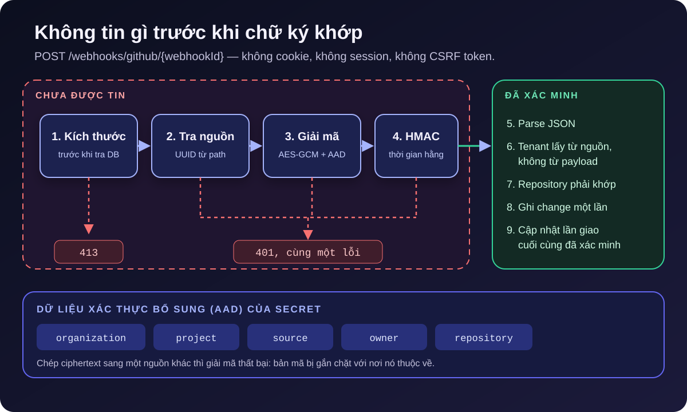

[NOTE]
====
Đây là *phần 3* trong series ba bài về https://github.com/hoangluongtran0309/ai-powered-release-notes-generator[ReleaseFlow].

. link:/blog/2026/building-releaseflow/[Từ pull request đã merge đến release note]
. link:/blog/2026/releaseflow-ai-human-review/[AI đề xuất, con người quyết định]
. Bảo mật một ứng dụng multi-tenant nhận webhook từ người lạ _(bài này)_
====

Nhìn từ góc bảo mật, ReleaseFlow có một hồ sơ khá khó chịu. Nó giữ dữ liệu của nhiều tổ chức trong cùng một database. Nó lưu token truy cập GitHub, GitLab, Linear, Jira, cùng credential của Slack, Notion, Confluence, Teams và Zendesk. Và nó có những endpoint *bất kỳ ai trên internet* cũng gọi được: webhook không có cookie, không có session, không có đăng nhập.

Bài cuối của series đi qua cách ReleaseFlow xử lý từng mặt đó. Không có gì ở đây là mới lạ; phần đáng nói là các quy tắc được viết thành code và test để chúng không phụ thuộc vào trí nhớ của người viết.

== Tenant isolation: tường minh thay vì ma thuật

Organization là ranh giới tenant. ADR-0001, quyết định đầu tiên của dự án, chọn *một schema PostgreSQL dùng chung*: mọi row thuộc tenant mang cột `organization_id`. Database riêng hoặc schema riêng cho mỗi tenant sẽ thêm độ phức tạp về provisioning và migration mà sản phẩm chưa cần.

Lựa chọn thú vị hơn là những gì ReleaseFlow *không* dùng: tenant filter ngầm của Hibernate. Filter ngầm khiến hành vi repository khó nhìn thấy khi đọc code và dễ bị bỏ qua ở những đường truy cập không đi qua Hibernate, như native query. Thay vào đó có ba quy tắc:

* *Tenant chỉ đến từ principal do server tạo.* Request DTO không bao giờ nhận tenant ID. Với webhook, tenant đến từ nguồn đã được xác minh chữ ký.
* *Mọi thao tác repository trên dữ liệu thuộc tenant phải truyền `organizationId`*, kể cả khi tra theo một ID vốn đã duy nhất toàn cục, ví dụ `findByIdAndOrganizationId(id, organizationId)`. Phạm vi tenant hiện ra ngay tại chỗ gọi.
* *Database là tuyến thứ hai.* Foreign key ghép như `(reviewed_by, organization_id) → app_users (id, organization_id)` khiến việc ghi một người duyệt thuộc tổ chức khác là bất khả thi ở tầng lưu trữ.

Cách này vẫn để hở khả năng quên một điều kiện tenant. ADR ghi thẳng hệ quả đó, và đặt ra yêu cầu bù lại: *mọi năng lực mới thuộc tenant phải có integration test âm* chứng minh tổ chức A không đọc hay sửa được dữ liệu của tổ chức B.

== Webhook: không tin gì trước khi chữ ký khớp

Một webhook đến với URL dạng `POST /webhooks/github/{webhookId}`. Mọi thứ trong request đó đều do người lạ kiểm soát: path, header, body. Câu hỏi thiết kế là: *ta được phép đọc gì, và theo thứ tự nào?*

.Thứ tự tin tưởng của một webhook

Service nhận webhook của GitHub thể hiện đúng thứ tự đó:

[source,java]
----
WebhookOutcome receive(String webhookId, String signature, String event, String deliveryId, byte[] body) {
    // Checked before the source is looked up, so the limit says nothing about what exists.
    webhookBody.requireWithinLimit(body); // <1>
    // Nothing else from the request is trusted before this source's own secret verifies it.
    VerifiedWebhook webhook = verifier.verify(webhookId, signature, body) // <2>
            .orElseThrow(WebhookSignatureInvalidException::new);
    if (event == null || event.isBlank()) {
        throw new MalformedWebhookPayloadException("error.webhook_payload_malformed.githubEventHeader");
    }
    JsonNode payload = parse(body); // <3>
    requireConfiguredRepository(webhook, event, payload); // <4>
    ...
}
----
<1> Body quá lớn bị từ chối bằng `413` *trước* khi tra database, nên phản hồi này không tiết lộ webhook ID nào tồn tại.
<2> Webhook ID không tồn tại, sai loại nguồn, không giải mã được secret hay chữ ký sai đều trả về `Optional.empty()` và cùng một lỗi `401`. Kẻ dò quét không phân biệt được các trường hợp.
<3> JSON chỉ được parse sau khi byte thô đã được xác minh.
<4> Payload phải nói về đúng repository đã cấu hình cho nguồn này; một chữ ký hợp lệ không đủ để ghi change vào repository khác.

Chữ ký được so bằng `MessageDigest.isEqual`, phép so sánh thời gian hằng, để thời gian phản hồi không rò rỉ số byte đúng. Mỗi nhà cung cấp có cách chứng minh riêng: GitHub và Linear ký HMAC trên body thô, GitLab dùng header có chữ ký, còn webhook automation của chính ReleaseFlow ký trên timestamp, delivery ID, *method*, *path* và digest của body, kèm giới hạn lệch đồng hồ năm phút để chống replay.

== Secret: mỗi kết nối một khóa, mỗi bản mã một chủ

Nếu mọi nguồn dùng chung một signing secret, lộ một kết nối là lộ tất cả. ADR-0002 cấp cho *mỗi* nguồn một webhook UUID duy nhất toàn cục. Với GitHub và GitLab, ReleaseFlow sinh thêm một secret 256-bit riêng; plaintext chỉ hiện đúng một lần trong response tạo nguồn, mọi lần đọc sau đó chỉ biết là secret có tồn tại. Linear tự tạo secret của nó, nên người dùng nhập vào và ReleaseFlow không bao giờ trả lại.

Secret và token được mã hóa bằng AES-256-GCM trước khi lưu, với nonce ngẫu nhiên 12 byte cho mỗi lần mã hóa. Điểm mấu chốt là *dữ liệu xác thực bổ sung* (AAD):

[source,java]
----
cipher.init(Cipher.ENCRYPT_MODE, key, new GCMParameterSpec(TAG_LENGTH_BITS, nonce));
cipher.updateAAD(additionalAuthenticatedData);
----

AAD không được mã hóa nhưng được xác thực cùng bản mã. ReleaseFlow đưa vào đó ID tổ chức, ID project, ID nguồn, owner và tên repository. Giả sử kẻ tấn công có quyền ghi vào database và chép ciphertext của tổ chức A sang một nguồn của tổ chức B: giải mã sẽ thất bại vì AAD không khớp. Bản mã bị gắn chặt với nơi nó thuộc về. Token truy cập dùng cùng cơ chế với thêm một dòng mục đích như `github-access-token`, nên secret webhook và token của cùng một nguồn cũng không thể hoán đổi.

Master key 32 byte chỉ đến từ biến môi trường `RELEASEFLOW_CREDENTIAL_MASTER_KEY`. Thiếu hoặc sai định dạng, ứng dụng từ chối khởi động thay vì chạy với trạng thái nửa vời. Hệ quả được ghi rõ trong ADR: mất master key nghĩa là mất quyền truy cập mọi credential đã lưu, và xoay vòng khóa là một quy trình chưa được xây dựng.

== CSRF không bao giờ bị tắt

Phiên đăng nhập của ReleaseFlow là cookie, nên mọi thao tác ghi phải mang CSRF token. Nhưng GitHub không thể gửi token mà nó chưa từng thấy, vì vậy ban đầu chuỗi filter cho webhook dùng `csrf().disable()`.

CodeQL báo đây là lỗi mức High. Đọc kỹ thì không khai thác được: chuỗi webhook thực sự không dùng cookie, test còn khẳng định không có `Set-Cookie` nào trả về. Nhưng mình vẫn sửa, vì `disable()` nói nhiều hơn mức cần thiết. Nó miễn trừ *mọi* thứ chuỗi đó sẽ match trong tương lai, kể cả một path ai đó thêm vào sau này có dùng cookie. Chuỗi cũ còn cho phép *mọi method trên mọi path* dưới `/webhooks/`.

ADR-0023 thay nó bằng những quy tắc hẹp và có tên:

* CSRF luôn được bật; ngoại lệ được viết tường minh: `csrf.ignoringRequestMatchers("/webhooks/**")`. Mở rộng ngoại lệ sau này là một chỉnh sửa có chủ đích, không phải hệ quả âm thầm.
* Chuỗi webhook chỉ cho phép đúng các endpoint đang tồn tại: `POST` tới GitHub, GitLab, Linear, automation, và một `GET` có chữ ký. Mọi thứ khác dưới `/webhooks/` bị từ chối, nên một controller mới map vào đó sẽ bị chặn cho đến khi có người quyết định khác.
* Cookie phiên vẫn là tuyến thứ hai: `HttpOnly`, `SameSite=Lax`, và `Secure` khi chạy HTTPS.

Quy tắc đáng nhớ nhất: *một path tự chứng minh bằng chữ ký có thể được miễn trừ; một path dựa vào cookie thì không bao giờ.*

== Những gì đi ra ngoài cũng phải bị giới hạn

Bảo mật không chỉ là chặn request vào. ReleaseFlow gọi ra rất nhiều nơi, và nhiều địa chỉ đích do người dùng nhập:

* URL webhook Slack được đối chiếu với allowlist host của deployment, mặc định chỉ `hooks.slack.com` và `hooks.slack-gov.com`, cả lúc lưu lẫn *trước mỗi lần gửi*.
* Mọi HTTP client gửi ra ngoài đặt `HttpClient.Redirect.NEVER` tường minh, kể cả những client trước đó dựa vào mặc định của JDK. Một redirect không thể biến lời gọi Slack thành lời gọi tới mạng nội bộ.
* Secret của mỗi automation action được mã hóa với AAD gồm tổ chức, rule, action, loại action và mục đích. Run chỉ snapshot ciphertext, không bao giờ snapshot secret.
* Lịch sử run chỉ lưu mã lỗi cố định, không bao giờ lưu thông điệp từ nhà cung cấp hay exception, để không vô tình ghi token hoặc dữ liệu nhạy cảm vào database. Lỗi AI cũng theo cùng nguyên tắc: một thông điệp cố định và an toàn.

CodeQL còn tìm ra ba biểu thức chính quy có thể chạy thời gian bậc hai trên input do người dùng gửi. Không cái nào khai thác được vì input đã bị giới hạn độ dài trước đó và chỉ admin mới gửi được. Mình vẫn viết lại chúng để chạy tuyến tính: code nhanh hơn, dễ đọc hơn, và không để lại một hình dạng nguy hiểm cho người sau sao chép.

== Metrics không được trở thành kênh rò rỉ

Khi thêm observability, rủi ro lớn nhất của một ứng dụng multi-tenant là label. Một label Prometheus là một lần đọc vĩnh viễn, không cần xác thực, của bất cứ thứ gì được đặt vào nó. ADR-0026 đặt ra những giới hạn cứng:

* Actuator chạy trên *port riêng*, mặc định 8081 và chỉ bind loopback, chỉ lộ `health` (không chi tiết) và `prometheus`. Port ứng dụng không phục vụ gì trong số đó.
* Chỉ bốn metric, và *không label nào mang tổ chức, project, release, rule, model hay nội dung lỗi*. Series được dựng từ enum lúc khởi động nên không có chỗ nào để một giá trị như vậy lọt vào, và unit test khẳng định tập tên label chính xác như tài liệu.
* `FAILED` và `UNKNOWN` được tách riêng: một lần giao hàng không rõ kết quả có thể đã tới nơi, nên gộp nó vào tỷ lệ lỗi là báo cáo sai.

Câu hỏi về một tổ chức cụ thể không thể trả lời bằng metrics, và đó là thiết kế có chủ đích. Nó cần một tính năng sản phẩm có câu chuyện phân quyền riêng, không phải một label.

== Chuỗi cung ứng cũng là bề mặt tấn công

Repository công khai nghĩa là pull request, công cụ build và base image đều có thể bị nhắm tới. GitHub Actions của ReleaseFlow chạy năm workflow cho mỗi push và pull request: build và test với Testcontainers kèm `npm audit`, CodeQL cho Java và JavaScript, Dependency Review, Gitleaks quét toàn bộ lịch sử Git, và Trivy quét container image.

Mọi action bên thứ ba được pin theo commit SHA, mọi base image theo digest, và các công cụ dòng lệnh được kiểm tra checksum SHA-256. Workflow mặc định chỉ có quyền `contents: read`. Container chạy dưới UID `65534` không phải root, và Docker Compose từ chối khởi động khi mật khẩu database, master key hay mật khẩu Grafana chưa được đặt.

== Bài học khép lại series

*Viết ra thứ tự tin tưởng.* "Không tin gì trước khi chữ ký khớp" đơn giản đến mức dễ vi phạm vô tình; comment và thứ tự dòng code trong `receive` biến nó thành thứ có thể review.

*Ngoại lệ phải hẹp và có tên.* `ignoringRequestMatchers("/webhooks/**")` và `disable()` hôm nay cho cùng kết quả, nhưng chỉ một trong hai còn đúng khi codebase lớn lên.

*Buộc dữ liệu mã hóa vào chủ sở hữu.* AAD là vài dòng code, nhưng nó biến một lỗi ghi database thành lỗi giải mã thay vì một vụ rò rỉ chéo tenant.

*Xử lý cảnh báo không khai thác được.* Không phải vì sợ, mà vì code sạch hơn và không để lại mẫu xấu cho người sau.

Qua ba bài, mình hy vọng ReleaseFlow cho thấy một điều: phần lớn giá trị của một hệ thống không nằm ở tính năng hào nhoáng nhất, mà ở những ranh giới được vạch rõ và được bảo vệ ở nhiều tầng. Bạn có thể xem link:/projects/releaseflow/[trang project ReleaseFlow], đọc https://github.com/hoangluongtran0309/ai-powered-release-notes-generator[mã nguồn và 30 ADR trên GitHub], hoặc thử https://github.com/hoangluongtran0309/ai-powered-release-notes-generator/releases/tag/v0.1.0[release v0.1.0] bằng Docker Compose. Nếu bạn tìm thấy điểm yếu, `SECURITY.md` trong repository hướng dẫn cách báo cáo riêng tư.
