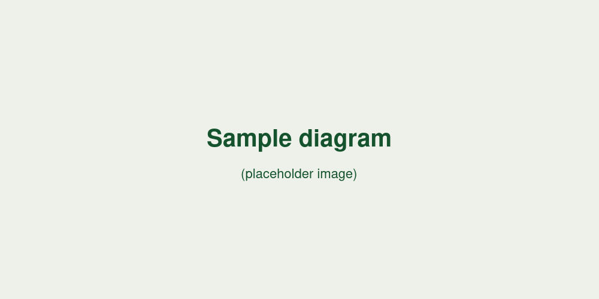

= Bài viết mẫu 1

Đây là bài viết *mẫu* (dummy content), không phải nội dung thật — chỉ dùng để
kiểm tra giao diện hiển thị các thành phần AsciiDoc: admonition, bảng, code
block có callout, ảnh và cross-reference nội bộ. Xem thêm ở
<<ket-luan,phần kết luận>> cuối bài.

== Code block mẫu

[source,java]
----
public record SamplePost(String slug, String title, List<String> tags) {

    public boolean hasTag(String tag) {
        return tags.contains(tag); // <1>
    }
}
----
<1> Chú thích callout mẫu.

Inline code mẫu: `hugo && npx pagefind --site public`.

== Admonition mẫu

NOTE: Đây là admonition NOTE mẫu, dùng để kiểm tra style hiển thị.

WARNING: Đây là admonition WARNING mẫu.

TIP: Đây là admonition TIP mẫu.

== Bảng mẫu

[cols="1,2"]
|===
| Cột 1 | Cột 2

| Dòng 1
| Dữ liệu mẫu

| Dòng 2
| Dữ liệu mẫu
|===

[[ket-luan]]
== Kết luận

Toàn bộ nội dung trên chỉ nhằm kiểm tra giao diện — không đại diện cho bài
viết thật nào.
